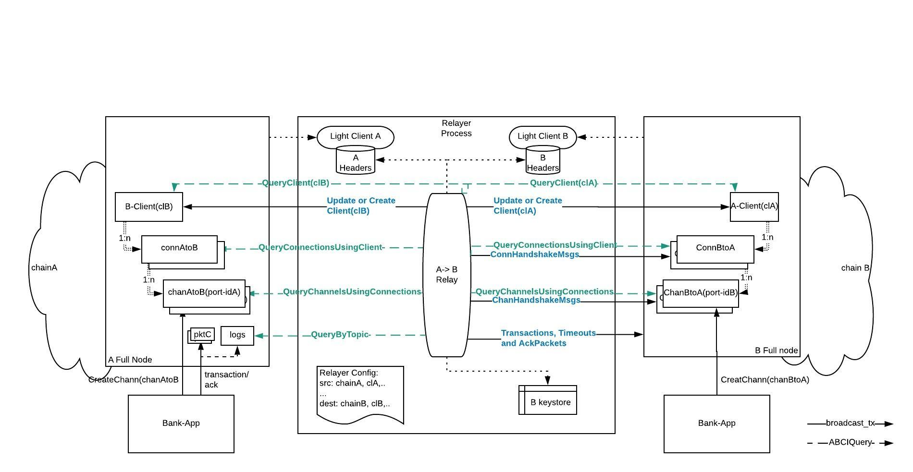

# ADR 002: IBC Relayer in Rust

## Changelog
* {date}: {changelog}

## Definitions
On-chain IBC Client (or IBC Client) - client code running on chain, typically only the light client verification related functionality.

Relayer Light Client - full light client functionality, including connecting to at least one provider (full node), storing and verifying headers, etc.

Source chain - the chain from which the relayer reads data to fill an IBC datagram.

Destination chain - the chain where the realyer submits transactions that include the IBC message.

A and B chains - for connection protocol, A is the "initiating" chain where `MsgConnectionOpenInit` is initially processed and eventually `MsgConnectionOpenAck`. B is the chain where `MsgConnectionOpenTry` and `MsgConnectionOpenConfirm` are processed. 
Similar for channel handshake protocol.

## Context
A relayer is an off-chain process responsible for relaying IBC packet data & metadata between two or more chains by scanning their states and submitting transactions. This is because in the IBC architecture, modules are not directly sending messages to each other over networking infrastructure, but instead they create and store the messages to be retrieved and forwarded by a relayer process. 

This document provides an initial Rust implementation specification of a relayer that interconnects Cosmos-SDK/ Tendermint chains.

The diagram below shows a high level view of the relayer and its interactions with the source and destination chains. The next sections go in more details of the different interactions.

.

## Assumptions and Dependencies
This section covers assumptions and dependencies about the chains and their IBC implementation. The first implementation focuses on and will only be tested with Cosmos-SDK/ Tendermint chains. In addition, functionality required by the relayer that is outside the scope of this document, and the availability of their implementations is considered.

#### Data Availability
The relayer monitors the chain state to determine when packet forwarding is required. The relayer must be able to retrieve the data within some time bound. This is referred to as **data availability**.

#### Data Legibility
IBC protocol defines the minimal data set that must be made available to relayers for correct operation of the protocol. The relayer expects the data to be legible, i.e. **data should be serialized** according to the IBC specification format; this includes consensus state, client, connection, channel, and packet information, and any auxiliary state structure necessary to construct proofs of inclusion or exclusion of particular key/value pairs in state. 
 - [IBC Specification] some protobuf specifications can be found under individual ICS-es, for exmple [ICS-03 connection protobufs](https://github.com/cosmos/ics/blob/master/spec/ics-002-client-semantics/data-structures.proto)

#### IBC Querier Module
IBC host state machines MUST provide query functions for all data available to relayers. For Cosmos/Tendermint chains this means:
- the IBC modules on chain correctly implement and respond to queries
  - [IBC-Modules-Rust] an implementation for some queries currently exist in Cosmos-SDK and same and more need to be implemented in Rust. The full requirements are detailed in section Relayer Queries. 
- the relayer needs the ability to send rpc/http ABCI queries to and receive replies from Tendermint/Cosmos-SDK
  - [[ABCI Rust](https://github.com/tendermint/rust-abci)] - ABCI Rust implementation
  - [IBC-Modules-Rust] identifier validation is required (ICS-024)
  - [IBC-Modules-Rust] requires Rust types for all query responses
  - [[Merkle-Proofs-Rust](https://github.com/confio/ics23/tree/master/rust)] (candidate implementation) - some query responses include proofs and included in IBC transactions by the relayer (some may be validated, TBD)

#### IBC Messages
The relayer creates transactions that include IBC messages to manage clients, connections and channels, and send application packets to destination chains. These messages must be defined in the IBC Rust implementation [IBC-Modules-Rust].

#### IBC Logging System
IBC packet data & timeouts are not stored directly in the chain state (as this storage is presumed to be expensive) but are instead committed to with a succinct cryptographic commitment (only the commitment is stored).
As a consequence, IBC requires that a **host state machine MUST provide an event logging system** that logs data in the course of transaction execution. **Logs must be queryable** by relayers to read IBC packet data & timeouts. 

The logging system must provide the following functions:
 - [IBC-Modules-Go] emitLogEntry for emitting log entries called by the state machine during transaction execution:
   - type emitLogEntry = (topic: string , data: []byte) => void
   - example: emitLogEntry("sendPacket", {sequence: packet.sequence , data: packet.data, timeout: packet.timeout})
 - [IBC-Modules-Go] queryByTopic for querying past logs matching a given topic:
   - type queryByTopic = (height: uint64 , topic: string) => Array < []byte >

#### Keyring 
The relay process must have access to its accounts with tokens on all destination chains, with sufficient balance to pay for transaction fees. Account key information must be stored and managed securely. A keyring implementation is required for CRUD key operations. 
[Keyring-Rust] Investigation in existing Rust implementations is needed. (ex: [hwchen-keyring](https://github.com/hwchen/keyring-rs))

### Chain Transactions and Signing
The relayer must create chain specific signed transactions. 
[Cosmos-Tx-Rust] For the first release Cosmos-SDK transaction signing is required. One possible implementation is [iqlusion's sdtx crate](https://github.com/iqlusioninc/crates/tree/develop/stdtx)

#### Implementation of IBC "routing module"
The default IBC handler uses a receiver call pattern, where modules must individually call the IBC handler in order to bind to
ports, start handshakes, accept handshakes, send and receive packets, etc. While this provides flexibility for modules, it imposes extra work on the part of the relayer processes that now needs to track the state of multiple modules. The IBC specification describes an IBC “routing module” to route packets, and simplify the task of relayers. This routing module accepts external datagrams and calls into the IBC handler to deal with handshakes and packet relay. The routing module keeps a lookup table of modules, which it can use to look up and call a module when a packet is received, so that external relayers need only ever relay packets to the routing module.
[IBC-Routing-Module-Go] Initial version of the relayer assumes that chains implement the "routing module"

#### Batching
The relayer may batch transactions if supported by destination chain and allowed by configuration. In this case the relayer  can bundle multiple datagrams into a single transaction and amortise any overhead costs (e.g. signature checks for fee payment).
Initial version of the relayer assumes batching is supported by all chains. An option may be later included in the configuration file.

## Relayer Requirements

A correct relayer MUST:

- **[R-config-start]** Read, parse, validate a configuration file upon start and configure itself for the specifed chains and paths
- **[R-transport]** Have access to the networking protocols (e.g. TCP/IP, UDP/IP, or QUIC/IP) and physical transport, required to read the state of one blockchain/ machine and submit data to another
- **[R-provider]** Maintain transport connections to at least one full node per chain
- **[R-query]** Query IBC data on source and destination chains
- **[R-light-client]** Run light clients for source chains and 
- **[R-IBC-client]** create and update IBC clients on destination chains 
- **[R-accounts]** Own accounts on destination chains with sufficient balance to pay for transaction fees
- **[R-transact]** Create, sign and forward IBC datagram transactions
- **[R-relay]** Perform correct relaying of all required messages, according to the IBC sub-protocol constraints
- **[R-restart]** Resume correct functionality after restarts
- **[R-upgrade]** Resume correct functionality after upgrades
- **[R-proofs]** Perform proof verification (as it will be done on the destination chain) and not forward messages where proof verification fails

The relayer MAY:
- **[R-config-cli]** Provide ways to change configuration at runtime
- **[R-bisection]** Perform bisection to optimize transaction costs and computation on destination chains
- **[R-relay-prio]** Filter or order transactions based on some criteria (e.g. in accordance with the fee payment model)

## Implementation
The initial implementation will heavily borrow from the Go relayer implementation that uses a "naive" algorithm for relaying messages. The structure of the configuration file is similar with the one in Go (see [Go-Relayer](https://github.com/cosmos/relayer))

### Configuration
(WIP)
Upon start the relayer reads a configuration file that includes global and per chain parameters. The file format is .toml
The relayer performs initialization based on the content of this file. Below is an example of a configuration file.

```$xslt
# This is an IBC relayer sample configuration
title = "IBC Relayer Config Example"

[global]
timeout = "10s"
strategy = "naive"

[[chains]]
  id = "chain_A"
  rpc_addr = "http://localhost:26657"
  account_prefix = "cosmos"
  key_name = "testkey"
  store_prefix = "ibc"
  client_ids = ["clA1", "clA2"]
  gas = 200000
  gas_adjustement = 1.3
  gas_price = "0.025stake"
  trusting_period = "336h"

[[chains]]
  id = "chain-B"
  rpc_addr = "http://localhost:26557"
  account_prefix = "cosmos"
  key_name = "testkey"
  store_prefix = "ibc"
  client_ids = ["clB1"]
  gas = 200000
  gas_adjustement = 1.3
  gas_price = "0.025stake"
  trusting_period = "336h"

[[connections]]

[connections.src]
  client_id = "clA1"
  connection_id = "conn1-idA-clA1"
[connections.dest]
  client_id = "clB1"
  connection_id = "conn1-idB-clB1"

[[connections.paths]]
  src_port = "app1-port-A"
  dest_port = "app1-port-B"
  direction = "unidirectional"

[[connections.paths]]
  src_port = "app2-port-A"
  dest_port = "app2-port-B"
  direction = "bidirectional"
```

#### Global
```
[global]
timeout = "10s"
strategy = "naive"
```

Relaying is done periodically and the frequency is dictated by the `timeout` parameter. The `strategy` parameter configures the relayer to run a particular relaying algorithm.

#### Chains 
Chain level information including account and key name, gas information, trusting period, etc. All source and destination chains must be listed here.
```
[[chains]]
  id = "chain-B"
  rpc_addr = "http://localhost:26557"
  account_prefix = "cosmos"
  key_name = "testkey"
  store_prefix = "ibc"
  client_ids = ["clB1"]
  gas = 200000
  gas_adjustement = 1.3
  gas_price = "0.025stake"
  trusting_period = "336h"
```

#### Relay Paths 
The realyer may be configured to relay between some application ports, over a number of connections and channels, in unidirectional or bidirectional mode.

```$xslt
[[connections]]

[connections.src]
  client_id = "clA1"
  connection_id = "conn1-idA-clA1"
[connections.dest]
  client_id = "clB1"
  connection_id = "conn1-idB-clB1"

[[connections.paths]]
  src_port = "app1-port-A"
  dest_port = "app1-port-B"
  direction = "unidirectional"
  [[connections.paths]]
  src_port = "app2-port-A"
  dest_port = "app2-port-B"
  direction = "bidirectional"
```

### Relayer Commands

`relayer start` starts the relayer with the specified configuration file

`relayer verify config` reads and verifies that the specified configuration file parses correctly

Other commands will be added as required.

_Note: it is expected that the chains can be configured with client, connections and channels. Integration testing will be done with Gaia application, therefore access to the gaiacli for IBC related configuration is available_

### Relayer Queries
The relayer queries chain state in order to build the IBC messages. It is expected that each chain type provides implementations of these queries. Initial Rust relayer implementation will be tested with Cosmos-SDK/Tendermint chains, and while some of the IBC-Modules functionality in Rust is not required (e.g. handler functions), a "query" crate should be available for the relayer. 
For tendermint, the queries use the `abci.RequestQuery` over rpc/http to retrieve the data. 

The format of the public/ provable state query parameters and responses is chain independent and should also be defined in this crate.
 
The following queries are required:

- `query_store_prefix(chain)` - returns the commitment prefix of the chain (returns chain specific []byte, e.g. `ibc` for tendermint)
- `query_all_client_states(chain)` - returns the IBC light clients instantiated on the chain
- `query_client_consensus_state(chain, clientID, height)` - returns the consensus state proof for a light client at a given height if height > 0, else it returns the latest height
- `query_connections(chain)` - returns all connections created on the chain
- `query_client_connections(chain, clientID)` - returns all connections associated with a light client
- ...more to be added


### Relayer Algorithm
A relayer algorithm is described in [relayer algorithm described in IBC Specifigication](https://github.com/cosmos/ics/blame/master/spec/ics-018-relayer-algorithms/README.md#L47) and [Go relayer implementation ](https://github.com/cosmos/relayer/blob/f3a302df9e6e0c28883f5480199d3190821bcc06/relayer/strategies.go#L49.).

This section describes the details of the relayer algorithm in the Rust implementation. 
The purpose of the relayer algorithm is to build and forward messages over the `src->dest` relaying paths it has been configured for. It is executed periodically with the frequency specified in the configuration file, with each run being a **relay cycle**.
For every destination the relayer:
- queries clients, connection, channels and packet related state on source and destination chains,
- creates new datagrams if needed, 
- batches multiple datagrams in single transactions, 
- signs and submits these datagrams to the destination.

#### Proofs
The relayer must include proofs in some datagrams as required by the IBC handlers. There are two types of proofs.
- proof of some local state on chain A. For example, a proof of correct connection state (`ProofInit`, `ProofTry`, `ProofAck`) is included in some of the connection handshake datagrams. The `ConnOpenTry` message includes the `ProofInit` that is obtained from chain A where the connection should be in `INIT` state and have certain local and counterpary identifiers. The message specific sections below go in more details. 
  - this proof is verified on chain B against the client A's stored consensus state
- proof that the chain A's IBC client `clB` is updated with a consensus state and height that have been seen on chain B.
  - this proof is verified on chain B against its local application state

#### Light Client Messages

After the initialization step tendermint light clients are instantiated for the source and destination chains within the relayer. 

In addition IBC light clients must be created on the source and destination chains if not already present.
IBC clients must be instantiated on both source and destination chains for a successful A->B relay of some IBC packets. The client creation is permissionless and a relayer may create a client if not already present. The IBC client is identified by a clientID.

In order to detect the existence of an A-client with identifier `clA` on chain B, the relayer queries the IBC clients on B and verifies if `clA` is returned. Same is done in the opposite direction.

[todo - change to Rust code, add messages]
```typescript
function clientDatagrams(A: Chain, B: Chain): Set<Datagram>) {
  clientMsgsForB = []
  // get latest header and height on A
  heightA = A.latestHeight()
  headerA = A.latestHeader()

  // get all clients instantiated on B
  existingOnB = query_all_client_states(B)

  for clIdA = range config.A.client_ids {
    if clIdA not in existingOnB {
      // create client 
      msg = ClientCreate({clIdA, headerA, config.A.trusting_period, config.A.unbonding_period, config.A.Signer()})

    } else if query_client(B, "A_store/clients/clIdA").height < heightA {
      // update client
      msg = ClientUpdate({clIdA, headerA, config.A.Signer()})

    } else {
      // do nothing
      continue
    }

    clientMsgsForB.push(msg)
  }
}
```

The relayer runs its own light client for A, retrieves and verifies headers, and updates the A-client on chain B with new headers as required. 

Since the relayer must pay for all transactions, including `clientCreate` and `clientUpdate` ones, there are incentives for optimizations.
For example, light client implementation of Tendermint supports bisection and the relayer may choose to send skipping headers to A-client on B, periodically or when required by new IBC datagrams.


#### Connection Messages
The relayer queries the source and destination chains of the relaying paths in order to determine if connection handshake datagrams should be sent to destination chain.

##### Connection Query

The following structures pertain to connection queries and should be detailed in [IBC-Modules-Rust-ADR]. 
The structures are shown here for reference. (??)

[todo - make it Rust]
```typescript
type Counterparty struct {
	ClientID     string            
	ConnectionID string           
	Prefix       commitment.PrefixI 
}
type ConnectionEnd struct {
	State    exported.State 
	ClientID string 
	Counterparty Counterparty 
	Versions []string 
}
// ConnectionResponse defines the client query response for a connection.
// It includes the proof and the height at which the proof was retrieved.
type ConnectionResponse struct {
	Connection  ConnectionEnd    
	Proof       commitment.Proof 
	ProofPath   commitment.Path  // specified in ICS024
	ProofHeight uint64           
}
```

The correct connection states on the `src` and `dest` chains must be verified by the relayer. In addition the relayer may perform some proof verification. 

The figure below shows the four connection handshake message types that can be created during a relay cycle (see the Relayer box and the four actions). For each message the queries (light grey arrows) and expected states on `A` and `B` are shown. For example, if the connection on A is in `OPEN` state and on B in `TRYOPEN`, the relayer will send a transaction to B including the `ConnOpenConfirm` datagram. This will cause the state of connection on B to change from `TRYOPEN` to `OPEN`.

.
##### MsgConnectionOpenInit
The `MsgConnectionOpenInit` message is used to initialize a connection.
[todo - make it Rust]
```typescript
type MsgConnectionOpenInit struct {
	ConnectionID string         // connAtoB
	ClientID     string         // clB
	Counterparty Counterparty   // {ClientID: clA, ConnectionID: connBtoA, Prefix: "B_store">
	Signer       sdk.AccAddress 
}
```
The comments show the values of the fields for the diagram above. 

The relayer creates and forwards this message only if it has been explicitly configured with the connection information (see `[[connections]]` section of the configuration file).

During a relay cycle for the A->B path, in order to create a `MsgConnectionOpenInit`, the relayer should:
- inspect its configured A->B path and get all configured connections
```typescript
 connections := getConfiguredConnections(A)
```
- for each connection in `connections` with ID `connAtoB`:
   - query connection state on chain A:
    ```typescript
     connectionEndOnA := query(chainA, "A_store/connections/connAtoB")
    ``` 
   - query connection state on chain B:
    ```typescript
     connBtoA := connectionEndOnA.Connection.Counterparty.ConnectionID
     connectionEndOnB := query(chainB, "B_store/connections/connBtoA")
    ```
   - if `connectionEndOnA.Connection.State != null` or `connectionEndOnB != null` continue with next connection 
   - query chain B store prefix (initial version will get this from the relayer configuration, see `store_prefix`)
   - create message with the information collected above. 
    ```typescript
    msg := MsgConnectionOpenTry{
        ConnectionID:           connectionEndOnA.ConnectionID
        ClientID:               connectionEndOnA.ClientID
        Counterparty:           Counterparty{
                                  ClientID:       connectionEndOnA.Counterparty.ClientID, 
                                  ConnectionID:   connBtoA,
                                  Prefix:         config.B.storePrefix
        CounterpartyVersions:   config.A.Versions()            
        Signer:                 config.B.Signer()    
    }
    ```
  

##### MsgConnectionOpenTry
The `MsgConnectionOpenTry` defines the message sent by the relayer to try to open a connection.

[todo - make it Rust]
```typescript
type MsgConnectionOpenTry struct {
	ConnectionID         string            // connBtoA
	ClientID             string            // clA
	Counterparty         Counterparty      // {ClientID: clB, ConnectionID: connAtoB, Prefix: "A_store">
	CounterpartyVersions []string          
	ProofInit            commitment.ProofI // proof that connAtoB connection end is stored on Chain A 
	ProofConsensus       commitment.ProofI // proof that chain A stored chain B's consensus state at ConsensusHeight
	ProofHeight          uint64            // hA, height of A at which relayer retrieved ProofInit
	ConsensusHeight      uint64            // hB
	Signer               sdk.AccAddress    
}
```
The comments show the values of the fields for the diagram above.
Note:
- `ProofHeight` is the height of chain A when relayer created the `ProofInit`, hA in the diagram.
- `ConsensusHeight` is the latest height of chain B that chain A has stored in its client `clB` at the time the relayer queried that client, `hB` in the diagram

During a relay cycle for the A->B path, in order to create a `MsgConnectionOpenTry`, including the proofs, the relayer should:
- get all connections on A
```typescript
 connections := query(chainA, "A_store/connections")
```
- for each connection in `connections` with ID `connAtoB`:
   - if not configured to relay for this connection then go to the next connection
   - query connection state with proof on chain A at `proofHeight`:
    ```typescript
     connectionEndOnA := queryWithProof(chainA, "A_store/connections/connAtoB")
     proofInit := connectionEndOnA.Proof
     proofHeight := connectionEndOn.ProofHeight
    ``` 
   - query connection state on chain B:
    ```typescript
     connBtoA := connectionEndOnA.Connection.Counterparty.ConnectionID
     connectionEndOnB := query(chainB, "B_store/connections/connBtoA")
    ```
   - if `connectionEndOnA.Connection.State != INIT` or `connectionEndOnB != null` continue with next connection 
   - update client `clA` on chain B with `proofHeight` if required
   - update client `clB` on chain A with recent height of chain B (`UpdateClient(clB)` message is sent to chain A)
   - query the consensus state (of chain B) stored in client `clB` on A
    ```typescript
     proofConsensusClientBonA, consensusHeight := queryWithProof(chainA, "A_store/clients/clB/consensusState/hB")
    ```
   - query chain A store prefix (initial version will get this from the relayer configuration, see `store_prefix`)
   - create message with the information collected above. Note the perspective "flip" as this message is destined to B
    ```typescript
    msg := MsgConnectionOpenTry{
        ConnectionID:           connectionEndOnA.Connection.Counterparty.ConnectionID
        ClientID:               connectionEndOnA.Connection.Counterparty.ClientID
        Counterparty:           Counterparty{
                                  ClientID:       connectionEndOnA.ClientID, 
                                  ConnectionID:   connAtoB,
                                  Prefix:         config.A.storePrefix
        CounterpartyVersions:   config.A.Versions()            
        ProofInit:              proofInit
        ProofConsensus:         proofConsensusClientBonA
        ProofHeight:            proofHeight
        ConsensusHeight:        consensusHeight
        Signer:                 config.B.Signer()    
    }
    ```
When `MsgConnectionOpenTry` is processed on B, the message handler does the following checks: 
- `ConsensusHeight` is valid (smaller or equal than current B height),
- `ProofConsensus` against B's app state at `ConsensusHeight` and 
- `ProofInit` against the client clA's consensus state at `ProofHeight`. 

The last `ProofInit` check requires the handler on B to recreate the `ConnectionEnd` as expected on A and verify it with the proof. For this to work the store prefix of A needs to be added as prefix to the proof path (standardized in ICS 24). The IBC specification allows multiple store prefixes to allow separate namespace across the different IBC modules. However there is currently no query endpoint for this in Cosmos-SDK/Tendermint and initial relayer version includes a per chain store prefix in the configuration.

##### MsgConnectionOpenAck
`MsgConnectionOpenAck` defines the message sent by the relayer to chain A to acknowledge the change of connection state to `TRYOPEN` on Chain B.
[todo - make it Rust]
```typescript
type MsgConnectionOpenAck struct {
	ConnectionID    string            // connAtoB
	ProofTry        commitment.ProofI // proof that connBtoA on Chain B is in TRYOPEN state
	ProofConsensus  commitment.ProofI // proof that chain B stored chain A's consensus at ConsensusHeight
	ProofHeight     uint64            // hB, height of B at which relayer retrieved the ProofTry
	ConsensusHeight uint64            // hA, height of A in ProofConsensus
	Version         string           
	Signer          sdk.AccAddress   
}
```

The comments show the values of the fields for the diagram above.
Note:
- `ProofHeight` is the height of chain B when the relayer created the `ProofTry`, hB in the diagram.
- `ConsensusHeight` is the latest height of chain A that chain B has stored in its client clA at the time the relayer queried that client, `hA` in the diagram

During a relay cycle for the B->A path, in order to create a `MsgConnectionOpenAck`, including the proofs, the relayer should:
- get all connections on B
```typescript
 connections := query(chainB, "B_store/connections")
```
- for each connection in `connections` with ID `connBtoA`:
   - if not configured to relay for this connection then go to the next connection
   - query connection state with proof on chain B at `proofHeight`:
    ```typescript
     connectionEndOnB := queryWithProof(chainB, "B_store/connections/connBtoA")
     proofTry := connectionEndOnB.Proof
     proofHeight := connectionEndOnB.ProofHeight
    ``` 
   - query connection state on chain A:
    ```typescript
     connAtoB := connectionEndOnB.Connection.Counterparty.ConnectionID
     connectionEndOnA := query(chainA, "A_store/connections/connAtoB")
    ```
   - if `connectionEndOnA.Connection.State != INIT` or `connectionEndOnB != TRYOPEN` continue with next connection 
   - update client `clB` on chain A with `proofHeight` if required
   - update client `clA` on chain B with recent height of chain A (`UpdateClient(clB)` message is sent to chain A)
   - query the consensus state (of chain A) stored in client `clA` on B
    ```typescript
     proofConsensusClientAonB, consensusHeight := queryWithProof(chainB, "B_store/clients/clA/consensusState/hA")
    ```
   - query chain B store prefix (initial version will get this from the relayer configuration, see `store_prefix`)
   - create message with the information collected above. Note the perspective "flip" as this message is destined to A
    ```typescript
    msg := MsgConnectionOpenAck{
        ConnectionID:           connectionEndOnB.Connection.Counterparty.ConnectionID
        CounterpartyVersions:   config.B.Versions()            
        ProofTry:               proofTry
        ProofConsensus:         proofConsensusClientAonB
        ProofHeight:            proofHeight
        ConsensusHeight:        consensusHeight
        Signer:                 config.A.Signer()    
    }
    ```

##### MsgConnectionOpenConfirm
`MsgConnectionOpenConfirm` defines the message sent by the relayer to chain B to confirm the opening of a connection on chain A.
[todo - make it Rust]
```typescript
type MsgConnectionOpenConfirm struct {
	ConnectionID string            // connBtoA
	ProofConfirm commitment.ProofI // proof that connAtoB on chain A is in OPEN state
	ProofHeight  uint64            // hA, height of A at which relayer retrieved the ProofAck
	Signer       sdk.AccAddress   
}
```

The comments show the values of the fields for the diagram above.
Note:
- `ProofHeight` is the height of chain A when the relayer created the `ProofConfirm`, hA in the diagram.

During a relay cycle for the A->B path, in order to create a `MsgConnectionOpenConfirm`, the relayer should:
- get all connections on A
```typescript
 connections := query(chainA, "A_store/connections")
```
- for each connection in `connections` with ID `connAtoB`:
   - if not configured to relay for this connection then go to the next connection
   - query connection state with proof on chain A at `proofHeight`:
    ```typescript
     connectionEndOnA := queryWithProof(chainA, "A_store/connections/connAtoB")
     proofConfirm := connectionEndOnA.Proof
     proofHeight := connectionEndOnA.ProofHeight
    ``` 
   - query connection state on chain A:
    ```typescript
     connBtoA := connectionEndOnA.Connection.Counterparty.ConnectionID
     connectionEndOnB := query(chainB, "B_store/connections/connBtoA")
    ```
   - if `connectionEndOnA.Connection.State != OPEN` or `connectionEndOnB != TRYOPEN` continue with next connection 
   - update client `clA` on chain B with `proofHeight` if required
   - create message with the information collected above. Note the perspective "flip" as this message is destined to A
    ```typescript
    msg := MsgConnectionOpenAck{
        ConnectionID:           connectionEndOnA.Connection.Counterparty.ConnectionID
        ProofConfirm:           proofConfirm
        ProofHeight:            proofHeight
        Signer:                 config.A.Signer()    
    }
    ```

#### Channels
The channel handshake messages are relayed in a similar way as the connection ones. In addition, checks on the state of the underlying connection is performed.
(WIP)

#### Packet, Timeouts and Acknowledgments
Application packets are not stored in the chain state, only a cryptographic commitment is stored. 
The relayer has to query the chain's logging system to get the packet data for a given source port and channel. 
The result of the query includes among others:
 - the source port and channel identifiers
 - the sequence number
These are used to create the packet's commitment path which is then used in a state query to get the packet commitment.

(WIP)

```typescript
function packetDatagrams(src: Chain, dest: Chain): Set<Datagram>) {
  connections = src.queryConnectionsUsingClient()
  channels = chain.getChannelsUsingConnections(connections)
  height = src.latestHeight()

  for (srcEnd in channels) {
    destEnd = dest.getChannel(srcEnd.destIdentifier)

    // First, scan logs for sent packets and relay all of them
    sentPacketLogs = src.queryByTopic(height, "sendPacket")
    for (logEntry in sentPacketLogs) {
      packet = src.getPacketCommitment(srcEnd.portIdentifier, srcEnd.channelIdentifier, logEntry.sequence)
      // relay packet with this sequence number
      packetData = Packet{logEntry.sequence, logEntry.timeout, srcEnd.portIdentifier, srcEnd.channelIdentifier,
                          destEnd.portIdentifier, destEnd.channelIdentifier, logEntry.data}
      destDatagrams.push(PacketRecv{
        packet: packetData,
        proof: packet.proof(),
        proofHeight: height,
      })
    }

    // Then, scan logs for received packets and relay acknowledgements
    recvPacketLogs = src.queryByTopic(height, "recvPacket")
    for (const logEntry of recvPacketLogs) {
      packet = src.getPacketCommitment(srcEnd.portIdentifier, srcEnd.channelIdentifier, logEntry.sequence)
      // relay packet acknowledgement with this sequence number
      packetData = Packet{logEntry.sequence, logEntry.timeout, srcEnd.portIdentifier, srcEnd.channelIdentifier,
                          destEnd.portIdentifier, destEnd.channelIdentifier, logEntry.data}
      destDatagrams.push(PacketAcknowledgement{
        packet: packetData,
        acknowledgement: logEntry.acknowledgement,
        proof: packet.proof(),
        proofHeight: height,
      })
    }
}
```

## Inter-relayer Coordination
Multiple realyers may run in parallel and, while it is expected that they relay over disjoint paths, it could be the case that they may submit same transactions to a destination chain. In this case only the first transaction succeeds while subsequent fail causing loss of fees. Ideally some coordination would be in place to avoid this but this is not adressed here.

## Relayer Restarts and Upgrades

 
## Decision

> This section explains all of the details of the proposed solution, including implementation details.
It should also describe affects / corollary items that may need to be changed as a part of this.
If the proposed change will be large, please also indicate a way to do the change to maximize ease of review.
(e.g. the optimal split of things to do between separate PR's)

## Status

> A decision may be "proposed" if it hasn't been agreed upon yet, or "accepted" once it is agreed upon. If a later ADR changes or reverses a decision, it may be marked as "deprecated" or "superseded" with a reference to its replacement.

{Deprecated|Proposed|Accepted}

## Consequences

> This section describes the consequences, after applying the decision. All consequences should be summarized here, not just the "positive" ones.

### Positive

### Negative

### Neutral

## References

> Are there any relevant PR comments, issues that led up to this, or articles referrenced for why we made the given design choice? If so link them here!

* {reference link}
