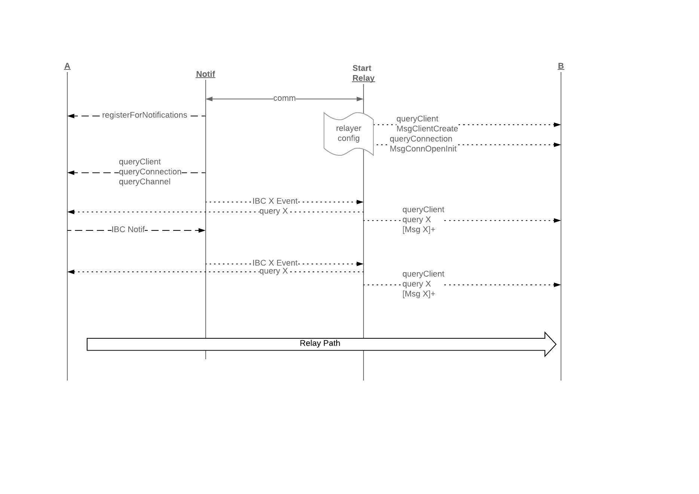
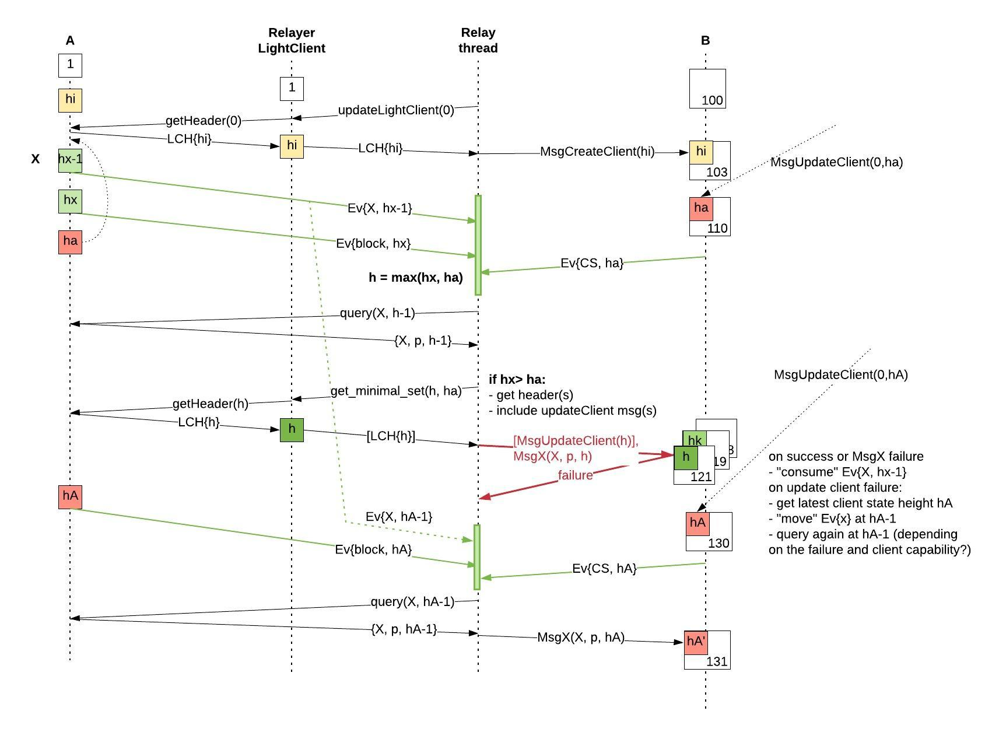

# ADR 002: IBC Relayer in Rust

## Changelog
* 2020-05-19: First draft. Accepted
* 2020-04-06: Configuration updates

## Definitions
These definitions are specific for this document and they may not be consistent with the IBC Specification.

IBC transaction - a transaction that includes IBC datagrams (including packets). This is constructed by the relayer and sent over the physical network to a chain according to the chain rules. For example, for tendermint chains a `broadcast_tx_commit` request is sent to a tendermint RPC server.

IBC datagram - is an element of the transaction payload sent by the relayer; it includes client, connection, channel and IBC packet data. Multiple IBC datagrams may be included in an IBC transaction.

IBC packet - a particular type of IBC datagram that includes the application packet and its commitment proof.

On-chain IBC Client (or IBC Client) - client code running on chain, typically only the light client verification related functionality.

Relayer Light Client - full light client functionality, including connecting to at least one provider (full node), storing and verifying headers, etc.

Source chain - the chain from which the relayer reads data to fill an IBC datagram.

Destination chain - the chain where the relayer submits transactions that include the IBC datagram.

A and B chains - for connection protocol, A is the "initiating" chain where `MsgConnectionOpenInit` is initially processed and eventually `MsgConnectionOpenAck`. B is the chain where `MsgConnectionOpenTry` and `MsgConnectionOpenConfirm` are processed.
Similar for channel handshake protocol.

## Context
A relayer is an off-chain process responsible for relaying IBC datagrams between two or more chains by scanning their states and submitting transactions. This is because in the IBC architecture, modules are not directly sending messages to each other over networking infrastructure, but instead they create and store the data to be retrieved and used by a relayer to build the IBC datagrams.

This document provides an initial Rust implementation specification of a relayer that interconnects Cosmos-SDK/ Tendermint chains.

The diagram below shows a high level view of the relayer and its interactions with the source and destination chains. The next sections go in more details of the different interactions.

.

## Assumptions and Dependencies
This section covers assumptions and dependencies about the chains and their IBC implementation. The first implementation focuses on and will only be tested with Cosmos-SDK/ Tendermint chains. In addition, functionality required by the relayer that is outside the scope of this document, and the availability of their implementations is considered.

#### Data Availability
The relayer monitors the chain state to determine when packet forwarding is required. The relayer must be able to retrieve the data within some time bound. This is referred to as **data availability**.

#### Data Legibility
IBC protocol defines the minimal data set that must be made available to relayers for correct operation of the protocol. The relayer expects the data to be legible, i.e. **data should be serialized** according to the IBC specification format; this includes consensus state, client, connection, channel, and packet information, and any auxiliary state structure necessary to construct proofs of inclusion or exclusion of particular key/value pairs in state.

#### Query Functionality
IBC host state machines MUST expose an interface for inspecting their state. For Cosmos/Tendermint chains this means:
- the IBC modules on chain correctly implement and respond to queries
  - [IBC-Modules-Rust] an implementation for some queries currently exist in Cosmos-SDK and same and more need to be implemented in Rust. The full requirements are detailed in section Relayer Queries.
- the relayer needs the ability to send rpc/http ABCI queries to and receive replies from Tendermint/Cosmos-SDK
  - [[ABCI Rust](https://github.com/tendermint/rust-abci)] - ABCI Rust implementation
  - [IBC-Modules-Rust] identifier validation is required (ICS-024)
  - [IBC-Modules-Rust] requires Rust types for all query responses
  - [[Merkle-Proofs-Rust](https://github.com/confio/ics23/tree/master/rust)] (candidate implementation) - some query responses include proofs and included in IBC transactions by the relayer (some may be validated, TBD)

#### IBC Messages
The relayer creates transactions that include IBC messages to manage clients, connections and channels, and send application packets to destination chains. These messages must be defined in the IBC Rust implementation [IBC-Modules-Rust].

#### IBC Logging System
IBC packet data & timeouts are not stored directly in the chain state (as this storage is presumed to be expensive) but are instead committed to with a succinct cryptographic commitment (only the commitment is stored).
As a consequence, IBC requires that a **host state machine MUST provide an event logging system** that logs data in the course of transaction execution. **Logs must be queryable** by relayers to read IBC packet data & timeouts.

The logging system must provide the following functions:
 - [IBC-Modules-Go] emitLogEntry for emitting log entries called by the state machine during transaction execution:
   - type emitLogEntry = (topic: string , data: []byte) => void
   - example: emitLogEntry("sendPacket", {sequence: packet.sequence , data: packet.data, timeout: packet.timeout})
 - [IBC-Modules-Go] queryByTopic for querying past logs matching a given topic:
   - type queryByTopic = (height: uint64 , topic: string) => Array < []byte >

#### Keyring
The relay process must have access to its accounts with tokens on all destination chains, with sufficient balance to pay for transaction fees. Account key information must be stored and managed securely. A keyring implementation is required for CRUD key operations.
[Keyring-Rust] Investigation in existing Rust implementations is needed. (ex: [hwchen-keyring](https://github.com/hwchen/keyring-rs))

### Chain Transactions and Signing
The relayer must create chain specific signed transactions.
[Cosmos-Tx-Rust] For the first release Cosmos-SDK transaction signing is required. One possible implementation is [iqlusion's sdtx crate](https://github.com/iqlusioninc/crates/tree/main/stdtx)

#### Implementation of IBC "routing module"
The default IBC handler uses a receiver call pattern, where modules must individually call the IBC handler in order to bind to
ports, start handshakes, accept handshakes, send and receive packets, etc. While this provides flexibility for modules, it imposes extra work on the part of the relayer processes that now needs to track the state of multiple modules. The IBC specification describes an IBC “routing module” to route packets, and simplify the task of relayers. This routing module accepts external datagrams and calls into the IBC handler to deal with handshakes and packet relay. The routing module keeps a lookup table of modules, which it can use to look up and call a module when a packet is received, so that external relayers need only ever relay packets to the routing module.
[IBC-Routing-Module-Go] Initial version of the relayer assumes that chains implement the "routing module"

#### Batching
The relayer may batch IBC datagrams in a single transaction if supported by destination chain and allowed by configuration. In this case the relayer can  amortise any overhead costs (e.g. signature checks for fee payment).
Initial version of the relayer assumes batching is supported by all chains. An option may be later included in the configuration file.

## Relayer Requirements

A correct relayer MUST:

- **[R-config-start]** Read, parse, validate a configuration file upon start and configure itself for the specified chains and paths
- **[R-transport]** Have access to the networking protocols (e.g. TCP/IP, UDP/IP, or QUIC/IP) and physical transport, required to read the state of one blockchain/ machine and submit data to another
- **[R-provider]** Maintain transport connections to at least one full node per chain
- **[R-query]** Query IBC data on source and destination chains
- **[R-light-client]** Run light clients for source chains and
- **[R-IBC-client]** create and update IBC clients on destination chains
- **[R-accounts]** Own accounts on destination chains with sufficient balance to pay for transaction fees
- **[R-transact]** Create, sign and forward IBC datagram transactions
- **[R-relay]** Perform correct relaying of all required messages, according to the IBC sub-protocol constraints
- **[R-restart]** Resume correct functionality after restarts
- **[R-upgrade]** Resume correct functionality after upgrades
- **[R-proofs]** Perform proof verification (as it will be done on the destination chain) and not forward messages where proof verification fails

The relayer MAY:
- **[R-config-cli]** Provide ways to change configuration at runtime
- **[R-bisection]** Perform bisection to optimize transaction costs and computation on destination chains
- **[R-relay-prio]** Filter or order transactions based on some criteria (e.g. in accordance with the fee payment model)

## Implementation
The initial implementation will heavily borrow from the Go relayer implementation that uses a "naive" algorithm for relaying messages. The structure of the configuration file is similar with the one in Go (see [Go-Relayer](https://github.com/cosmos/relayer))

### Configuration

> WIP

Upon start the relayer reads a configuration file that includes global and per chain parameters. The file format is .toml
Below is an example of a configuration file.

```toml
[global]
log_level = "error"

[mode]

[mode.clients]
enabled = true
refresh = true
misbehaviour = true

[mode.connections]
enabled = false

[mode.channels]
enabled = false

[mode.packets]
enabled = true
clear_interval = 100
clear_on_start = true
tx_confirmation = true

[[chains]]
  id = "chain_A"
  rpc_addr = "http://localhost:26657"
  grpc_addr = "http://localhost:9090"
  websocket_addr = "ws://localhost:26657/websocket"
  rpc_timeout = "10s"
  account_prefix = "cosmos"
  key_name = "testkey"
  store_prefix = "ibc"
  client_ids = ["clA1", "clA2"]
  gas = 200000
  gas_adjustement = 1.3
  gas_price = "0.025stake"
  trusting_period = "336h"

[[chains]]
  id = "chain_B"
  rpc_addr = "http://localhost:26557"
  grpc_addr = "http://localhost:9091"
  websocket_addr = "ws://localhost:26557/websocket"
  rpc_timeout = "10s"
  account_prefix = "cosmos"
  key_name = "testkey"
  store_prefix = "ibc"
  client_ids = ["clB1"]
  gas = 200000
  gas_adjustement = 1.3
  gas_price = "0.025stake"
  trusting_period = "336h"

```
The main sections of the configuration file are:
- `global`:
Relaying is done periodically and the frequency is dictated by the `timeout` parameter. The `strategy` parameter configures the relayer to run a particular relaying algorithm.
- `chains`:
Chain level information including account and key name, gas information, trusting period, etc. All source and destination chains must be listed here.
- paths (`connections`, `connections.paths`):
The relayer may be configured to relay between some application ports, over a number of connections and channels, in unidirectional or bidirectional mode.

### Initialization

The relayer performs initialization based on the content of the configuration file:
- the file is parsed and semantically validated
- the chains, connections, ports, channels for which relaying is enabled are stored in the Config structure

```rust
pub struct Config {
    pub global: GlobalConfig,
    pub chains: Vec<ChainConfig>,
    pub connections: Option<Vec<Connection>>,
}

pub struct GlobalConfig {
    /// All valid log levels, as defined in tracing:
    /// https://docs.rs/tracing-core/0.1.17/tracing_core/struct.Level.html
    pub log_level: String,
}

pub struct ChainConfig {
    pub id: ChainId,
    pub rpc_addr: tendermint_rpc::Url,
    pub websocket_addr: tendermint_rpc::Url,
    pub grpc_addr: tendermint_rpc::Url,
    pub rpc_timeout: Duration,
    pub account_prefix: String,
    pub key_name: String,
    pub client_ids: Vec<String>,
    pub gas: u64,
    pub trusting_period: Duration,
}

pub struct Connection {
    pub src: Option<ConnectionEnd>,    // use any source
    pub dest: Option<ConnectionEnd>,   // use any destination
    pub paths: Option<Vec<RelayPath>>, // use any port, direction bidirectional
}

pub struct ConnectionEnd {
    pub client_id: String,
    pub connection_id: Option<String>, // use all connections to this client
}

pub enum Direction {
    Unidirectional,
    Bidirectional,
}

pub struct RelayPath {
    pub src_port: Option<String>,  // default from any source port
    pub dest_port: Option<String>, // default from any dest port
    pub src_channel: Option<String>,  // default from any source port
    pub dest_channel: Option<String>, // default from any dest port
    pub direction: Direction, // default bidirectional
}
```
All `Option` fields with `None` values mean "any" values. For `direction`, default is bidirectional.
All non-`Option` fields are mandatory and must appear in the configuration file.
If the relayer is started with an invalid configuration file, an error is displayed and the realyer process exits.

### Relayer Commands

#### Validate
To validate a configuration file:

`relayer -c <config_file> config validate `

The command verifies that the specified configuration file parses and it is semantically correct.

#### Start
To start the relayer:

`relayer -c <config_file> start`

The command performs the validation as described above and then starts the relayer.

#### Query
Most of the queries performed while relaying are also available from the CLI.

`relayer -c <config_file> query client state <chain> <client_id> [-h <chain_height>] [-p <proof_required>]`

The command queries the full client state of `<client_id>` on `<chain>` at `<height>`, with or without proof depending on the `<proof_required>` flag. Default `<height>` is latest state and `<proof_required>` is `true`.

`relayer -c <config_file> query client consensus <chain> <client_id> <consensus_height> [-h <chain_height>] [-p <proof_required>]`

The command queries the consensus state of `<client_id>` at height `<consensus_height>` on `<chain>` at `<height>`, with or without proof depending on the `<proof_required>` flag. Default `<height>` is latest state and `<proof_required>` is `true`.

### Relayer Queries
The relayer queries chain state in order to build the IBC messages. It is expected that each chain type provides implementations of these queries. Initial Rust relayer implementation will be tested with Cosmos-SDK/Tendermint chains, and while some of the IBC-Modules functionality in Rust is not required (e.g. handler functions), a "query" crate should be available for the relayer.
For tendermint, the queries use the `abci.RequestQuery` over rpc/http to retrieve the data.

The format of the public/ provable state query parameters and responses is chain independent and should also be defined in this crate.

The following queries are required:

- `query_store_prefix(chain)` - returns the commitment prefix of the chain (returns chain specific []byte, e.g. `ibc` for tendermint)
- `query_all_client_states(chain)` - returns the IBC light clients instantiated on the chain
- `query_client_consensus_state(chain, clientID, height)` - returns the consensus state proof for a light client at a given height if height > 0, else it returns the latest height
- `query_connections(chain)` - returns all connections created on the chain
- `query_client_connections(chain, clientID)` - returns all connections associated with a light client
- ...more to be added

### Relayer Concurrency Architecture
The following threads are spawned and execute within the relayer process:
- one Tendermint full light client thread, per configured configured source chain. For example if A->C and B->C paths are enabled then there will be two light client threads, one for A and one for B. These threads download light client headers (block header and commits), verify them and store them as trusted headers in the per chain stores.
- one thread for the main relaying functionality, aka relay thread.
- one thread to relay notifications from source chain and to generate IBC events to the relay thread.

The figure below shows the interactions for the last two threads.


On start:
1. Communication (channel ?) between the relay and the notification threads is established.
2. The notification thread registers for IBC events.
3. The relay thread creates the IBC datagrams for A, for all configuration triggered events, for clients `MsgCreateClient`, `MsgUpdateClient` and
4. for connections and channels, i.e. `MsgConnOpenInit` and `MsgChannOpenInit` are sent to chains to initiate connection and channel handshake if required. It then waits for events from the notification thread.
5. The notification thread queries the source chain A at latest height and
6. sends IBC events to the relay thread. Then it waits for notifications from A.
7. For each event related to X (connection, channel or packets), the relay thread queries the client and X state on destination B, and
8. the X state on source chain A.
9. With the information collected in previous steps, the relay thread creates a buffer of messages destined to destination B.
10. When the notification thread receives an IBC notification for X it sends it to the relay thread.
11. Steps 11-14 are the same as 6-9 above.

Initial version will have a single relay thread for all configured paths. Temporary threads may be created for the source and destination queries required.
Future versions may create multiple relay threads. One possibility is to create one for each destination chain Z, responsible for relaying over *->Z paths. Or have a thread pool, selecting an available thread for relaying to a given destination. The notification thread will route the IBC events to the proper thread. Multiple notification threads, e.g. per source, should also be considered.

### Relayer Algorithm

A relayer algorithm is described in [relayer algorithm described in IBC Specification](https://github.com/cosmos/ibc/tree/main/spec/relayer/ics-018-relayer-algorithms/README.md#L47) and [Go relayer implementation ](https://github.com/cosmos/relayer/blob/f3a302df9e6e0c28883f5480199d3190821bcc06/relayer/strategies.go#L49.).

This section describes some of the details of the really thread algorithm in the Rust implementation. Inputs are the IBC Events and the events of interest are described in Appendix A.

At high level, for each event from a source chain, the relayer:
- queries client, connection, channels and/or packet related state on source and destination chains,
- creates new datagrams if needed,
- batches multiple datagrams in single transaction,
- signs and submits these transactions to the destination.

#### Proofs
The relayer must include proofs in some datagrams as required by the IBC handlers. There are two types of proofs:
- proof of some local state on source chain (A). For example, a proof of correct connection state (`ProofInit`, `ProofTry`, `ProofAck`) is included in some of the connection handshake datagrams. The `ConnOpenTry` message includes the `ProofInit` that is obtained from chain A where the connection should be in `INIT` state and have certain local and counterparty identifiers. The message specific sections below go in more details.
- proof that the chain A's IBC client `clB` is updated with a consensus state and height that have been stored on chain B.
- these proofs are verified on chain B against the consensus state stored by the A client at `proof_height`.

Notes:
The proof checks require the handlers on B to recreate the state as expected on chain A and to verify the proof against this. For this to work the store prefix of A needs to be added as prefix to the proof path (standardized in ICS 24). There is currently no query endpoint for this in Cosmos-SDK/Tendermint and initial relayer version includes a per chain store prefix in the configuration.
The verification on B requires the presence of a consensus state for client A at same height as `proof_height`.

#### Light Client Messages
After initialization, relayer light clients are created on the destination chains if not already present.
For a successful A->B relay of IBC packets IBC clients must be instantiated on both source and destination chains, potentially by different relayers. The client creation is permissionless and a relayer may create a client if not already present.
```rust
let msg = MsgCreateClient::new(client_id, header, trusting_period, bonding_period, signer);
```

The relayer runs its own light client thread for A that periodically retrieves and verifies headers. The relay thread uses the stored headers to update the A-client on chain B with new headers as required.
```rust
let msg = MsgUpdateClient::new(client_id, header, signer);
```
It is possible that the relay thread needs a more recent trusted header and in this case it would need a mechanism to signal the client thread to retrieve this header.
Since the relayer must pay for all transactions, including `MsgClientCreate` and `MsgClientUpdate`, there are incentives for optimizations.
For example, light client implementation of Tendermint supports bisection and the relayer may choose to send skipping headers to A-client on B, periodically or when required by new IBC datagrams.

#### IBC Client Consensus State vs Relayer Light Client States vs Chain states
A number of IBC datagrams contain proofs obtained from chain A at a some height `h`. A proof needs to be verified on B against the commitment root for `h` which, for Tendermint clients, is included in the client consensus state at `h+1`. This is because for Tendermint chains the application Hash after applying all transactions in block `n` is included in block at height `n+1`.

The relayer therefore needs to ensure that the consensus state at `proof_height+1` exists on chain B.

One proposal is shown below and described in the rest of this section.


The relayer creates a light client on B with `hi` and then updates it as required by processing different IBC events. Let `ha'` be the last consensus state for client on B.
When some IBC event for X (connection, channel or packet) is received, it includes the height, let it be `hx-1` at which the event occurred on A.
According to the proposal here, the relayer should:
- get the latest consensus state height of client on B, `ha`
- let `h = max(hx, ha)`
- query for item X at height `h-1` and get a proof `p` at this height
- wait for the block at height `hx` to be received, i.e. `Ev{block, hx}`
- get the minimal set of headers from the light client such that `h` verifies against `ha`
- send zero or more `MsgUpdateClient` datagrams and the `MsgX{X, p, h}` in a transaction to B
- if the transaction is successful or `MsgX..` failed, then "consume" the `Ev{X,..}`
  - if `MsgX` fails there is nothing that can be done, another relayer must have submitted first
- else raise again the event at `hA-1` if one not already there
- the effect of this is that a new query is made at `hA-1` and since the consensus state at `hA` exists on B, only `MsgX` needs to be sent out

#### Connection Messages
The relayer queries the source and destination chains of the relaying paths in order to determine if connection handshake datagrams should be sent to destination chains.

##### Connection Query
The following structures pertain to connection queries and should be detailed in [IBC-Modules-Rust-ADR].
The structures are shown here for reference.

```rust
pub struct Counterparty {
    pub client_id:      ClientId,
    pub connection_id:  ConnectionId,
    pub prefix:         CommitmentRoot,
}

pub struct ConnectionEnd {
    pub state:          ConnectionState,
    pub Id:             ConnectionId,
    pub client_id:      ClientId,
    pub counterparty:   Counterparty,
    pub versions:       Vec<String>
}

pub enum ConnectionState {
    "UNINIT",
    "INIT",
    "TRYOPEN",
    "OPEN",
}

// ConnectionResponse defines the query response for a connection.
// It includes the proof and the height at which the proof was retrieved.
pub struct ConnectionResponse {
    pub connection:     ConnectionEnd,
    pub proof:          Option<CommitmentProof>,
    pub proof_path:     CommitmentPath,
    pub proof_height:   Height,
}
```

#### Connection Relaying

The figure below shows the four connection handshake message types that can be created during a relay cycle (see the Relayer box and the four actions). For each message the queries (light grey arrows) and expected states on `A` and `B` are shown. For example, if the connection on A is in `OPEN` state and on B in `TRYOPEN`, the relayer will send a transaction to B including the `ConnOpenConfirm` datagram. Once processed on B, the state of connection changes from `TRYOPEN` to `OPEN`.


##### MsgConnectionOpenInit
The `MsgConnectionOpenInit` message is used to initialize a connection. This is done when the relay thread starts, after loading the configuration that includes the connection information and before entering its event loop. In this section it is assumed the message is relayed to A.
```rust
pub struct MsgConnectionOpenInit {
    pub connection_id:  ConnectionId, // connAtoB
    pub client_id:      ClientId,     // clB
    pub counterparty:   Counterparty, // {ClientID: clA, ConnectionID: connBtoA, Prefix: "B_store">
    pub signer:         AccAddress
}
```
The comments show the values of the fields for the diagram above.

The relayer creates and forwards this message only if it has been explicitly configured with the connection information (see `connections.src` and `connections.dest`sections of the configuration file).

In order to create a `MsgConnectionOpenInit` the relayer recreates the `ConnectionEnd` from the configuration, as it will be stored on A. The steps are:
- create the `ConnectionEnd` for the B->A path
```rust
 let connection_a = getConfiguredConnection(A, B, ..);
```
- query connection state on chain A and if it already exist then continue with next event
```rust
let existing_a = ibc_query_connection(chainA, connection_a);
if existing_a.state != "UNINIT" {
  continue;
}
```
- create the message
```rust
let init_msg = MsgConnectionOpenInit {
    connection_id:  connection_a.connection_id,
    client_id:      connection_a.client_id,
    counterparty:   Counterparty {
                      ClientID:       connection_a.counterparty.client_id,
                      connection_id:  connection_a.counterparty.connection_id,
                      prefix:         config(B).store_prefix,
                    }
    Signer:         config(A).signer,
}
```
- send `init_msg` in a transaction to B

##### MsgConnectionOpenTry
The `MsgConnectionOpenTry` defines the message sent by the relayer to try to open a connection. In this section it is assumed to be relayed to B.

```rust
pub struct MsgConnectionOpenTry {
    pub connection_id:    ConnectionId, // connBtoA
    pub client_id:        ClientId,     // clA
    pub counterparty:     Counterparty, // {ClientID: clB, ConnectionID: connAtoB, Prefix: "A_store">
    pub counterparty_versions:   Vec<String>,
    pub proof_init:       CommitmentProof, // proof that connAtoB connection end is stored on Chain A
    pub proof_consensus:  CommitmentProof, // proof that on A at proof_height (hA), the B client has
                                           // stored B's consensus state at consensus_height (hB)
    pub proof_height:     Height,          // hA, height of A at which relayer retrieved proof_init
    pub consensus_height: Height,          // hB
    pub signer:           AccAddress,
}
```
The comments show the values of the fields for the diagram above.
Note:
- `proof_height` is the height of chain A when relayer created the `proof_init`, hA in the diagram.
- `consensus_height` is the latest height of chain B that chain A has stored in its client `clB` at the time the relayer queried that client, `hB` in the diagram

The relayer creates a `MsgConnectionOpenTry` for the A->B relay path when an IBC event notification is received.
The steps are:
- let `connAtoB` be the connection identifier on A,`hx` the height when the event occurred and `clA` the client ID of A on B
- query last client state height on B
```rust
let ha_prime = ibc_query_client_state(chainB, 0).height;
```
- create `UpdateClientMsg`(s) for `clA` on chain B if required (i.e. if `hx` is higher than latest height of `clA` on B)
```rust
 let h = max(hx, ha_prime);
 let headers = get_minimal_set(h, ha_prime);
 let client_msgs = updateClientMsgs(clA, headers, signer);
```
- send `client_msgs` to B
- query latest height `ha` of A and wait for `ha > h` (Rust TODO)
- query connection with proof at `h` on chain A and if it is not in proper state then continue with the next event
```rust
 let query_response = ibc_query_connection_with_proof(chainA, connAtoB, h);
 if query_response.connection.state != "INIT" {
   continue;
 }
 let connection_a = query_response.connection;
 let proof_init = query_response.proof;
 let proof_height := query_response.proof_height;
 assert(proof_height = h);
```
- query the consensus state stored by client `clB` on A
```rust
 let consensus_response = ibc_query_consensus_with_proof(chainA, connection_a.client_id);
 let proof_consensus = consensus_response.proof;
 let consensus_height = consensus_response.proof_height;
```
- create the `MsgConnectionOpenTry` message with the information collected above.
```rust
let try_msg = MsgConnectionOpenTry {
    connection_id:  connBtoA,
    client_id:      clA,
    counterparty:   Counterparty{
                      client_id:       connection_a.client_id,
                      connection_id:   connAtoB,
                      prefix:          config(A).store_prefix,
                    }
    proof_init,
    proof_consensus,
    proof_height,
    consensus_height,
    signer:                 config.B.Signer(),
}
```
- send `try_msg` to B

When `MsgConnectionOpenTry` is processed on B, the message handler:
- checks that `consensus_height` is valid (smaller or equal than chain B's current height) and within trusting period,
- client `clA` verifies `proof_consensus` for B's consensus state at `consensus_height` and
- client `clA` verifies `proof_init` for the `ConnectionEnd`object that B expects to be present on A at `proof_height`.
The relayer may also perform these verifications before submitting the transaction.

##### MsgConnectionOpenAck
(WIP) - needs to be updated with correct query sequence

`MsgConnectionOpenAck` defines the message sent by the relayer to chain A to acknowledge the change of connection state to `TRYOPEN` on Chain B.

```rust
pub struct MsgConnectionOpenAck {
    pub connection_id:      ConnectionId,   // connAtoB
    pub proof_try:          CommitmentProof, // proof that connBtoA on Chain B is in TRYOPEN state
    pub proof_consensus:    CommitmentProof, // proof that on B at proof_height (hB), the A client has
                                           // stored A's consensus state at consensus_height (hA)
    pub proof_height:     Height,          // hB, height of B at which relayer retrieved proof_try
    pub consensus_height: Height,          // hA
    pub versions:   <String>,
    pub signer:           AccAddress,
}
```
The comments show the values of the fields for the diagram above.
Note:
- `proof_height` is the height of chain B when relayer created the `proof_try`, hB in the diagram.
- `consensus_height` is the latest height of chain A that chain B has stored in its client `clA` at the time the relayer queried that client, `hA` in the diagram

The relayer creates a `MsgConnectionOpenAck` for the B->A relay path when an IBC event notification is received or when chain B is scanned. The steps are:
- let `connBtoA` be the connection identifier on B
- query connection with proof on chain B and if it is not in proper state then continue with next event
```rust
 let query_response = ibc_query_connection_with_proof(chainB, connBtoA);
 if query_response.connection.state != "TRYOPEN" {
   continue;
 }
 let connection_b = query_response.connection;
 let proof_try = query_response.proof;
 let proof_height := query_response.proof_height;
```
- query connection on chain A and validate its state:
```rust
 let connAtoB = connection_b.counterparty.connection_id;
 let connection_a = ibc_query_connection(chainA, connAtoB);
 if connection_a.state != "INIT"  && connection_a.state != "TRYOPEN" {
   continue;
 }
```
- create `UpdateClientMsg` for `clB` on chain A if required (i.e. if `proof_height` is higher than latest height of `clB` on A)
```rust
 let client_msg = MsgUpdateClient::new(connection_a.client_id, header, signer);
```
- query the consensus state stored by client `clA` on B:
```rust
 let consensus_response = ibc_query_consensus_with_proof(chainB, connection_b.client_id);
 let proof_consensus = consensus_response.proof;
 let consensus_height = consensus_response.proof_height;
```
- create the `MsgConnectionOpenAck` message with the information collected above
```rust
let ack_msg = MsgConnectionOpenAck {
    connection_id:  connAtoB,
    proof_try,
    proof_consensus,
    proof_height,
    consensus_height,
    signer:         config.A.Signer(),
}
```
- send `client_msg` and `ack_msg` in a transaction to A

##### MsgConnectionOpenConfirm
(WIP) - needs to be updated with correct query sequence

`MsgConnectionOpenConfirm` defines the message sent by the relayer to chain B to confirm the opening of a connection on chain A.

```rust
pub struct MsgConnectionOpenConfirm {
    pub connection_id:      ConnectionId,   // connBtoA
    pub proof_confirm:      CommitmentProof,// proof that connAtoB on chain A is in OPEN state
    pub proof_height:       Height,         // hA, height of A at which relayer retrieved the proof_confirm
    pub signer:           AccAddress,
}
```

The relayer creates a `MsgConnectionOpenConfirm` for the A->B relay path when an IBC event notification is received or when chain A is scanned. The steps are:
- let `connAtoB` be the connection identifier on A
- query connection with proof on chain A and if it is not in proper state then continue with next event
```rust
 let query_response = ibc_query_connection_with_proof(chainA, connAtoB);
 if query_response.connection.state != "OPEN" {
   continue;
 }
 let connection_a = query_response.connection;
 let proof_confirm = query_response.proof;
 let proof_height = query_response.proof_height;
```
- query connection on chain B and validate its state:
```rust
 let connBtoA = connection_a.counterparty.connection_id;
 let connection_b = ibc_query_connection(chainB, connBtoA);
 if connection_b.state != "INIT"  && connection_b.state != "TRYOPEN" {
   continue;
 }
```
- create `UpdateClientMsg` for `clA` on chain B if required (i.e. if `proof_height` is higher than latest height of `clA` on B)
```rust
 let client_msg = MsgUpdateClient::new(connection_b.client_id, header, config.B.Signer());
```
- create the `MsgConnectionOpenConfirm` message with the information collected above
```rust
let confirm_msg = MsgConnectionOpenAck {
    connection_id:  connBtoA,
    proof_confirm,
    proof_height,
    signer:         config.B.Signer(),
}
```
- send `client_msg` and `confirm_msg` in a transaction to A

#### Channels
(WIP)
The channel handshake messages are relayed in a similar way as the connection ones. In addition, checks on the state of the underlying connection is performed.

#### Packet, Timeouts and Acknowledgments
(WIP)
Application packets are not stored in the chain state, only a cryptographic commitment is stored.
The relayer has to query the chain's logging system to get the packet data for a given source port and channel.
The result of the query includes among others:
 - the source port and channel identifiers
 - the sequence number
These are used to create the packet's commitment path which is then used in a state query to get the packet commitment.

## Inter-relayer Coordination
Multiple relayers may run in parallel and, while it is expected that they relay over disjoint paths, it could be the case that they may submit same transactions to a chain. In this case only the first transaction succeeds while subsequent fail causing loss of fees. Ideally some coordination would be in place to avoid this but this is out of scope of this document.

## Relayer Restarts and Upgrades

## Decision

> This section explains all of the details of the proposed solution, including implementation details.
It should also describe affects / corollary items that may need to be changed as a part of this.
If the proposed change will be large, please also indicate a way to do the change to maximize ease of review.
(e.g. the optimal split of things to do between separate PR's)

## Status

> A decision may be "proposed" if it hasn't been agreed upon yet, or "accepted" once it is agreed upon. If a later ADR changes or reverses a decision, it may be marked as "deprecated" or "superseded" with a reference to its replacement.

{Deprecated|Proposed|Accepted}

## Consequences

> This section describes the consequences, after applying the decision. All consequences should be summarized here, not just the "positive" ones.

### Positive

### Negative

### Neutral

### Appendix A
The IBC Events, input to the relay thread are described here.

```
{"create_client": {
   "client_id": <clientID>,
   "client_type": <clientType>,
  }
}

{"update_client": {
   "client_id": <clientID>,
   "client_type": <clientType>,
  }
}

{"connection_open_init": {
    "connection_id": <connectionID>,
    "client_id": <clientID>,
    "counterparty_connection_id": <connectionID>,
    "counterparty_client_id": <clientID>,
 }
}

{}"connection_open_try": {
    "connection_id": <connectionID>,
    "client_id": <clientID>,
    "counterparty_connection_id": <connectionID>,
    "counterparty_client_id": <clientID>,
 }
}

{"connection_open_ack": {
    "connection_id": <connectionID>,
 }
}

{"connection_open_confirm": {
    "connection_id": <connectionID>,
 }
}

{"channel_open_init": {
    "port_id": <portID>,
    "channel_id": <channelID>,
    "counterparty_port_id": <portID>,
    "counterparty_channel_id": <channelID>,
    "connection_id": <connectionID>,
 }
}

{"channel_open_try": {
    "port_id": <portID>,
    "channel_id": <channelID>,
    "counterparty_port_id": <portID>,
    "counterparty_channel_id": <channelID>,
    "connection_id": <connectionID>,
 }
}

{"channel_open_ack": {
    "port_id": <portID>,
    "channel_id": <channelID>,
 }
}

{"channel_open_confirm": {
    "port_id": <portID>,
    "channel_id": <channelID>,
 }
}

{"channel_close_init": {
    "port_id": <portID>,
    "channel_id": <channelID>,
 }
}

{"channel_close_confirm": {
    "port_id": <portID>,
    "channel_id": <channelID>,
 }
}

{"send_packet": {
    "packet_data": String,
    "packet_timeout_height": String,
    "packet_timeout_timestamp": String,
    "packet_sequence": String,
    "packet_src_port": <portID>,
    "packet_src_channel": <channelID>,
    "packet_dst_port": <portID>,
    "packet_dst_channel": <channelID>,
}

{"recv_packet": {
    "packet_data": String,
    "packet_ack": String,
    "packet_timeout_height": String,
    "packet_timeout_timestamp": String,
    "packet_sequence": String,
    "packet_src_port": <portID>,
    "packet_src_channel": <channelID>,
    "packet_dst_port": <portID>,
    "packet_dst_channel": <channelID>,
}
```

## References

> Are there any relevant PR comments, issues that led up to this, or articles referenced for why we made the given design choice? If so link them here!

* {reference link}
