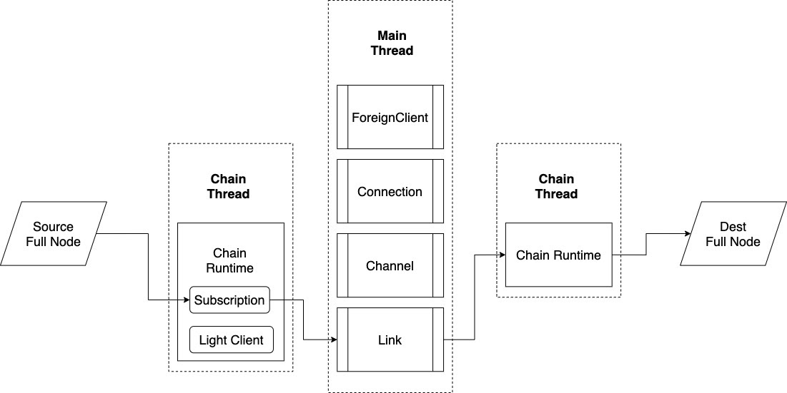
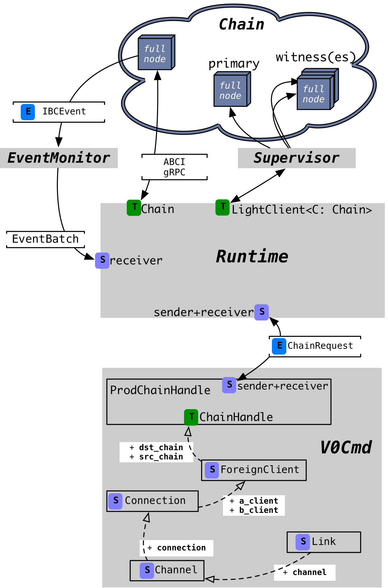

# ADR 005: Relayer v0.1 implementation

## Changelog

* 04.01.2020: First draft proposed.
* 09.02.2020: Revised, fixed todos, reviewed.

## Context

This ADR documents the implementation of the `v0.1` [relayer lib crate]
[ibc-relayer].
This library is instantiated in the [Hermes][hermes] binary of the 
[ibc-relayer-cli crate][ibc-relayer-cli] (which is not the focus of this discussion).

As a main design goal, `v0.1` is meant to lay a foundation upon which we can 
add more features and enhancements incrementally with later relayer versions.
This is to say that `v0.1` may be deficient in terms of features or 
robustness, and rather aims to be simple, adaptable, and extensible.
For this reason, we primarily discuss aspects of concurrency and architecture.


### Relayer versioning scheme

On the mid-term, the relayer architecture is set out to evolve across three 
versions.

The first of these, `v0.1`, makes several simplifying assumptions 
about the environment of the relayer and its features. These assumptions 
are important towards limiting the scope that `v0.1` aims to 
cover, and allowing a focus on the architecture and concurrency model to 
provide for growth in the future.

These assumptions are documented below in the [decision](#decision) section.

## Decision


### Configuration

For the most part, the relayer configuration will be 
static: the configuration for chains and their respective objects (clients, 
connections, or channels) will be fully specified in the relayer 
configuration file and will not change throughout execution.
Light clients are also statically defined in the config file, and cannot be 
switched dynamically at runtime.

Recent changes to the ICS protocol specifies identifier 
selection for clients, connections, and channels to be [deterministic][ids].
For this reason, we will not need to specify any identifiers in the 
configuration file.
We only specify which pairs of chains should communicate with one 
another, and the port identifier to use for that purpose.
This pair of chains plus their corresponding port identifiers is called a 
__relaying path__.
Any relaying path is unidirectional.

An example with the relevant section of the configuration file follows.

```toml
[[connections]]
a_chain = 'ibc-0'
b_chain = 'ibc-1'

[[connections.paths]]
a_port = 'transfer'
b_port = 'transfer'
```

Here there are two chains, ith one connection between them, and a path for 
relaying on the port called `transfer` on both chains, from chain `ibc-0` 
to `ibc-1`.

### Links

A [link][link] is a relayer-level protocol that implements packet relay across 
one relaying path.
The relayer at `v0.1` will focus on a single link.
This limitation will be lifted in subsequent versions.

### Chain State

Each chain is assumed to start with an empty IBC state.
This means that the relayer will take care of creating the client, 
connection, and channel objects respectively on each side of a link.

### Proof Verification

The `v0.1` relayer will _not_ do proof verification.

### Feature set

The [complete list of features is documented elsewhere][features] in detail.

## Relayer Concurrency Model

Relayer `v0.1` works under the assumption that there are no competing relayers 
running concurrently (which may interfere with each other). 
Furthermore, as stated above, the relayer will handle a single link (one 
packet relaying direction from a source chain to a destination chain).
The following diagram sketches the relayer domain decomposition at a 
high-level, with a focus on one link.




The relayer supports a single stack made of a connection, a channel, and a link.

The application thread that runs upon starting creates a link associated 
with the relaying path.
It also triggers messages for creating all objects (clients, a connection, 
and a channel) underlying this link.
These will cause the relayer to build and send all messages associated with 
the handshakes for these objects, plus a retry mechanism.
It should work even these events are received by the link in the same time 
with the live chain IBC events.
In other words, no synchronization with starts of other threads should be 
required.

Beside the application thread, the relayer maintains one or more threads 
for each chain.
The number of threads per chain is chain-specific:
- For the production chain [Gaia][gaia] (see also the [References]
  (#references) below), there are three separate 
  threads, described in more detail in the [architecture](#architecture) 
  section.
- For the mock chain ([Mock](#references)), there is one thread.

The link runs in the main application thread. This consumes events 
from the chains, performs queries and sends transactions synchronously.


#### Architecture

The following diagram provides more detail into how the relayer is 
structured.
Here the focus is on the interfaces within the relayer, as well as the 
interface between the relayer and a single chain.



##### Legend

Some of the notation from this figure has the following meaning.

| Notation | Description | Examples |
| ------ | ----------- | ----------- |
| `E` | Enum: typically messages between threads | `ChainRequest`; `IBCEvent` |
| `S` | Struct: a processing element | `ForeignClient`; `Connection` |
| `T` | Trait: typically  interface between threads | `Chain`; `LightClient<C: Chain>` |

##### Levels of abstraction

At the top of this diagram, there is a chain consisting of multiple full nodes.
The deeper (i.e., lower) we go into this sketch, the closer we get to the user, or 
Hermes (the relayer CLI).
To understand the relayer architecture intuitively, we can break down the 
levels of abstraction as follows:

###### 1. The actual chain, comprising a number of full nodes
- This is the lowest level of abstraction, the farthest away from relayer 
     users
- The relayer communicates with a chain via three interfaces: 
    - (i) the `LightClient` trait (handled via the supervisor for the 
      production chain),
    - (ii) the `Chain` trait (where the communication happens over the 
  ABCI/gRPC interface primarily), and 
    - (iii) an `EventMonitor` which subscribes to a full node, and carries batches 
  of events from that node to the chain runtime in the relayer. Currently, 
  the relayer registers for `Tx` and `Block` notifications. It then extracts 
  the IBC events from the `Tx` and generates a `NewBlock` event also for the
  block. Note that a notification may include multiple IBC Events.
     
###### 2. The chain runtime

- This is an intermediary layer, sitting between the relayer application and 
  any chain(s);
- The runtime is universal for all possible chains, i.e., does _not_ contain any 
     chain-specific code;
- Accepts as input requests from the application (Hermes, the CLI), in the form of 
     [`ChainRequest`][chain-req] via a crossbeam channel
- Responds to the application via a crossbeam channel
- Has objects which implement the three interfaces named above 
  (`LightClient`, `Chain`, and `EventMonitor`) and orchestrates access to 
  these objects as required by application requests

###### 3. The relayer application

- Communicates with the runtime via a `ChainHandle`, which contains the 
      appropriate crossbeam sender and receiver channels to/from the runtime
- Upon start-up, instantiates relayer-level objects in the following order: 
  two `ForeignClient`s (one per chain), a `Connection` (which contains the 
  two clients), a `Channel` (containing the connection), and on top of that 
  a `Link`.
- The code here is part of the Hermes (relayer CLI) binary.

##### Threads

Each thread in this diagram is a separate box shaded in gray.
There are four threads running: the `EventMonitor`, the `Supervisor`, the 
`Runtime`, and the main application thread, called `V0Cmd`.

## Status

Accepted

## Consequences

### Positive
- prepares the relayer crate for incremental growth

### Negative

### Neutral

## References:

- __Gaia__: the correct Gaia instance for working with `v0.1` can be obtained 
  from https://github.com/cosmos/relayer, with `git checkout v4.0.0` by 
  executing `make build-gaia`. This
  [comment](https://github.com/informalsystems/hermes/pull/449#issuecomment-750248113)
  provides additional insights into development-time relayer `v0.1` environment.

- __Mock__: Has been removed after splitting the ibc-rs repository


[ids]: https://github.com/cosmos/cosmos-sdk/pull/7993
[link]: https://github.com/informalsystems/hermes/blob/master/docs/architecture/adr-004-relayer-domain-decomposition.md#link
[chain-req]: https://github.com/informalsystems/hermes/blob/379dd9812f6e7a42b9428f64eb52fe292d417476/relayer/src/chain/handle.rs#L51
[ibc-relayer]: https://github.com/informalsystems/hermes/tree/master/crates/relayer
[ibc-relayer-cli]: https://github.com/informalsystems/hermes/tree/master/crates/relayer-cli
[hermes]: https://hermes.informal.systems
[features]: https://github.com/informalsystems/hermes/blob/v0.1.0/guide/src/feature_matrix.md
