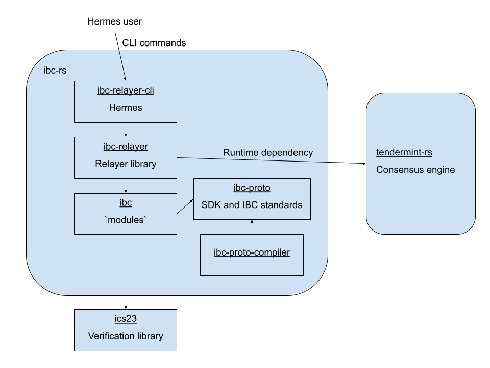

# Architecture

This document describes the architecture of `ibc-rs`. If you're looking for a high-level overview of the code base, you've come to the right place!

## Terms 

Some important terms and acronyms that are commonly used include:

 * IBC: Refers to the *I*nter*B*lockchain *C*ommunication protocol, a distributed protocol that allows different sovereign blockchains to communicate with one another. The protocol has both on-chain and off-chain components.
 * ICS: Refers to *I*nter*C*hain *S*tandards, which are stadardization documents that capture the specifications of the IBC protocol across multiple documents. For example, ICS02 captures the client abstraction of the IBC protocol.
 * IBC module: Refers to a piece of on-chain logic on an IBC-enabled chain.
 * Relayer: Refers to an off-chain process that is responsible for relaying packets between chains.
 * Hermes: Refers to the `ibc-rs` crate's particular relayer implementation. 

## Bird's Eye View

At its highest level, `ibc-rs` implements the InterBlockchain Communication protocol which is captured in [specifications in a separate repository](ibc-specs). `ibc-rs` exposes modules that implement the specified protocol logic. The IBC protocol can be understood as having two separate components: on-chain and off-chain logic. The relayer, which is the main off-chain component, is a standalone process, of which Hermes is an implementation. On-chain components can be thought of as modules or smart contracts that run as part of a chain. The main on-chain components deal with the abstractions of clients, connections, and channels. 

## Code Map 

This section talks briefly about the various directories and modules in `ibc-rs`. 

### `modules`

> Note: While the name of the directory is `modules`, the name of the crate is `ibc`. 

This crate contains the main data structures and on-chain logic of the IBC protocol. These are the fundamental pieces that make up the IBC protocol. There is the conceptual notion of 'handlers', which are pieces of code that each handle a particular type of message. The most notable handlers are the [client][ibc-client], [connection][ibc-connection], and [channel][ibc-channel] handlers.

> Note: The naming of directories in the `ibc` crate follow a slightly different convention compared to the other crates in `ibc-rs`. This is because this crate implements the [ICS standards][ics-standards]. Modules in the `ibc` crate that implement a piece of the ICS standard are prefixed with the standard's designation. For example, the `modules/src/ics02_client` implements [ICS 02][ics02], which specifies the Client abstraction. These prefixes may be removed in the future. 

#### Clients (ICS 02)

Clients encapsulate all of the verification methods of another IBC-enabled chain in order to ensure that the other chain adheres to the IBC protocol and does not exhibit misbehaviour. Clients "track" the metadata of the other chain's blocks, and each chain has a client for every other chain that it communicates with. 

#### Connections (ICS 03)

Connections associate a chain with another chain by connecting a client on the local chain with a client on the remote chain. This association is pair-wise unique and is established between two chains following a 4-step handshake process. 

#### Channels (ICS 04)

Channels are an abstraction layer that facilitate communication between applications and the chains those applications are built upon. One important function that channels can fulfill is guaranteeing that data packets sent between an application and its chain are well-ordered. 

### `relayer`

This crate provides the logic for relaying datagrams between chains. The process of relaying packets is an off-chain process that is kicked off by submitting transactions to read from or write to an IBC-enabled chain's state. More broadly, a relayer enables a chain to ascertain another chain's state by accessing its clients, connections, channels, or anything that is IBC-related.

### `relayer-cli`

A CLI wrapper around the `relayer` crate for running and issuing commands to a chain via a relayer. This crate exposes the Hermes binary. 

### `relayer-rest`

An add-on to the CLI mainly for exposing some internal runtime details of Hermes for debugging and observability reasons. 

### `proto`

Depends on the `proto-compiler` crate's generated proto files.

Consists of protobuf-generated Rust types which are necessary for interacting with the Cosmos SDK. Also contains client and server methods that the relayer library includes for accessing the gRPC calls of a chain.

### `proto-compiler`

CLI tool to automate the compilation of proto buffers, which allows Hermes developers to go from a type specified in proto files to generate client gRPC code or server gRPC code.

### `telemetry`

Used by Hermes to gather telemetry data and expose it via a Prometheus endpoint.

## Cross-Cutting Concerns

### Testing

Most of the components in the `ibc` crate (i.e. the `modules` directory) have basic unit testing coverage. We mock up chains in order to help test `ibc` components. The main utility for constructing a mock chain is the [`MockContext`][mock-context] type.  

In the future, [`basecoin-rs`][basecoin-rs] will be used to more robustly test `ibc` components in a more thorough fashion than what mocks can currently provide (for example, data being sent between a basecoin chain and an `ibc` module will have to go  through the serialization/deserialization process). 

### Error Handling 

What are some of the most common issues that lead to errors? There's a lot of serializing and deserializing of I/O, especially in Hermes. How does Hermes choose to handle these errors? 

Handled via the in-house [`flex-error`][flex-error] library. 

[basecoin-rs]: https://github.com/informalsystems/basecoin-rs
[flex-error]: https://github.com/informalsystems/flex-error
[ibc-specs]: https://github.com/cosmos/ibc#interchain-standards
[ibc-standards]: https://github.com/cosmos/ibc#standardisation
[ibc-client]: https://github.com/informalsystems/ibc-rs/tree/master/modules/src/ics02_client
[ibc-connection]: https://github.com/informalsystems/ibc-rs/tree/master/modules/src/ics03_connection
[ibc-channel]: https://github.com/informalsystems/ibc-rs/tree/master/modules/src/ics04_channel
[ics02]: https://github.com/cosmos/ibc/blob/master/spec/core/ics-002-client-semantics/README.md
[mock-context]: https://github.com/informalsystems/ibc-rs/blob/794d224e3f21a4d977beeaefc8d959bb30939a73/modules/src/mock/context.rs#L43