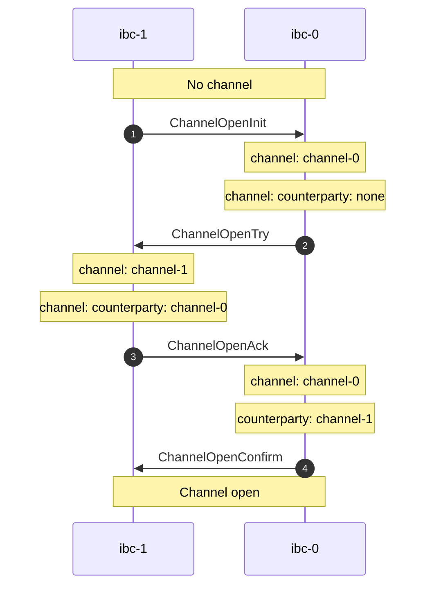

# Channel Open Handshake

The `tx` commands can be used to establish a channel for a given connection. Only `unordered` channels are currently supported.

<center>



</center>

## Table of Contents

<!-- toc -->

## Channel Open Init

Use the `chan-open-init` command to initialize a new channel.

```shell
{{#template ../../../templates/help_templates/tx/chan-open-init.md}}
```

__Example__

First, let's initialize the channel on `ibc-0` using an existing connection identified by `connection-0`:

```shell
hermes tx chan-open-init --dst-chain ibc-0 --src-chain ibc-1 --dst-connection connection-0 --dst-port transfer --src-port transfer
```

```json
Success: OpenInitChannel(
    OpenInit(
        Attributes {
            height: Height {
                revision: 0,
                height: 3091
            },
            port_id: PortId(
                "transfer",
            ),
            channel_id: Some(
                ChannelId(
                    "channel-0",
                ),
            ),
            connection_id: ConnectionId(
                "connection-0",
            ),
            counterparty_port_id: PortId(
                "transfer",
            ),
            counterparty_channel_id: None,
        },
    ),
)
```

A new channel has been initialized on `ibc-1` with identifier `channel-0`.

> Note that the `counterparty_channel_id` field is currently empty.


## Channel Open Try

Use the `chan-open-try` command to establish a counterparty to the channel on the other chain.

```shell
{{#template ../../../templates/help_templates/tx/chan-open-try.md}}
```

__Example__

Let's now create the counterparty to `channel-0` on chain `ibc-1`:

```shell
hermes tx chan-open-try --dst-chain ibc-1 --src-chain ibc-0 --dst-connection connection-1 --dst-port transfer --src-port transfer --src-channel channel-0
```

```json
Success: OpenTryChannel(
    OpenTry(
        Attributes {
            height: Height {
                revision: 1,
                height: 3213
            },
            port_id: PortId(
                "transfer",
            ),
            channel_id: Some(
                ChannelId(
                    "channel-1",
                ),
            ),
            connection_id: ConnectionId(
                "connection-1",
            ),
            counterparty_port_id: PortId(
                "transfer",
            ),
            counterparty_channel_id: Some(
                ChannelId(
                    "channel-0",
                ),
            ),
        },
    ),
)
```

A new channel has been created on `ibc-1` with identifier `channel-1`.

> Note that the field `counterparty_channel_id` points to the channel on `ibc-0`.


## Channel Open Ack

Use the `chan-open-ack` command to acknowledge the channel on the initial chain.

```shell
{{#template ../../../templates/help_templates/tx/chan-open-ack.md}}
```

__Example__

We can now acknowledge on `ibc-0` that `ibc-1` has accepted the opening of the channel:

```shell
hermes tx chan-open-ack --dst-chain ibc-0 --src-chain ibc-1 --dst-connection connection-0 --dst-port transfer --src-port transfer --dst-channel channel-0 --src-channel channel-1
```

```json
Success: OpenAckChannel(
    OpenAck(
        Attributes {
            height: Height {
                revision: 0,
                height: 3301
            },
            port_id: PortId(
                "transfer",
            ),
            channel_id: Some(
                ChannelId(
                    "channel-0",
                ),
            ),
            connection_id: ConnectionId(
                "connection-0",
            ),
            counterparty_port_id: PortId(
                "transfer",
            ),
            counterparty_channel_id: Some(
                ChannelId(
                    "channel-1",
                ),
            ),
        },
    ),
)
```

> Note that the field `counterparty_channel_id` now points to the channel on `ibc-1`.


## Channel Open Confirm

Use the `chan-open-confirm` command to confirm that the channel has been acknowledged,
and finish the handshake, after which the channel is open on both chains.

```shell
{{#template ../../../templates/help_templates/tx/chan-open-confirm.md}}
```

__Example__

Confirm on `ibc-1` that `ibc-0` has accepted the opening of the channel,
after which the channel is open on both chains.

```shell
hermes tx chan-open-confirm --dst-chain ibc-1 --src-chain ibc-0 --dst-connection connection-1 --dst-port transfer --src-port transfer --dst-channel channel-1 --src-channel channel-0
```

```json
    OpenConfirm(
        Attributes {
            height: Height {
                revision: 1,
                height: 3483
            },
            port_id: PortId(
                "transfer",
            ),
            channel_id: Some(
                ChannelId(
                    "channel-1",
                ),
            ),
            connection_id: ConnectionId(
                "connection-1",
            ),
            counterparty_port_id: PortId(
                "transfer",
            ),
            counterparty_channel_id: Some(
                ChannelId(
                    "channel-0",
                ),
            ),
        },
    ),
)
```

We have now successfully opened a channel over an existing connection between the two chains.

