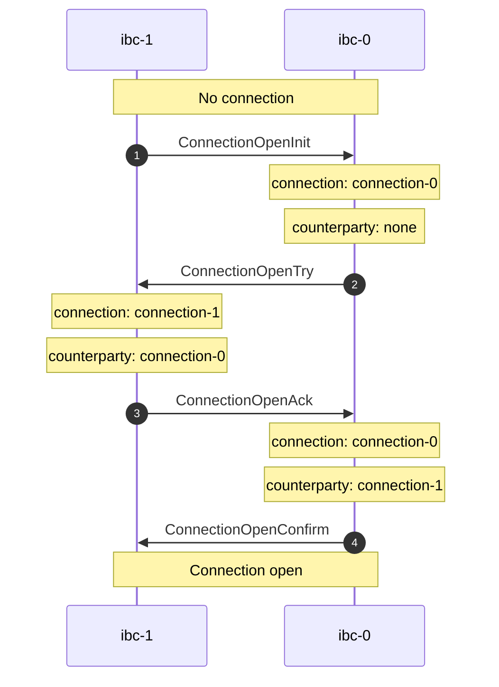

# Connection Handshake

The `tx` commands can be used to establish a connection between two clients.

<center>



</center>

## Table of Contents

<!-- toc -->

## Connection Init

Use the `conn-init` command to initialize a new connection on a chain.

```shell
USAGE:
    hermes tx conn-init --dst-chain <DST_CHAIN_ID> --src-chain <SRC_CHAIN_ID> --dst-client <DST_CLIENT_ID> --src-client <SRC_CLIENT_ID>

DESCRIPTION:
    Initialize a connection (ConnectionOpenInit)

REQUIRED:
        --src-chain <SRC_CHAIN_ID>      Identifier of the source chain
        --src-client <SRC_CLIENT_ID>    Identifier of the source client
        --dst-chain <DST_CHAIN_ID>      Identifier of the destination chain
        --dst-client <DST_CLIENT_ID>    Identifier of the destination client
```

__Example__

Given that two clients were previously created with identifier `07-tendermint-0` on chain `ibc-0` and
identifier `07-tendermint-1` on chain `ibc-1`, we can initialize a connection between the two clients.

First, let's initialize the connection on `ibc-0`:

```shell
hermes tx conn-init --dst-chain ibc-0 --src-chain ibc-1 --dst-client 07-tendermint-0 --src-client 07-tendermint-1
```

```json
Success: OpenInitConnection(
    OpenInit(
        Attributes {
            height: Height {
                revision: 0,
                height: 73,
            },
            connection_id: Some(
                ConnectionId(
                    "connection-0",
                ),
            ),
            client_id: ClientId(
                "07-tendermint-0",
            ),
            counterparty_connection_id: None,
            counterparty_client_id: ClientId(
                "07-tendermint-1",
            ),
        },
    ),
)
```

A new connection has been initialized on `ibc-0` with identifier `connection-0`.

> Note that the `counterparty_connection_id` field is currently empty.


## Connection Try

Use the `conn-try` command to establish a counterparty to the connection on the other chain.

```shell
USAGE:
    hermes tx conn-try [OPTIONS] --dst-chain <DST_CHAIN_ID> --src-chain <SRC_CHAIN_ID> --dst-client <DST_CLIENT_ID> --src-client <SRC_CLIENT_ID> --src-connection <SRC_CONNECTION_ID>

DESCRIPTION:
    Relay the connection attempt (ConnectionOpenTry)

OPTIONS:
        --dst-connection <DST_CONNECTION_ID>
            Identifier of the destination connection (optional) [aliases: dst-conn]

REQUIRED:
        --src-chain <SRC_CHAIN_ID>
            Identifier of the source chain

        --src-client <SRC_CLIENT_ID>
            Identifier of the source client

        --src-connection <SRC_CONNECTION_ID>
            Identifier of the source connection (required) [aliases: src-conn]

        --dst-chain <DST_CHAIN_ID>
            Identifier of the destination chain

        --dst-client <DST_CLIENT_ID>
            Identifier of the destination client
```

__Example__

Let's now create the counterparty to `connection-0` on chain `ibc-1`:

```shell
hermes tx conn-try --dst-chain ibc-1 --src-chain ibc-0 --dst-client 07-tendermint-1 --src-client 07-tendermint-0 --src-connection connection-0
```

```json
Success: OpenTryConnection(
    OpenTry(
        Attributes {
            height: Height {
                revision: 1,
                height: 88,
            },
            connection_id: Some(
                ConnectionId(
                    "connection-1",
                ),
            ),
            client_id: ClientId(
                "07-tendermint-1",
            ),
            counterparty_connection_id: Some(
                ConnectionId(
                    "connection-0",
                ),
            ),
            counterparty_client_id: ClientId(
                "07-tendermint-0",
            ),
        },
    ),
)
```

A new connection has been created on `ibc-1` with identifier `connection-1`.

> Note that the field `counterparty_connection_id` points to the connection on `ibc-0`.


## Connection Ack

Use the `conn-ack` command to acknowledge the connection on the initial chain.

```shell
USAGE:
    hermes tx conn-ack --dst-chain <DST_CHAIN_ID> --src-chain <SRC_CHAIN_ID> --dst-client <DST_CLIENT_ID> --src-client <SRC_CLIENT_ID> --dst-connection <DST_CONNECTION_ID> --src-connection <SRC_CONNECTION_ID>

DESCRIPTION:
    Relay acknowledgment of a connection attempt (ConnectionOpenAck)

REQUIRED:
        --src-chain <SRC_CHAIN_ID>
            Identifier of the source chain

        --src-client <SRC_CLIENT_ID>
            Identifier of the source client

        --src-connection <SRC_CONNECTION_ID>
            Identifier of the source connection (required) [aliases: src-conn]

        --dst-chain <DST_CHAIN_ID>
            Identifier of the destination chain

        --dst-client <DST_CLIENT_ID>
            Identifier of the destination client

        --dst-connection <DST_CONNECTION_ID>
            Identifier of the destination connection (required) [aliases: dst-conn]
```

__Example__

We can now acknowledge on `ibc-0` that `ibc-1` has accepted the connection attempt:

```shell
hermes tx conn-ack --dst-chain ibc-0 --src-chain ibc-1 --dst-client 07-tendermint-0 --src-client 07-tendermint-1 --dst-connection connection-0 --src-connection connection-1
```

```json
Success: OpenAckConnection(
    OpenAck(
        Attributes {
            height: Height {
                revision: 0,
                height: 206,
            },
            connection_id: Some(
                ConnectionId(
                    "connection-0",
                ),
            ),
            client_id: ClientId(
                "07-tendermint-0",
            ),
            counterparty_connection_id: Some(
                ConnectionId(
                    "connection-1",
                ),
            ),
            counterparty_client_id: ClientId(
                "07-tendermint-1",
            ),
        },
    ),
)
```

> Note that the field `counterparty_connection_id` now points to the connection on `ibc-1`.


## Connection Confirm

Use the `conn-confirm` command to confirm that the connection has been acknowledged,
and finish the handshake, after which the connection is open on both chains.

```shell
USAGE:
    hermes tx conn-confirm --dst-chain <DST_CHAIN_ID> --src-chain <SRC_CHAIN_ID> --dst-client <DST_CLIENT_ID> --src-client <SRC_CLIENT_ID> --dst-connection <DST_CONNECTION_ID> --src-connection <SRC_CONNECTION_ID>

DESCRIPTION:
    Confirm opening of a connection (ConnectionOpenConfirm)

REQUIRED:
        --src-chain <SRC_CHAIN_ID>
            Identifier of the source chain

        --src-client <SRC_CLIENT_ID>
            Identifier of the source client

        --src-connection <SRC_CONNECTION_ID>
            Identifier of the source connection (required) [aliases: src-conn]

        --dst-chain <DST_CHAIN_ID>
            Identifier of the destination chain

        --dst-client <DST_CLIENT_ID>
            Identifier of the destination client

        --dst-connection <DST_CONNECTION_ID>
            Identifier of the destination connection (required) [aliases: dst-conn]
```

__Example__

Confirm on `ibc-1` that `ibc-0` has accepted the connection attempt.

```shell
hermes tx conn-confirm --dst-chain ibc-1 --src-chain ibc-0 --dst-client 07-tendermint-1 --src-client 07-tendermint-0 --dst-connection connection-1 --src-connection connection-0
```

```json
Success: OpenConfirmConnection(
    OpenConfirm(
        Attributes {
            height: Height {
                revision: 1,
                height: 239,
            },
            connection_id: Some(
                ConnectionId(
                    "connection-1",
                ),
            ),
            client_id: ClientId(
                "07-tendermint-1",
            ),
            counterparty_connection_id: Some(
                ConnectionId(
                    "connection-0",
                ),
            ),
            counterparty_client_id: ClientId(
                "07-tendermint-0",
            ),
        },
    ),
)
```

We have now successfully established a connection between the two chains.

