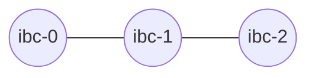

# IBC Packet Forwarding

This section covers IBC packet forwarding introduced in Gaia v6.0.x

## Overview

Packet forwarding allows a Chain to send a packet to another chain without having a direct channel. This means that if there are three Chains A, B and C, with the following channels:



Then if the IBC packet forward middleware is active, Chain A can send a packet to Chain C, by setting the receiver of the packet as following:

```
{intermediate_refund_address}|{foward_port}/{forward_channel}:{final_destination_address}
```

As specified in the packet-forward-middleware module implementation, [packet-forward-middleware](https://github.com/strangelove-ventures/packet-forward-middleware).

## Important notice

Depending on which major version of Gaia is used, the behaviour of packet forwarding will change.

__Gaia v7.0.x__

The IBC packet forward middleware is disabled on this version. This will cause the sender to be refunded when trying to transfer tokens using packet forwarding.

__Gaia v6.0.x__

Since this version uses the packet-forward-middleware v1.0.1 and the atomic forward feature was only introduced in v3, if the destination address is invalid, then the intermediary chain will be refunded instead of the sender.

__Gaia v8.0.x__

Everything seems to be working as expected in this version.

__Example__

Here is [an example](./test.md) of token transfer from Chain A to Chain C, going through Chain B.