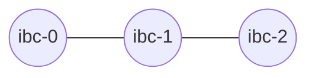
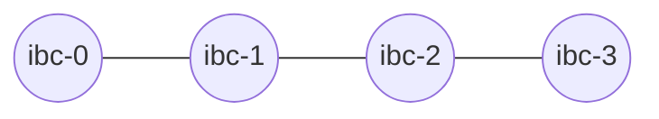

# IBC Packet Forwarding

This section covers IBC packet forwarding introduced in Gaia v6.0.x

## Overview

__v3.0.0+__

Packet forwarding middleware introduced

Packet forwarding allows a Chain to send a packet to another chain without having a direct channel. This means that if there are three Chains A, B and C, with the following channels:



Then if the IBC packet forward middleware is active, Chain A can send a packet to Chain C, by including the following memo:

```json
{
  "forward": {
    "receiver": "chain-c-bech32-address",
    "port": "transfer",
    "channel": "channel-123"
  }
}
```

If there are four Chains A, B, C and D, with the following channels:



Then if the IBC packet forward middleware is active, Chain A can send a packet to Chain D, by including the following memo:

```json
{
  "forward": {
    "receiver": "chain-c-bech32-address",
    "port": "transfer",
    "channel": "channel-a-to-b",
    "timeout": "10m",
    "retries": 2,
    "next": {
      "forward": {
        "receiver": "chain-d-bech32-address",
        "port": "transfer",
        "channel":"channel-c-to-d",
        "timeout":"10m",
        "retries": 2
      }
    }
  }
}
```

## Legacy method

Before the packet forward middleware `v3.0.0` the receiver address was used to forward packets. In order for Chain A to send a packet to Chain C, the receiver of the packet had to be set as following:

```
{intermediate_refund_address}|{foward_port}/{forward_channel}:{final_destination_address}
```

As specified in the packet-forward-middleware module implementation, [packet-forward-middleware](https://github.com/strangelove-ventures/packet-forward-middleware/tree/v2.1.3#example).

## Important notice

Depending on which major version of Gaia is used, the behaviour of packet forwarding will change.

__Gaia v7.0.x__

The IBC packet forward middleware is disabled on this version. This will cause the sender to be refunded when trying to transfer tokens using packet forwarding.

__Gaia v6.0.x__

Since this version uses the packet-forward-middleware v1.0.1 and the atomic forward feature was only introduced in v3, if the destination address is invalid, then the intermediary chain will be refunded instead of the sender. And it uses the overloaded receiver method to forward packets.

__Gaia v8.0.x__

Everything seems to be working as expected in this version, using the `memo` field to forward packets.

__Example__

Here is [an example](./test.md) of token transfer from Chain A to Chain C, going through Chain B using the `memo` field.

__Legacy Example__

Here is [an example](./legacy_test.md) of token transfer from Chain A to Chain C, going through Chain B using the overloaded receiver.