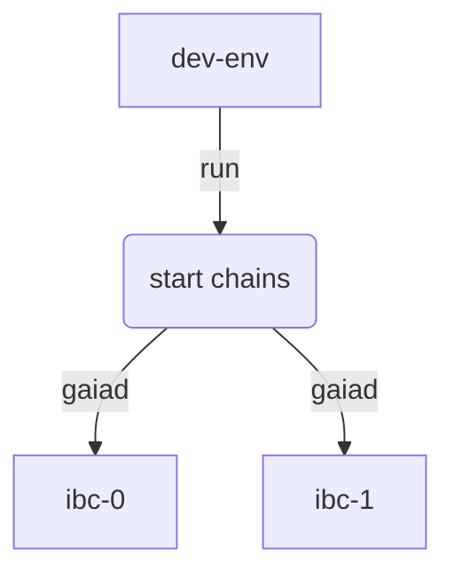

### Start the local chains

To run the script to start the local chains, open a terminal and navigate to the `ibc-rs` repository folder

```bash
cd ibc-rs
```

#### Configuration

In order to run the script, you will need a `TOML` configuration file to be passed as a parameter. Please check the [`Configuration`](./config.md) section for more information about the relayer configuration file.

The following configuration file can be used for running the local chains:

##### loop_config.toml
```toml
[global]
timeout = '10s'
strategy = 'naive'
log_level = 'error'

[[chains]]
id = 'ibc-0'
rpc_addr = 'tcp://localhost:26657'
grpc_addr = 'tcp://localhost:9090'
account_prefix = 'cosmos'
key_name = 'testkey'
store_prefix = 'ibc'

gas = 200000
max_msg_num = 4
max_tx_size = 1048576
clock_drift = '5s'
trusting_period = '14days'

[chains.trust_threshold]
numerator = '1'
denominator = '3'

[[chains]]
id = 'ibc-1'
rpc_addr = 'tcp://localhost:26557'
grpc_addr = 'tcp://localhost:9091'
account_prefix = 'cosmos'
key_name = 'testkey'
store_prefix = 'ibc'
clock_drift = '5s'
trusting_period = '14days'

[chains.trust_threshold]
numerator = '1'
denominator = '3'
```

#### Stop and cleanup

If this is not the first time you are running the script, you can manually stop the two gaia instances and clean up the data executing the following commands:

```shell
killall gaiad
rm -rf data/
```

#### Run the script

Run the following script with the parameters below to start the chains:

```bash
./dev-env loop_config.toml ibc-0 ibc-1
```

The script will configure and start two `gaiad` instances, one named `ibc-0` and the other `ibc-1`



If the script runs successfully you should see a message similar to the one below in the terminal:

```shell
$ ./dev-env ./relayer-cli/tests/fixtures/two_chains.toml ibc-0 ibc-1

GAIA VERSION INFO: 3.0.0
Generating gaia configurations...
Creating gaiad instance: home=./data | chain-id=ibc-0 | p2p=:26656 | rpc=:26657 | profiling=:6060 | grpc=:9090 | samoleans=:100000000000
Change settings in config.toml file...
balances:
- amount: "0"
  denom: stake
pagination:
  next_key: null
  total: "0"
balances:
- amount: "100000000000"
  denom: samoleans
- amount: "100000000000"
  denom: stake
pagination:
  next_key: null
  total: "0"
Creating gaiad instance: home=./data | chain-id=ibc-1 | p2p=:26556 | rpc=:26557 | profiling=:6061 | grpc=:9091 | samoleans=:100000000000
Change settings in config.toml file...
balances:
- amount: "0"
  denom: stake
pagination:
  next_key: null
  total: "0"
balances:
- amount: "100000000000"
  denom: samoleans
- amount: "100000000000"
  denom: stake
pagination:
  next_key: null
  total: "0"
ibc-0 initialized. Watch file /home/user/development/github.com/informalsystems/ibc-rs/data/ibc-0.log to see its execution.
ibc-1 initialized. Watch file /home/user/development/github.com/informalsystems/ibc-rs/data/ibc-1.log to see its execution.
Building the Rust relayer...
Removing light client peers from configuration...
Adding primary peers to light client configuration...
Adding secondary peers to light client configuration...
Importing keys...
```

#### Data directory
The script creates a `data` directory in the current directory in order. The `data` directory contains the chain stores and configuration files.

The `data` directory has a tree structure similar to the one below:

```shell
data
├── ibc-0
│   ├── config
│   ├── data
│   ├── keyring-test
│   ├── key_seed.json
│   └── validator_seed.json
├── ibc-0.log
├── ibc-1
│   ├── config
│   ├── data
│   ├── keyring-test
│   ├── key_seed.json
│   └── validator_seed.json
└── ibc-1.log

```

#### Next Steps

In the next section [Relaying packets](./relay_packets.md) you will learn how to execute transactions and queries on the relayer in order to relay packets.