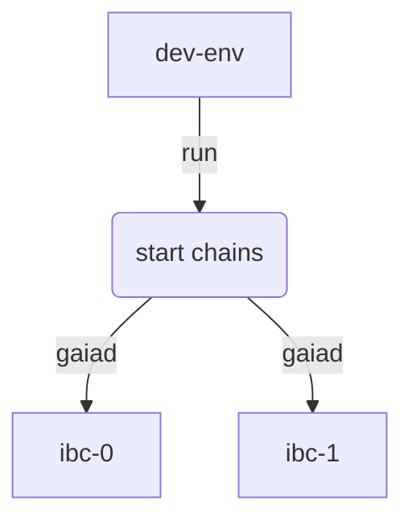

# Start the local chains

To start the local chains, open a terminal and navigate to the `ibc-rs` repository folder

```bash
cd ibc-rs
```

### Stop existing `gaiad` processes

If this is not the first time you are running the script, you can manually stop the two gaia instances executing the following command to kill all `gaiad` processes:

```shell
killall gaiad
```

> __NOTE__: If you have any `Docker` containers running that might be using the same ports as `gaiad` (e.g. port 26657 or port 9090), please ensure you stop them first before proceeding to the next step.

### Configuration file

In order to run the script, you will need a `TOML` configuration file to be passed as a parameter. Please check the [`Configuration`](./config.md) section for more information about the relayer configuration file.

The following configuration file in the `ibc-rs` repository folder can be used for running the local chains:

__config.toml__

```toml
[global]
timeout = '10s'
strategy = 'naive'
log_level = 'error'

[[chains]]
id = 'ibc-0'
rpc_addr = 'tcp://localhost:26657'
grpc_addr = 'tcp://localhost:9090'
account_prefix = 'cosmos'
key_name = 'testkey'
store_prefix = 'ibc'
gas = 3000000
clock_drift = '5s'
trusting_period = '14days'

[chains.trust_threshold]
numerator = '1'
denominator = '3'

[[chains]]
id = 'ibc-1'
rpc_addr = 'tcp://localhost:26557'
grpc_addr = 'tcp://localhost:9091'
account_prefix = 'cosmos'
key_name = 'testkey'
store_prefix = 'ibc'
gas = 3000000
clock_drift = '5s'
trusting_period = '14days'

[chains.trust_threshold]
numerator = '1'
denominator = '3'

[[connections]]
a_chain = 'ibc-0'
b_chain = 'ibc-1'

[[connections.paths]]
a_port = 'transfer'
b_port = 'transfer'
```

#### Saving the configuration file

##### Create the config.toml file

```shell
mkdir -p $HOME/.hermes && touch $HOME/.hermes/config.toml
```

##### Add content to the configuration file:

You can use your preferred text editor. If using `vi` you can run:

```shell
vi ~/.hermes/config.toml
```

Then just __`copy`__ the content for `config.toml` above and __`paste`__ into this file.

### Running the script to start the chains

From the `ibc-rs` repository folder run the following script with the parameters below to start the chains (`ibc-0` and `ibc-1`) and configure the light client peers:

```bash
./scripts/dev-env ~/.hermes/config.toml ibc-0 ibc-1
```

> __NOTE__: If the script above prompts you to delete the data folder just answer __'yes'__

The script configures and starts two __`gaiad`__ instances, one named __`ibc-0`__ and the other __`ibc-1`__



If the script runs successfully you should see a message similar to the one below in the terminal:

```shell
GAIA VERSION INFO: 4.0.0
Generating gaia configurations...
Creating gaiad instance: home=./data | chain-id=ibc-0 | p2p=:26656 | rpc=:26657 | profiling=:6060 | grpc=:9090 | samoleans=:100000000000
Change settings in config.toml file...
balances:
- amount: "0"
  denom: stake
pagination:
  next_key: null
  total: "0"
balances:
- amount: "100000000000"
  denom: samoleans
- amount: "100000000000"
  denom: stake
pagination:
  next_key: null
  total: "0"
Creating gaiad instance: home=./data | chain-id=ibc-1 | p2p=:26556 | rpc=:26557 | profiling=:6061 | grpc=:9091 | samoleans=:100000000000
Change settings in config.toml file...
balances:
- amount: "0"
  denom: stake
pagination:
  next_key: null
  total: "0"
balances:
- amount: "100000000000"
  denom: samoleans
- amount: "100000000000"
  denom: stake
pagination:
  next_key: null
  total: "0"
ibc-0 initialized. Watch file /dev/github.com/informalsystems/ibc-rs/data/ibc-0.log to see its execution.
ibc-1 initialized. Watch file /dev/github.com/informalsystems/ibc-rs/data/ibc-1.log to see its execution.
Building the Rust relayer...
Removing light client peers from configuration...
Adding primary peers to light client configuration...
Adding secondary peers to light client configuration...
Importing keys...
Done!
```

### Data directory
The script creates a __`data`__ directory in the current directory in order. The __`data`__ directory contains the chain stores and configuration files.

The __`data`__ directory has a tree structure similar to the one below:

```shell
data
├── ibc-0
│   ├── config
│   ├── data
│   ├── keyring-test
│   ├── key_seed.json
│   └── validator_seed.json
├── ibc-0.log
├── ibc-1
│   ├── config
│   ├── data
│   ├── keyring-test
│   ├── key_seed.json
│   └── validator_seed.json
└── ibc-1.log

```

### $HOME/.hermes directory

By the default `hermes` expects the configuration file to be in the __`$HOME/.hermes`__ folder. 

It also stores the private keys for each chain in this folder as outlined in the [Keys](./keys.md) section. 

After executing the __`dev-env`__ script, this is how the folder should look like:

```shell
$HOME/.hermes/
├── config.toml
└── keys
    ├── ibc-0
    │   └── keyring-test
    │       └── testkey.json
    └── ibc-1
        └── keyring-test
            └── testkey.json
```

#### Next Steps

In the next section, ["Connecting the chains"](./connect_chains.md), you will learn how to execute transactions and queries on the relayer in order to relay packets.