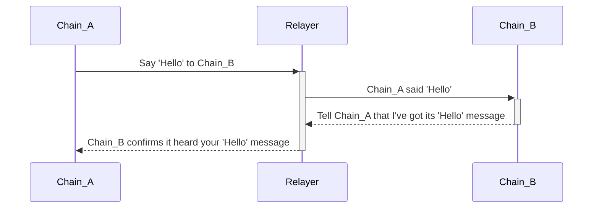

# What is a relayer ?

```mermaid
sequenceDiagram
    Chain_A->>+Relayer: Say 'Hello' to Chain_B
    Relayer->>+Chain_B: Chain_A said 'Hello'
    Chain_B-->>-Relayer: Tell Chain_A that I've got its 'Hello' message
    Relayer-->>-Chain_A: Chain_B confirms it heard your 'Hello' message
            
```