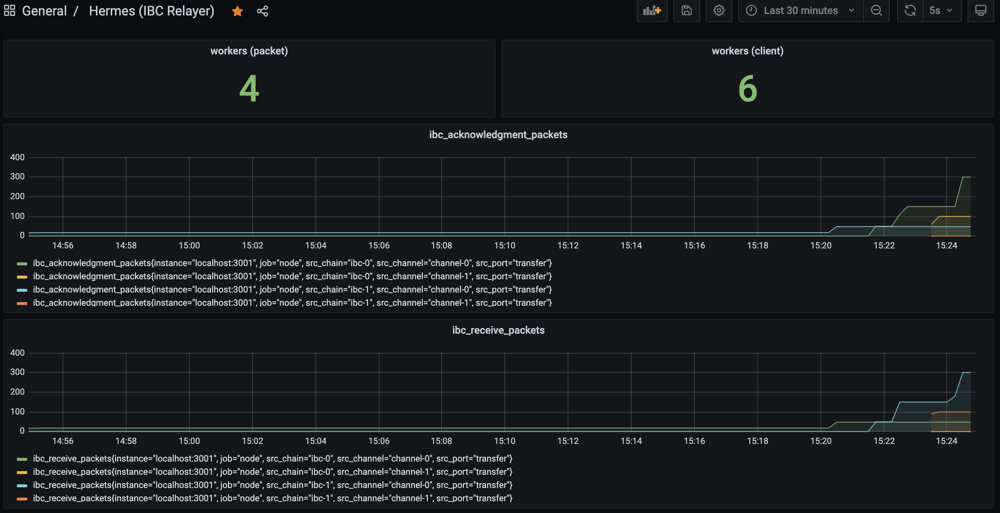

# Telemetry

*Since version 0.4.0.*

To gain a better understanding of the status and activity of the relayer,
Hermes features a built-in telemetry service based on the [OpenTelemetry][opentelemetry] observability framework,
whose metrics can be exposed over HTTP for integration with the [Prometheus][prometheus] monitoring system.

The official Hermes builds for Linux and macOS come with telemetry support since version 0.4.0,
and can be [downloaded directly from the GitHub Releases][gh-releases] page.

[gh-releases]: https://github.com/informalsystems/ibc-rs/releases
[opentelemetry]: https://opentelemetry.io
[prometheus]: https://prometheus.io

## Configuration

The telemetry service is not active by default, and must be enabled in the relayer configuration:

```toml
[telemetry]
enabled = true
host    = '127.0.0.1'
port    = 3001
```

Please see the [relevant section in the *Configuration* page](./config.md#telemetry) for details about the configuration options.

## Metrics

The following table describes the metrics currently tracked by the telemetry service:

| Name                         | Description                                          | OpenTelemetry type  |
| ---------------------------- | ---------------------------------------------------- | ------------------- |
| `workers`                    | Number of workers per object                         | `i64` UpDownCounter |
| `ibc_client_updates`         | Number of client updates performed per client        | `u64` Counter       |
| `ibc_client_misbehaviours`   | Number of misbehaviours detected per client          | `u64` Counter       |
| `ibc_receive_packets`        | Number of receive packets relayed per channel        | `u64` Counter       |
| `ibc_acknowledgment_packets` | Number of acknowledgment packets relayed per channel | `u64` Counter       |
| `ibc_timeout_packets`        | Number of timeout packets relayed per channel        | `u64` Counter       |

## Integration with Prometheus

With the settings , the telemetry service will be enabled and will serve the metrics using
the Prometheus encoder over HTTP at [`http://localhost:3001/metrics`](http://localhost:3001/metrics).

After starting Hermes with `hermes start`, and letting it run for a while to relay packets,
open [`http://localhost:3001/metrics`](http://localhost:3001/metrics) in a browser, you should
see Prometheus-encoded metrics.

For example, with 3 channels and after transferring some tokens between the chains:

```text
# HELP ibc_acknowledgment_packets Number of acknowledgment packets relayed per channel
# TYPE ibc_acknowledgment_packets counter
ibc_acknowledgment_packets{src_chain="ibc-0",src_channel="channel-0",src_port="transfer"} 300
ibc_acknowledgment_packets{src_chain="ibc-0",src_channel="channel-1",src_port="transfer"} 100
ibc_acknowledgment_packets{src_chain="ibc-1",src_channel="channel-0",src_port="transfer"} 48
ibc_acknowledgment_packets{src_chain="ibc-1",src_channel="channel-1",src_port="transfer"} 0
# HELP ibc_receive_packets Number of receive packets relayed per channel
# TYPE ibc_receive_packets counter
ibc_receive_packets{src_chain="ibc-0",src_channel="channel-0",src_port="transfer"} 48
ibc_receive_packets{src_chain="ibc-0",src_channel="channel-1",src_port="transfer"} 0
ibc_receive_packets{src_chain="ibc-1",src_channel="channel-0",src_port="transfer"} 300
ibc_receive_packets{src_chain="ibc-1",src_channel="channel-1",src_port="transfer"} 100
# HELP ibc_timeout_packets Number of timeout packets relayed per channel
# TYPE ibc_timeout_packets counter
ibc_timeout_packets{src_chain="ibc-0",src_channel="channel-0",src_port="transfer"} 1
ibc_timeout_packets{src_chain="ibc-0",src_channel="channel-1",src_port="transfer"} 0
ibc_timeout_packets{src_chain="ibc-1",src_channel="channel-0",src_port="transfer"} 0
ibc_timeout_packets{src_chain="ibc-1",src_channel="channel-1",src_port="transfer"} 0
# HELP workers Number of workers per object
# TYPE workers gauge
workers{type="client"} 6
workers{type="packet"} 4
```

### Visualization with Grafana

Here's how these metrics look like in [Grafana](https://prometheus.io/docs/visualization/grafana/) with a Prometheus data source:


