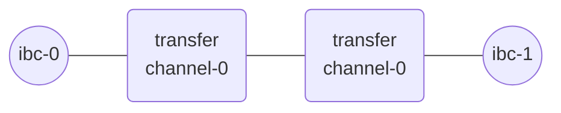

# Add a new relay path

In order to connect two IBC-enabled chains, both chains need an on-chain client that keeps track of the other chain. These two clients can be connected by one or multiple connections. Then, channels need to be created, over a connection, to specify the destination module.

> __WARNING__: In production, do not create clients, connections or channels between two chains before checking that a client/connection/channel does not already fulfill the same function.

---

## Identifiers

A chain allocates identifiers when it creates clients, connections and channels. These identifiers can subsequently be used to refer to existing clients, connections, and channels.

> NOTE: If you want to ensure you get the same identifiers while following the tutorials, run each of the commands in this page only __once__ or reset the chains as instructed in section [Start local chains](./start-local-chains.md#reset-your-configuration-and-start-the-chains). 

Chains allocate identifiers using a chain-specific allocation scheme. Currently, the *cosmos-sdk* implementation uses the following identifiers:

- `07-tendermint-<n>` for tendermint clients.
- `connection-<n>` for connections.
- `channel-<n>` for channels.

It is possible for two chains to use the same identifier to designate two different objects. For example, two different channels, one on the Hub and one on Osmosis, can both be designated with the `channel-0` identifier. 


## Create the relay path

A relay path refers to a specific channel used to interconnect two chains and over which packets are being sent.

Hermes can be started to listen for packet events on the two ends of multiple paths and relay packets over these paths.
This can be done over a new path or over existing paths.

>__NOTE__: The following steps decompose every step from the creation of the clients to the channel handshake for educational purposes. 
> More realistically, you'd use the command `{{#template ../../templates/commands/hermes/create_channel_new_client a-chain=ibc-0 b-chain=ibc-1 a-port=transfer b-port=transfer}}` in order to create a new client on each chain, establish a connection, and open a channel, all with a single command.

You will need to first create a client on both chains and then establish a connection between them. It is possible to have multiple connections between clients, which can be useful in order to support multiple versions of IBC. Finally, you need to create channels over a connection to identify the source and destination modules. You can learn more in the [cosmos academy tutorial](https://tutorials.cosmos.network/academy/4-ibc/what-is-ibc.html).  

### Create clients

First, create a client on `ibc-1` tracking the state of `ibc-0`. It will be assigned `07-tendermint-0` as its identifier:

```shell
{{#template ../../templates/commands/hermes/create_client host-chain=ibc-1 reference-chain=ibc-0}}
```

If the command is successful, the output should be similar to:
```json
SUCCESS CreateClient(
    CreateClient(
        Attributes {
            client_id: ClientId(
                "07-tendermint-0",
            ),
            client_type: Tendermint,
            consensus_height: Height {
                revision: 0,
                height: 2,
            },
        },
    ),
)
```

Now, create a client on `ibc-0` tracking `ibc-1`:

```shell
{{#template ../../templates/commands/hermes/create_client host-chain=ibc-0 reference-chain=ibc-1}}
```
If the command is successful, the output should be similar to:
```json
SUCCESS CreateClient(
    CreateClient(
        Attributes {
            client_id: ClientId(
                "07-tendermint-0",
            ),
            client_type: Tendermint,
            consensus_height: Height {
                revision: 1,
                height: 3,
            },
        },
    ),
)
```
As you can see, the identifier is also `07-tendermint-0` because the client-id is **local to a chain**. 


### 2. Create connections


After creating clients on both chains, you have to establish a connection between them. Both chains will assign `connection-0` as the identifier of their first connection:

```shell
{{#template ../../templates/commands/hermes/create_connection a-chain=ibc-0 a-client=07-tendermint-0 b-client=07-tendermint-0}}
```
>__NOTE__: The command does not take `--b-chain` as argument as `--a-client` can only track one chain (`ibc-1`). 

If the command runs successfully, it should output something similar to:

<details><summary style="font-weight:bold">Create connection output</summary>

```
2022-08-29T11:16:39.833467Z  INFO ThreadId(01) using default configuration from '$HOME/.hermes/config.toml'
2022-08-29T11:16:39.838071Z  INFO ThreadId(01) Creating a new connection with pre-existing clients 07-tendermint-0 and 07-tendermint-0
2022-08-29T11:16:39.843103Z  INFO ThreadId(15) wait_for_block_commits: waiting for commit of tx hashes(s) F87AE29F8BA86EA9F6533C0CE8A34101C90948B824446E0B4889C4F953A9E094 id=ibc-0
2022-08-29T11:16:41.047867Z  INFO ThreadId(01) 🥂 ibc-0 => IbcEventWithHeight {
    event: OpenInitConnection(
        OpenInit(
            Attributes {
                connection_id: Some(
                    ConnectionId(
                        "connection-0",
                    ),
                ),
                client_id: ClientId(
                    "07-tendermint-0",
                ),
                counterparty_connection_id: None,
                counterparty_client_id: ClientId(
                    "07-tendermint-0",
                ),
            },
        ),
    ),
    height: Height {
        revision: 0,
        height: 29,
    },
}

2022-08-29T11:16:44.061620Z  INFO ThreadId(15) wait_for_block_commits: waiting for commit of tx hashes(s) AEEAE5846991C6748248ECD81A5B8D83E7E0388322202900788C72518649EF7B id=ibc-0
2022-08-29T11:16:51.249114Z  INFO ThreadId(41) wait_for_block_commits: waiting for commit of tx hashes(s) BFED59B2EBE5D75A19C1CBB1FB931FF6FC81EF02F872CEB3D37AA40DDA5101B4 id=ibc-1
2022-08-29T11:16:52.452619Z  INFO ThreadId(01) 🥂 ibc-1 => IbcEventWithHeight {
    event: OpenTryConnection(
        OpenTry(
            Attributes {
                connection_id: Some(
                    ConnectionId(
                        "connection-0",
                    ),
                ),
                client_id: ClientId(
                    "07-tendermint-0",
                ),
                counterparty_connection_id: Some(
                    ConnectionId(
                        "connection-0",
                    ),
                ),
                counterparty_client_id: ClientId(
                    "07-tendermint-0",
                ),
            },
        ),
    ),
    height: Height {
        revision: 1,
        height: 31,
    },
}

2022-08-29T11:16:55.459367Z  WARN ThreadId(01) [ibc-0 -> ibc-1:07-tendermint-0] resolving trusted height from the full list of consensus state heights for target height 0-31; this may take a while
2022-08-29T11:16:55.469498Z  INFO ThreadId(41) wait_for_block_commits: waiting for commit of tx hashes(s) D232FCF03549B692604A06AFC1D82494FB1D466E61880E9A8653FEFC2F41BA69 id=ibc-1
2022-08-29T11:17:02.248045Z  INFO ThreadId(15) wait_for_block_commits: waiting for commit of tx hashes(s) 0ABC352714048C0873537CCEBE31393E1CB09F810B5AAE495833436A8F9447C0 id=ibc-0
2022-08-29T11:17:06.159408Z  INFO ThreadId(01) 🥂 ibc-0 => IbcEventWithHeight {
    event: OpenAckConnection(
        OpenAck(
            Attributes {
                connection_id: Some(
                    ConnectionId(
                        "connection-0",
                    ),
                ),
                client_id: ClientId(
                    "07-tendermint-0",
                ),
                counterparty_connection_id: Some(
                    ConnectionId(
                        "connection-0",
                    ),
                ),
                counterparty_client_id: ClientId(
                    "07-tendermint-0",
                ),
            },
        ),
    ),
    height: Height {
        revision: 0,
        height: 34,
    },
}

2022-08-29T11:17:11.202362Z  INFO ThreadId(41) wait_for_block_commits: waiting for commit of tx hashes(s) F5A344056C7F8775620581756985C2C5DB43F396A18956C017E56EFB4A8FF616 id=ibc-1
2022-08-29T11:17:12.407373Z  INFO ThreadId(01) 🥂 ibc-1 => IbcEventWithHeight {
    event: OpenConfirmConnection(
        OpenConfirm(
            Attributes {
                connection_id: Some(
                    ConnectionId(
                        "connection-0",
                    ),
                ),
                client_id: ClientId(
                    "07-tendermint-0",
                ),
                counterparty_connection_id: Some(
                    ConnectionId(
                        "connection-0",
                    ),
                ),
                counterparty_client_id: ClientId(
                    "07-tendermint-0",
                ),
            },
        ),
    ),
    height: Height {
        revision: 1,
        height: 35,
    },
}

2022-08-29T11:17:15.409868Z  INFO ThreadId(01) connection handshake already finished for Connection {
    delay_period: 0ns,
    a_side: ConnectionSide {
        chain: BaseChainHandle {
            chain_id: ChainId {
                id: "ibc-0",
                version: 0,
            },
            runtime_sender: Sender { .. },
        },
        client_id: ClientId(
            "07-tendermint-0",
        ),
        connection_id: Some(
            ConnectionId(
                "connection-0",
            ),
        ),
    },
    b_side: ConnectionSide {
        chain: BaseChainHandle {
            chain_id: ChainId {
                id: "ibc-1",
                version: 1,
            },
            runtime_sender: Sender { .. },
        },
        client_id: ClientId(
            "07-tendermint-0",
        ),
        connection_id: Some(
            ConnectionId(
                "connection-0",
            ),
        ),
    },
}

SUCCESS Connection {
    delay_period: 0ns,
    a_side: ConnectionSide {
        chain: BaseChainHandle {
            chain_id: ChainId {
                id: "ibc-0",
                version: 0,
            },
            runtime_sender: Sender { .. },
        },
        client_id: ClientId(
            "07-tendermint-0",
        ),
        connection_id: Some(
            ConnectionId(
                "connection-0",
            ),
        ),
    },
    b_side: ConnectionSide {
        chain: BaseChainHandle {
            chain_id: ChainId {
                id: "ibc-1",
                version: 1,
            },
            runtime_sender: Sender { .. },
        },
        client_id: ClientId(
            "07-tendermint-0",
        ),
        connection_id: Some(
            ConnectionId(
                "connection-0",
            ),
        ),
    },
}
```
</details>

### 3. Channel identifiers


Finally, after the connection has been established, you can now open a new channel on top of it. Both chains will assign `channel-0` as the identifier of their first channel:

```shell
{{#template ../../templates/commands/hermes/create_channel a-chain=ibc-0 a-connection=connection-0 a-port=transfer b-port=transfer}}
```
>__NOTE__: Again, you do not need to specify the counterparty chain as a connection can only be established with a single counterparty. The `port` specifies the protocol which will be used on this channel. 

If the command runs succesfully, it should output something similar to:

<details><summary style="font-weight:bold">Create channel output</summary>

```
2022-08-29T11:26:28.027659Z  INFO ThreadId(01) using default configuration from '$HOME/.hermes/config.toml'
2022-08-29T11:26:28.040558Z  INFO ThreadId(15) wait_for_block_commits: waiting for commit of tx hashes(s) A7B19D0BB98DD6724B7E41A2CAD8381989D38C8D9E8C141D111DBF9DB5C20DC1 id=ibc-0
2022-08-29T11:26:33.455062Z  INFO ThreadId(01) 🎊  ibc-0 => IbcEventWithHeight {
    event: OpenInitChannel(
        OpenInit {
            port_id: PortId(
                "transfer",
            ),
            channel_id: Some(
                ChannelId(
                    "channel-0",
                ),
            ),
            connection_id: ConnectionId(
                "connection-0",
            ),
            counterparty_port_id: PortId(
                "transfer",
            ),
            counterparty_channel_id: None,
        },
    ),
    height: Height {
        revision: 0,
        height: 147,
    },
}

2022-08-29T11:26:38.199410Z  INFO ThreadId(41) wait_for_block_commits: waiting for commit of tx hashes(s) 31CBCFAA6806315A5A6D96C71AEBFDFD71757F823914037B51893F123332282D id=ibc-1
2022-08-29T11:26:39.704788Z  INFO ThreadId(01) 🎊  ibc-1 => IbcEventWithHeight {
    event: OpenTryChannel(
        OpenTry {
            port_id: PortId(
                "transfer",
            ),
            channel_id: Some(
                ChannelId(
                    "channel-0",
                ),
            ),
            connection_id: ConnectionId(
                "connection-0",
            ),
            counterparty_port_id: PortId(
                "transfer",
            ),
            counterparty_channel_id: Some(
                ChannelId(
                    "channel-0",
                ),
            ),
        },
    ),
    height: Height {
        revision: 1,
        height: 148,
    },
}

2022-08-29T11:26:44.242127Z  INFO ThreadId(15) wait_for_block_commits: waiting for commit of tx hashes(s) 0B6EAF8ABCC7E807EDBD65E73EEE32CEE736BE787D2791C49D1436F2BA810F37 id=ibc-0
2022-08-29T11:26:48.455749Z  INFO ThreadId(01) 🎊  ibc-0 => IbcEventWithHeight {
    event: OpenAckChannel(
        OpenAck {
            port_id: PortId(
                "transfer",
            ),
            channel_id: Some(
                ChannelId(
                    "channel-0",
                ),
            ),
            counterparty_channel_id: Some(
                ChannelId(
                    "channel-0",
                ),
            ),
            connection_id: ConnectionId(
                "connection-0",
            ),
            counterparty_port_id: PortId(
                "transfer",
            ),
        },
    ),
    height: Height {
        revision: 0,
        height: 150,
    },
}

2022-08-29T11:26:53.297494Z  INFO ThreadId(41) wait_for_block_commits: waiting for commit of tx hashes(s) 005B0105B4E1541F3ABF56CF5AB340EDA4DE0A81939CF379F1FEA272160C47EE id=ibc-1
2022-08-29T11:26:54.501966Z  INFO ThreadId(01) 🎊  ibc-1 => IbcEventWithHeight {
    event: OpenConfirmChannel(
        OpenConfirm {
            port_id: PortId(
                "transfer",
            ),
            channel_id: Some(
                ChannelId(
                    "channel-0",
                ),
            ),
            connection_id: ConnectionId(
                "connection-0",
            ),
            counterparty_port_id: PortId(
                "transfer",
            ),
            counterparty_channel_id: Some(
                ChannelId(
                    "channel-0",
                ),
            ),
        },
    ),
    height: Height {
        revision: 1,
        height: 151,
    },
}

2022-08-29T11:26:57.503582Z  INFO ThreadId(01) channel handshake already finished for Channel {
    ordering: Unordered,
    a_side: ChannelSide {
        chain: BaseChainHandle {
            chain_id: ChainId {
                id: "ibc-0",
                version: 0,
            },
            runtime_sender: Sender { .. },
        },
        client_id: ClientId(
            "07-tendermint-0",
        ),
        connection_id: ConnectionId(
            "connection-0",
        ),
        port_id: PortId(
            "transfer",
        ),
        channel_id: Some(
            ChannelId(
                "channel-0",
            ),
        ),
        version: None,
    },
    b_side: ChannelSide {
        chain: BaseChainHandle {
            chain_id: ChainId {
                id: "ibc-1",
                version: 1,
            },
            runtime_sender: Sender { .. },
        },
        client_id: ClientId(
            "07-tendermint-0",
        ),
        connection_id: ConnectionId(
            "connection-0",
        ),
        port_id: PortId(
            "transfer",
        ),
        channel_id: Some(
            ChannelId(
                "channel-0",
            ),
        ),
        version: None,
    },
    connection_delay: 0ns,
}

SUCCESS Channel {
    ordering: Unordered,
    a_side: ChannelSide {
        chain: BaseChainHandle {
            chain_id: ChainId {
                id: "ibc-0",
                version: 0,
            },
            runtime_sender: Sender { .. },
        },
        client_id: ClientId(
            "07-tendermint-0",
        ),
        connection_id: ConnectionId(
            "connection-0",
        ),
        port_id: PortId(
            "transfer",
        ),
        channel_id: Some(
            ChannelId(
                "channel-0",
            ),
        ),
        version: None,
    },
    b_side: ChannelSide {
        chain: BaseChainHandle {
            chain_id: ChainId {
                id: "ibc-1",
                version: 1,
            },
            runtime_sender: Sender { .. },
        },
        client_id: ClientId(
            "07-tendermint-0",
        ),
        connection_id: ConnectionId(
            "connection-0",
        ),
        port_id: PortId(
            "transfer",
        ),
        channel_id: Some(
            ChannelId(
                "channel-0",
            ),
        ),
        version: None,
    },
    connection_delay: 0ns,
}
```
</details>

## Visualize the current network

You can visualize the topology of the current network with: 

```shell
{{#template ../../templates/commands/hermes/query_channels_show_counterparty chain=ibc-0}}
```

If all the commands were successful, this command should output : 

```
ibc-0: transfer/channel-0 --- ibc-1: transfer/channel-0
```

The chains __ibc-0__ and __ibc-1__ are now set up and configured as so:

__Relay path__: 


Before going over the next sections, please ensure the commands above are executed.

---

## Next Steps

The [following section](./start-relaying.md) describes how to relay packets over the relay path you just created.

