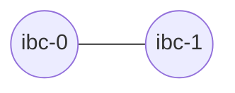
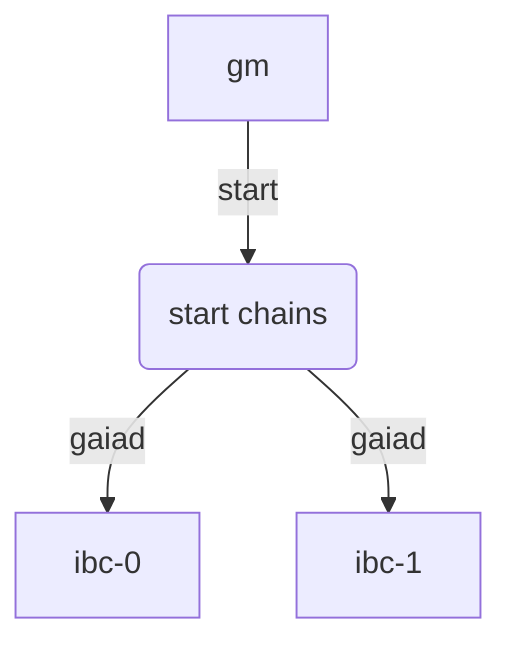

# Start the local chains

In this chapter, you will learn how to spawn two Gaia chains, and use Hermes to relay packets between them. The topology of the network will look like this:



To spawn the chains and configure Hermes accordingly, we will make use of Gaiad Manager `gm` that we installed in the last section [Install Gaiad Manager](../pre-requisites/gaiad-manager.md).

---

### Reset your configuration and start the chains

Make sure you have the `$HOME/.gm/gm.toml` that we configured in the previous section [Install Gaiad Manager](../pre-requisites/gaiad-manager.md). If this is not the first time you are running the script, you can manually stop the two gaia instances executing the following command to kill all `gaiad` processes:

```shell
{{#template ../../templates/commands/gm/stop.md}}
```

Then, reset the configuration of every node and every chain with:
```shell
rm -r $HOME/.gm/node-*
rm -r $HOME/.gm/ibc-*
```


> __NOTE__: If you have any `Docker` containers running that might be using the same ports as `gaiad` (e.g. port 27010-27012), please ensure you stop them first before proceeding to the next step.

Finally, start the chains with the `start` command.

```bash
{{#template ../../templates/commands/gm/start.md}}
```

This configures and starts two __`gaiad`__ instances, one named __`ibc-0`__ and the other named __`ibc-1`__:



If the command runs successfully, it should output something similar to:

```shell
Creating ibc-0 config...
ibc-0 started, PID: 11244, LOG: $HOME/.gm/ibc-0/log
Creating ibc-1 config...
ibc-1 started, PID: 11796, LOG: $HOME/.gm/ibc-1/log
Creating node-0 config...
node-0 started, PID: 12342, LOG: $HOME/.gm/node-0/log
Creating node-1 config...
node-1 started, PID: 12885, LOG: $HOME/.gm/node-1/log
```

Run the following command to check the status of the chains:

```bash
{{#template ../../templates/commands/gm/status.md}}
```

If the command is successful, you should see a message similar to:
```
NODE               PID    RPC   APP  GRPC  HOME_DIR
ibc-0            11244  27010 27011 27012  $HOME/.gm/ibc-0
 node-0          12342  27030 27031 27032  $HOME/.gm/node-0
ibc-1            11796  27020 27021 27022  $HOME/.gm/ibc-1
 node-1          12885  27040 27041 27042  $HOME/.gm/node-1
```


### Configuration file

Gaiad Manager `gm` takes care of creating the configuration file. Run the command below to create the `$HOME/.hermes/config.toml` file:

```bash
{{#template ../../templates/commands/gm/hermes_config.md}}
```
>__NOTE__: You can visit the [`Configuration`](../../documentation/configuration/index.md) section for more information about the configuration file.

Based on the `gm.toml` we created in the previous section [Install Gaiad Manager](../pre-requisites/gaiad-manager.md), your `$HOME/.hermes/config.toml` file should look like below :

__config.toml__

```toml
{{#include ../../templates/files/hermes/local-chains/config.toml}}
```

### Adding private keys to the chains

`gm` will automatically generate private keys that will be used by `hermes` to sign transactions.

To see the keys generated by `gm`, run the command below

```bash
{{#template ../../templates/commands/gm/keys.md}}
```

This will generate an output similar to the one below (albeit all on the same line):

<details><summary style="font-weight:bold">{{#template ../../templates/commands/gm/keys.md}} output</summary>

```
"$HOME/go/bin/gaiad" keys list --keyring-backend test --keyring-dir "$HOME/.gm/ibc-0"

- name: validator
address: cosmos1a5545h09sdzwgjpraasgkvu0f585lc33k9h4kx
pubkey: cosmospub1addwnpepqw5j24lg0ya34umnrn7akxuks3as2ktggndxg37cnfsx2fl5xkl8ymte6c2
mnemonic: "confirm path season shiver adjust order quarter now empower crystal busy foam pony web chaos bachelor magnet imitate audit wear spike chunk garlic sport"

- name: wallet
address: cosmos14czpvfgzcr06astyylahshcexzwm0j9ne6h5p5
pubkey: cosmospub1addwnpepqdcmngqappsxp6jp53atfx6kt5p7d6vce4un3mfvsa8gtml5n8lj2yh29q9
mnemonic: "brass exhibit artist beef album canvas liar fine water wave bus rose sunny permit strategy eight stove legal sustain vessel offer great book loan"

- name: wallet1
address: cosmos1qs5nmmf7jall4sm38fjssxfw5ay87mfp22p3xm
pubkey: cosmospub1addwnpepqtxfgjxg8xrc9xrzqyfs3ud6svmu7wrt608s80d0t0g93rylu4kd7kpckj6
mnemonic: "puzzle pole beyond announce clip else cause airport index pencil intact camp leisure pole nasty put meat cover garage ripple chief unfair destroy spatial"

- name: wallet2
address: cosmos1n7qyhjkfp8szpy7ury7vlejd5wcfc2ysdd9xlx
pubkey: cosmospub1addwnpepq2nuh2a9x9wd6ad78dcft3e8tuds5xs4ypeterl0zenw9ejt0tdvk38yd3z
mnemonic: "february slab crane panther harbor judge artefact ghost clay torch stay cave enrich narrow sausage expand tomato margin wool repeat squeeze couch fork unhappy"

"$HOME/go/bin/gaiad" keys list --keyring-backend test --keyring-dir "$HOME/.gm/ibc-1"

- name: validator
address: cosmos14eg9y3kjlrepk8lmdavw8u5l472sl8e6xv99yk
pubkey: cosmospub1addwnpepq0q4f0aaaq2wycg7y3x8j8gfacazdf3xlxujkjguy2k3gq654jwuyn58hhq
mnemonic: "clarify concert lens mobile hover lucky bulk home elite fix school jungle draw soul excess siren advice accuse shallow copper model absorb salon mystery"

- name: wallet
address: cosmos120jm7xkv49erxty6ec9trs85j8yfgjwwdlsrtz
pubkey: cosmospub1addwnpepqgs0llcm64e7yrpx7hs9fmzqefnwxzfxnujf3qgysdpv8w5aalu2z2e86gs
mnemonic: "shine again similar wheel also frozen equal win ask grit artist quality subject twenty pet scrub olympic ladder puppy balcony blood exotic buddy gather"

- name: wallet1
address: cosmos18ccme8td0zdktcy7dafhurdhx7x8xxx0s445y2
pubkey: cosmospub1addwnpepq045d9qjrkvfxdx39849qdcrny0zr8z2elx6z7kjkgezrvw2enepx98pyxf
mnemonic: "join skill day disease canal alpha sweet sing icon donor relief little wheat borrow silver allow child silent teach then flower deliver arena library"

- name: wallet2
address: cosmos1x45ucdaa3fegemh3x2xp0qtnxl2gv533e2fg6g
pubkey: cosmospub1addwnpepq0ryrcm08l8x5wskhd5dczrduj535fxs9w7wky04ux97amljcffe6ewxymg
mnemonic: "wish burden unfair subway club pulp wood helmet whip decline between maid defense sniff cash guard cargo travel donor nasty saddle tumble service fringe"

"$HOME/go/bin/gaiad" keys list --keyring-backend test --keyring-dir "$HOME/.gm/node-0"
[]

"$HOME/go/bin/gaiad" keys list --keyring-backend test --keyring-dir "$HOME/.gm/node-1"
[]
```

</details>

Next, we will need to associate a private key with chains `ibc-0` and `ibc-1` which `hermes` will use to sign transactions. 

```bash
{{#template ../../templates/commands/gm/hermes_keys.md}}
```

If successful, the command should show an output similar to:

```
SUCCESS Added key 'wallet' (cosmos1qsl5sq48r7xdfwq085x9pnlfu9ul5seufu3n03) on chain ibc-0
SUCCESS Added key 'wallet2' (cosmos1haaphqucg2u9g8gwgv6z8jzegvca85r4d7yqh9) on chain ibc-0
SUCCESS Added key 'wallet1' (cosmos1cgjf7m9txsxf2pdekxk60ll6xusx0heznqsnxn) on chain ibc-0
SUCCESS Added key 'wallet' (cosmos1zp3t2rp7tjr23wchp36lmw7vhk77gtvvc7lc5s) on chain ibc-1
SUCCESS Added key 'wallet2' (cosmos1644x9c8pyfwcmg43ch2u3vr6hl4rkmkz2weq39) on chain ibc-1
SUCCESS Added key 'wallet1' (cosmos1dsrj2uqjvtssenkwperuvfkgkg2xvmydvpzswy) on chain ibc-1
```

> __TROUBLESHOOTING__: 
> - If the command does not out output anything, make sure the path to Hermes' binary is set in `$HOME/.gm/gm.toml`.

### The `$HOME/.gm` directory

This directory is created when you install `gm` and the binaries are stored here but when we start the chains, all the related files and folders are stored here as well.

The `$HOME/.gm` directory has a tree structure similar to the one below:

```shell
.gm
├── bin
│   ├── gm
│   ├── lib-gm
│   └── shell-support
├── gm.toml
├── ibc-0
│   ├── config
│   ├── data
│   ├── init.json
│   ├── keyring-test
│   ├── log
│   ├── pid
│   ├── validator_seed.json
│   ├── wallet1_seed.json
│   ├── wallet2_seed.json
│   └── wallet_seed.json
├── ibc-1
│   ├── config
│   ├── data
│   ├── init.json
│   ├── keyring-test
│   ├── log
│   ├── pid
│   ├── validator_seed.json
│   ├── wallet1_seed.json
│   ├── wallet2_seed.json
│   └── wallet_seed.json
├── node-0
│   ├── config
│   ├── data
│   ├── init.json
│   ├── keyring-test
│   ├── log
│   └── pid
└── node-1
    ├── config
    ├── data
    ├── init.json
    ├── keyring-test
    ├── log
    └── pid
```

> __Tip__: You can use the command `tree ./data/ -L 2` to view the folder structure above

### The `$HOME/.hermes` directory

By the default `hermes` expects the configuration file to be in the __`$HOME/.hermes`__ folder.

It also stores the private keys for each chain in this folder as outlined in the [Keys](../../documentation/commands/keys/index.md) section.

After executing `{{#template ../../templates/commands/gm/start.md}}`, this is how the folder should look like:

```shell
$HOME/.hermes/
├── config.toml
└── keys
    ├── ibc-0
    │   └── keyring-test
    │       └── testkey.json
    └── ibc-1
        └── keyring-test
            └── testkey.json
```

---

## Next Steps

[The next section](./add-a-new-relay-path.md) describes how clients, connections and channels are created and how their identifiers are assigned.

