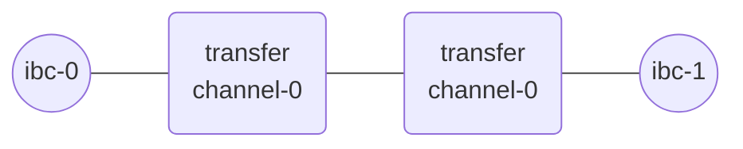

# Start relaying

In the [previous section](./add-a-new-relay-path.md), you created clients, established a connection between them and opened a channel on top of it. Now you can start relay on this path.

__Relay path__:


## Query balances

Use the following commands to query balances on your local chains:

- Balance at ibc-0:

    ```shell
    gaiad --node tcp://localhost:27030 query bank balances $(gaiad --home ~/.gm/ibc-0 keys --keyring-backend="test" show wallet -a)
    ```

- Balance at ibc-1:

    ```shell
    gaiad --node tcp://localhost:27040 query bank balances $(gaiad --home ~/.gm/ibc-1 keys --keyring-backend="test" show wallet -a)
    ```

> __NOTE__ the RPC addresses used in the two commands above are configured in `~/.hermes/config.toml` file. It can also be found with `gm status`

At this point of the tutorial, the two commands should output something similar to:

```
balances:
- amount: "100000000"
  denom: samoleans
- amount: "99994088"
  denom: stake
pagination:
  next_key: null
  total: "0"
```
>__NOTE__: Some `stake` tokens were used during the connection and channel handshakes.

## Exchange packets

Now, let's exchange `samoleans` between two chains.

- Open a new terminal and start Hermes using the `start` command : 

    ```shell
    hermes start
    ```
    Hermes will first relay the pending packets that have not been relayed and then start passive relaying by listening to and acting on packet events. 

- In a separate terminal, use the `ft-transfer` command to send `100000 samoleans` from ibc-0 to ibc-1 from channel-0:
    ```shell
    hermes tx ft-transfer --dst-chain ibc-1 --src-chain ibc-0 --src-port transfer --src-channel channel-0 --amount 100000 --timeout-seconds 1000
    ```
- Wait a few seconds then query balances on `ibc-1` and `ibc-0`. You should observe something similar to:
    - Balances at ibc-0:
        ```
        balances:
        - amount: "99900000"
        denom: samoleans
        - amount: "99992054"
        denom: stake
        pagination:
        next_key: null
        total: "0"
        ```
    - Balances at ibc-1:
        ```
        balances:
        - amount: "100000"
        denom: ibc/C1840BD16FCFA8F421DAA0DAAB08B9C323FC7685D0D7951DC37B3F9ECB08A199
        - amount: "100000000"
        denom: samoleans
        - amount: "99989196"
        denom: stake
        pagination:
        next_key: null
        total: "0"
        ```
    The samoleans were transferred to ibc-1 and are visible under the denomination `ibc/C1840...`. 

- Transfer back half of these tokens to ibc-0:
    ```shell
    hermes tx ft-transfer --dst-chain ibc-0 --src-chain ibc-1 --src-port transfer --src-channel channel-0 --amount 100000 --timeout-seconds 1000 --denom ibc/C1840BD16FCFA8F421DAA0DAAB08B9C323FC7685D0D7951DC37B3F9ECB08A199
    ```
- Wait a few seconds then query balances on `ibc-1` and `ibc-0` again. You should observe something similar to:
    - Balances at ibc-0:
        ```
        balances:
        - amount: "100000000"
        denom: samoleans
        - amount: "99987927"
        denom: stake
        pagination:
        next_key: null
        total: "0"
        ```
    - Balances at ibc-1:
        ```
        balances:
        - amount: "0"
        denom: ibc/C1840BD16FCFA8F421DAA0DAAB08B9C323FC7685D0D7951DC37B3F9ECB08A199
        - amount: "100000000"
        denom: samoleans
        - amount: "99983879"
        denom: stake
        pagination:
        next_key: null
        total: "0"
        ```
- Open your browser and open `http://localhost:3001/metrics`. At this point, you should observe that the `wallet_balance` metric corresponds to what you observed in the previous step. All the metrics can be useful and are described in the [Telemetry](../../documentation/telemetry/index.md) section. We will describe a way to use them in the tutorial [Relaying in production](../production/index.md).

## Stop relaying and stop the chains

- Stop Hermes by pressing `Ctrl+C` on the terminal running `hermes start`.

- Stop the chains with `gm stop`.

## Next steps

In this tutorial, you learned the basics of relaying:
- Create clients on two chains.
- Establish a connection between them.
- Open a channel.
- Visualize your network.
- Exchange packets. 

In the [next tutorial](../more-chains/index.md), you will learn how to relay between multiple chains with multiple instances.