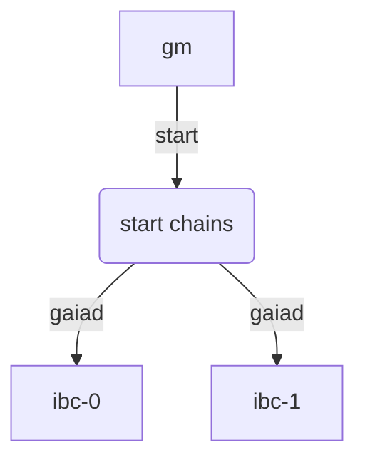

# Start the local chains

In this chapter, you will learn how to spawn two Gaia chains, and use Hermes to relay packets between them.

To spawn the chains and configure Hermes accordingly, we will make use of Gaiad Manager `gm` that we installed in the last section [Install Gaiad Manager](gaiad-manager.md)

### Stop existing `gaiad` processes

If this is not the first time you are running the script, you can manually stop the two gaia instances executing the following command to kill all `gaiad` processes:

```shell
killall gaiad
```

> __NOTE__: If you have any `Docker` containers running that might be using the same ports as `gaiad` (e.g. port 26657 or port 9090), please ensure you stop them first before proceeding to the next step.

### Configuration file

Gaiad Manager `gm` takes care of creating the configuration file. Run the command below to create the `$HOME/.hermes/config.toml` file

```bash
gm hermes config
```
Please check the [`Configuration`](../../config.md) section for more information about the relayer configuration file.

Based on the `gm.toml` we created in the previous section [Install Gaiad Manager](gaiad-manager.md), your `$HOME/.hermes/config.toml` file should look like below :

__config.toml__

```toml
[global]
log_level = 'info'

[mode]

[mode.clients]
enabled = true
refresh = true
misbehaviour = true

[mode.connections]
enabled = true

[mode.channels]
enabled = true

[mode.packets]
enabled = true
clear_interval = 100
clear_on_start = true
tx_confirmation = true

[telemetry]
enabled = true
host = '127.0.0.1'
port = 3001

[[chains]]
id = 'ibc-0'
rpc_addr = 'http://localhost:27030'
grpc_addr = 'http://localhost:27032'
websocket_addr = 'ws://localhost:27030/websocket'
rpc_timeout = '15s'
account_prefix = 'cosmos'
key_name = 'wallet'
store_prefix = 'ibc'
gas_price = { price = 0.01, denom = 'stake' }
max_gas = 10000000
clock_drift = '5s'
trusting_period = '14days'
trust_threshold = { numerator = '1', denominator = '3' }

[[chains]]
id = 'ibc-1'
rpc_addr = 'http://localhost:27040'
grpc_addr = 'http://localhost:27042'
websocket_addr = 'ws://localhost:27040/websocket'
rpc_timeout = '15s'
account_prefix = 'cosmos'
key_name = 'wallet'
store_prefix = 'ibc'
gas_price = { price = 0.01, denom = 'stake' }
max_gas = 10000000
clock_drift = '5s'
trusting_period = '14days'
trust_threshold = { numerator = '1', denominator = '3' }
```

### Adding private keys to the chains

`gm` will automatically generate private keys that will be used by `hermes` to sign transactions.

To see the keys generated by `gm`, run the command below

```bash
gm key
```

This will generate an output similar to the one below (albeit all on the same line):
```json
{
  "name": "testkey",
  "type": "local",
  "address": "cosmos1tc3vcuxyyac0dmayf887t95tdg7qpyql48w7gj",
  "pubkey": "cosmospub1addwnpepqgg7ng4ycm60pdxfzdfh4hjvkwcr3da59mr8k883vsstx60ruv7kur4525u",
  "mnemonic": "[24 words mnemonic]"
}
```

Next, we will need to associate a private key with chains `ibc-0` and `ibc-1` which `hermes` will use to sign transactions. 

```bash
gm hermes keys
```

If successful, the command should show an output similar to:

```
Success: Added key testkey ([ADDRESS]) on [CHAIN ID] chain
```

### Starting the chains with `gm`

Make sure you have the `$HOME/.gm/gm.toml` that we configured in the previous section [Install Gaiad Manager](gaiad-manager.md) and run the `gm` command below to start the chains.

```bash
gm start
```

This configures and starts two __`gaiad`__ instances, one named __`ibc-0`__ and the other __`ibc-1`__



If the command runs successfully you should see a message similar to the one below in the terminal:

```shell
network1 started, PID: 99468, LOG: /Users/testuser/.gm/network1/log
network2 started, PID: 99538, LOG: /Users/testuser/.gm/network2/log
ibc-0 started, PID: 99645, LOG: /Users/testuser/.gm/ibc-0/log
ibc-1 started, PID: 99750, LOG: /Users/testuser/.gm/ibc-1/log
```
Run the below command to check the status of the chains

```bash
gm status
```

### $HOME/.gm directory

This directory is creted when you install `gm` and the binaries are stored here but when we start the chains, all the related files and folders are stored here as well.

The $HOME/.gm directory has a tree structure similar to the one below:

```shell
.gm
├── bin
│   ├── gm
│   ├── lib-gm
│   └── shell-support
├── gm.toml
├── ibc-0
│   ├── config
│   ├── data
│   ├── init.json
│   ├── keyring-test
│   ├── log
│   ├── pid
│   ├── validator_seed.json
│   ├── wallet1_seed.json
│   ├── wallet2_seed.json
│   └── wallet_seed.json
├── ibc-1
│   ├── config
│   ├── data
│   ├── init.json
│   ├── keyring-test
│   ├── log
│   ├── pid
│   ├── validator_seed.json
│   ├── wallet1_seed.json
│   ├── wallet2_seed.json
│   └── wallet_seed.json
├── node-0
│   ├── config
│   ├── data
│   ├── init.json
│   ├── keyring-test
│   ├── log
│   └── pid
└── node-1
    ├── config
    ├── data
    ├── init.json
    ├── keyring-test
    ├── log
    └── pid

```

> __Tip__: You can use the command `tree ./data/ -L 2` to view the folder structure above

### $HOME/.hermes directory

By the default `hermes` expects the configuration file to be in the __`$HOME/.hermes`__ folder.

It also stores the private keys for each chain in this folder as outlined in the [Keys](../../commands/keys/index.md) section.

After executing `gm start`, this is how the folder should look like:

```shell
$HOME/.hermes/
├── config.toml
└── keys
    ├── ibc-0
    │   └── keyring-test
    │       └── testkey.json
    └── ibc-1
        └── keyring-test
            └── testkey.json
```

#### Next Steps

[The next section](./identifiers.md) describes how identifers for clients, connections and channels
are allocated, and will walk you through how to pre-allocate some identifers
to help matching them with their corresponding chains for the purpose of this tutorial.
