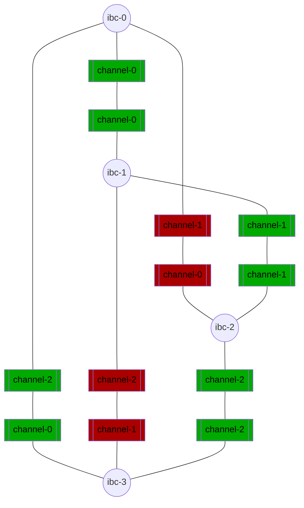

# Build the topology

At this point in the tutorial, you should have four chains running and Hermes correctly configured. You can perform a `health-check` with the command :

```shell
{{#template ../../templates/commands/hermes/health_check}}
```

If the command runs successfully, it should output something similar to:
```
    2022-08-23T15:54:58.150005Z  INFO ThreadId(01) using default configuration from '$HOME/.hermes/config.toml'
    2022-08-23T15:54:58.150179Z  INFO ThreadId(01) [ibc-0] performing health check...
    2022-08-23T15:54:58.163298Z  INFO ThreadId(01) chain is healthy chain=ibc-0
    2022-08-23T15:54:58.163323Z  INFO ThreadId(01) [ibc-1] performing health check...
    2022-08-23T15:54:58.169132Z  INFO ThreadId(01) chain is healthy chain=ibc-1
    2022-08-23T15:54:58.169154Z  INFO ThreadId(01) [ibc-2] performing health check...
    2022-08-23T15:54:58.178418Z  INFO ThreadId(01) chain is healthy chain=ibc-2
    2022-08-23T15:54:58.178445Z  INFO ThreadId(01) [ibc-3] performing health check...
    2022-08-23T15:54:58.184615Z  INFO ThreadId(01) chain is healthy chain=ibc-3
    SUCCESS performed health check for all chains in the config
```

In the following tutorial, we will connect all of these chains in a full mesh topology, then use `Packet filters` to simulate the topology given at the beginning of the [previous section](./start-local-chains.md).

> __NOTE__: It is also possible to only create the channels that you want. However, in production, anyone can open channels and recreate a fully-connected topology.

---

## Connect all the chains

Execute the following command:
```shell
{{#template ../../templates/commands/gm/hermes_cc}}
```

If this command runs successfully, it should output the following:

```shell
{{#template ../../templates/commands/hermes/create_channel_new_client binary="$HOME/ibc-rs/target/release/hermes" a-chain=ibc-0 b-chain=ibc-1 a-port=transfer b-port=transfer}}
{{#template ../../templates/commands/hermes/create_channel_new_client binary="$HOME/ibc-rs/target/release/hermes" a-chain=ibc-0 b-chain=ibc-2 a-port=transfer b-port=transfer}}
{{#template ../../templates/commands/hermes/create_channel_new_client binary="$HOME/ibc-rs/target/release/hermes" a-chain=ibc-0 b-chain=ibc-3 a-port=transfer b-port=transfer}}
{{#template ../../templates/commands/hermes/create_channel_new_client binary="$HOME/ibc-rs/target/release/hermes" a-chain=ibc-1 b-chain=ibc-2 a-port=transfer b-port=transfer}}
{{#template ../../templates/commands/hermes/create_channel_new_client binary="$HOME/ibc-rs/target/release/hermes" a-chain=ibc-1 b-chain=ibc-3 a-port=transfer b-port=transfer}}
{{#template ../../templates/commands/hermes/create_channel_new_client binary="$HOME/ibc-rs/target/release/hermes" a-chain=ibc-2 b-chain=ibc-3 a-port=transfer b-port=transfer}}
```

Executing these commands will:
* For every pair of chains, create a client on both chain tracking the state of the counterparty chain.
* Create a connection between these two clients.
* Create a `transfer` channel over this connection.

Use the flag `--exec` flag to execute these commands:

```shell
{{#template ../../templates/commands/gm/hermes_cc_exec}}
```

At this point, your network should be fully connected. It is now time to filter channels. The following chart shows the current state of the network. The channels that we want to filter out are filled in red while the channels we want to relay on are filled in green:

__Network topology__


You can verify that everything is correct with the commands:

```shell
{{#template ../../templates/commands/hermes/query_channels_show_counterparty chain=ibc-0}}
{{#template ../../templates/commands/hermes/query_channels_show_counterparty chain=ibc-1}}
{{#template ../../templates/commands/hermes/query_channels_show_counterparty chain=ibc-2}}
{{#template ../../templates/commands/hermes/query_channels_show_counterparty chain=ibc-3}}
```

Which should normally output: 

```
ibc-0: transfer/channel-0 --- ibc-1: transfer/channel-0
ibc-0: transfer/channel-1 --- ibc-2: transfer/channel-0
ibc-0: transfer/channel-2 --- ibc-3: transfer/channel-0

ibc-1: transfer/channel-0 --- ibc-0: transfer/channel-0
ibc-1: transfer/channel-1 --- ibc-2: transfer/channel-1
ibc-1: transfer/channel-2 --- ibc-3: transfer/channel-1

ibc-2: transfer/channel-0 --- ibc-0: transfer/channel-1
ibc-2: transfer/channel-1 --- ibc-1: transfer/channel-1
ibc-2: transfer/channel-2 --- ibc-3: transfer/channel-2

ibc-3: transfer/channel-0 --- ibc-0: transfer/channel-2
ibc-3: transfer/channel-1 --- ibc-1: transfer/channel-2
ibc-3: transfer/channel-2 --- ibc-2: transfer/channel-2
```

## Add packet filters

Let's use packet filters to relay only on the green paths specified in the chart. In order to add filters, open your default configuration file `$HOME/.hermes/config.toml` and add:
- Under `ibc-0`'s config: 
    ```
    [chains.packet_filter]
    policy = 'allow'
    list = [
        ['transfer', 'channel-0'],
        ['transfer', 'channel-2'],
    ]
    ```
- Under `ibc-1`'s config:
    ```
    [chains.packet_filter]
    policy = 'allow'
    list = [
        ['transfer', 'channel-0'],
        ['transfer', 'channel-1'],
    ]
    ```
- Under `ibc-2`'s config:
    ```
    [chains.packet_filter]
    policy = 'allow'
    list = [
        ['transfer', 'channel-0'],
        ['transfer', 'channel-2'],
    ]
    ```
- Under `ibc-3`'s config:
    ```
    [chains.packet_filter]
    policy = 'allow'
    list = [
        ['transfer', 'channel-0'],
        ['transfer', 'channel-2'],
    ]
    ```

> __NOTE__: It is also possible to use a `deny` policy to filter out the channels you do not want to relay on. However, if other channels exist or are created, the relayer will also relay on them.

At this point, your config file should look like this:
<details><summary style="font-weight:bold">config.toml</summary>

```
{{#template ../../templates/files/hermes/more-chains/config_with_filters.toml}}
```

</details>

It is also possible to check that the configuration file is valid with the command:

```shell
{{#template ../../templates/commands/hermes/config_validate}}
```

If the command runs successfully, the output should be:

```
SUCCESS "configuration is valid"
```

---

## Next Steps

The [following section](./start-relaying.md) describes how to relay packets between any chain with this topology.
