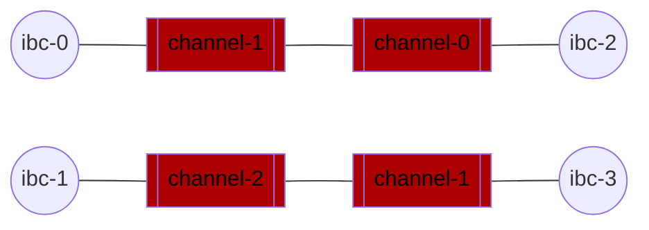

# Add new instances of Hermes

In the previous section, you attempted a direct transfer between `ibc-1` and `ibc-3` which failed because your current instance of Hermes does not relay on that path.

In the following section, you will start new instances of Hermes to relay on the paths which are currently disabled:



Running multiple instances of Hermes can have many advantages and disadvantages. It allows for fine-grained control over every channel and can be more stable than running a single instance. However, you will also need to manage more wallets. 

---


## Create a new config file

First, you will have to create a new configuration file with:
- New packets filters.

    In order to enable the new paths.

- Different wallets.

    **Two instances of Hermes can not share the same wallet.**

- A different telemetry port.

    **Two processes can not share the same port for any of their services.**

Create the following configuration file at `$HOME/hermes_second_instance.toml`:

__hermes_second_instance.toml__

```toml
{{#template ../../templates/files/hermes/more-chains/hermes_second_instance.toml}}
```

In order to make use of this config, specify it with the `--config` flag:

```shell
hermes --config $HOME/hermes_second_instance.toml <COMMAND>
```

## Query pending packets
Let's find the packet that was lost in the first step of the [previous section](./start-relaying.md) with the `query packet` command:

```shell
{{#template ../../templates/commands/hermes/query_packet_pending chain=ibc-1 port=transfer channel=channel-2}}
```

>__NOTE__: You do not need to specify the configuration file as long as `ibc-1` and `ibc-3` are in the default config file.

If the command runs succesfully, it should output:

```
SUCCESS Summary {
    src: PendingPackets {
        unreceived_packets: [
            Sequence(
                1,
            ),
        ],
        unreceived_acks: [],
    },
    dst: PendingPackets {
        unreceived_packets: [],
        unreceived_acks: [],
    },
}
```

## Clear the packet
Now that we have retrieved this packet, let's clear it manually with the command `hermes clear packets`:

```shell
{{#template ../../templates/commands/hermes/optional_config_flag/clear_packets config=$HOME/hermes_second_instance.toml chain=ibc-1 port=transfer channel=channel-2}}
```
>__NOTE__: We are using the second config to avoid using the same wallets as the running instance of the relayer. You could also simply use the `key-name` and `counterparty-key-name` flags to set another wallet. If you do not use it, you will observe a few `account_sequence_mismatch` errors on the terminal running `hermes start` but hermes will automatically recover.

If the command runs succesfully, it should output:

```
SUCCESS [
    UpdateClient(
        cs_h: 07-tendermint-1(1-364),
    ),
    WriteAcknowledgement(
        WriteAcknowledgement - seq:1, path:channel-2/transfer->channel-1/transfer, toh:no timeout, tos:Timestamp(2022-08-29T18:29:44.733494709Z)),
    ),
    UpdateClient(
        cs_h: 07-tendermint-2(3-365),
    ),
    AcknowledgePacket(
        AcknowledgePacket - seq:1, path:channel-2/transfer->channel-1/transfer, toh:no timeout, tos:Timestamp(2022-08-29T18:29:44.733494709Z)),
    ),
]
```

>__NOTE__: It can also output a TimeoutPacket if you execute it after the packet times out (10000 seconds in this case).

You can verify that the packet was correctly relayed by querying balances or directly querying packets:
```shell
{{#template ../../templates/commands/hermes/query_packet_pending chain=ibc-1 port=transfer channel=channel-2}}
```

If the command runs successfully, it should output:

```
SUCCESS Summary {
    src: PendingPackets {
        unreceived_packets: [],
        unreceived_acks: [],
    },
    dst: PendingPackets {
        unreceived_packets: [],
        unreceived_acks: [],
    },
}
```

As you can see, there is currently no stuck packet between `ibc-1` and `ibc-3`. 

## Make stuck packets

For the sake of learning, let's make new stuck packets on the `ibc-0<>ibc-2` channel and the `ibc-1<>ibc-3` channel.

```shell
{{#template ../../templates/commands/hermes/transfer dst-chain=ibc-3 src-chain=ibc-1 src-port=transfer src-channel=channel-2 amount=1000000 timeout-seconds=10000}}
{{#template ../../templates/commands/hermes/transfer dst-chain=ibc-2 src-chain=ibc-0 src-port=transfer src-channel=channel-1 amount=1000000 timeout-seconds=10000}}
```

If both commands run successfully, they should output a `SUCCESS` message. 

Now, let's verify that these packets are indeed stuck with the `query packet` command:

- On `ibc-0`:
    ```shell
    {{#template ../../templates/commands/hermes/query_packet_pending chain=ibc-0 port=transfer channel=channel-1}}
    ```

    Which should output:

    ```
    SUCCESS Summary {
        src: PendingPackets {
            unreceived_packets: [
                Sequence(
                    1,
                ),
            ],
            unreceived_acks: [],
        },
        dst: PendingPackets {
            unreceived_packets: [],
            unreceived_acks: [],
        },
    }
    ```
    

- On `ibc-1`:
    ```shell
    {{#template ../../templates/commands/hermes/query_packet_pending chain=ibc-1 port=transfer channel=channel-2}}
    ```

    Which should output:
    
    ```
    SUCCESS Summary {
        src: PendingPackets {
            unreceived_packets: [
                Sequence(
                    2,
                ),
            ],
            unreceived_acks: [],
        },
        dst: PendingPackets {
            unreceived_packets: [],
            unreceived_acks: [],
        },
    }   
    ```

You have pending packets on the two paths filtered out by our running instance. 

>__NOTE__: You can also verify that Hermes is still relaying on the other paths by sending a packet from `ibc-1` to `ibc-2`:
>
>```shell
>{{#template ../../templates/commands/hermes/transfer dst-chain=ibc-2 src-chain=ibc-1 src-port=transfer src-channel=channel-1 amount=1000000 timeout-seconds=10000}}
>```
>
>Wait a few seconds then verify that no packet is pending with:
>```shell
>{{#template ../../templates/commands/hermes/query_packet_pending chain=ibc-1 port=transfer channel=channel-1}}
>```


## Start your second instance to clear packets

Instead of clearing packets manually again, you can just start Hermes with the [new config file you created](#create-a-new-config-file) in a new terminal:

```shell
{{#template ../../templates/commands/hermes/optional_config_flag/start config=$HOME/hermes_second_instance.toml}}
```

At launch, Hermes will clear pending packets before moving into passive mode.

- Wait a few seconds. You should observe logs produced on the terminal running the second instance of Hermes.

- Query for pending packets at `ibc-0` on `channel-1` and `ibc-1` on `channel-2` again with the `query packet pending` command. Both should output:
    ```
    SUCCESS Summary {
        src: PendingPackets {
            unreceived_packets: [],
            unreceived_acks: [],
        },
        dst: PendingPackets {
            unreceived_packets: [],
            unreceived_acks: [],
        },
    }
    ```

You can now send packets between any pair of chains. One of your two instances will relay it. Feel free to exchange more packets and observe the logs.

## Stop relaying and stop the chains

- Stop Hermes by pressing `Ctrl+C` on the terminals running `{{#template ../../templates/commands/hermes/start}}`.

- Stop the chains with `{{#template ../../templates/commands/gm/stop}}`.

---

## Next Steps

In the [next tutorial](../production/index.md), you will learn how to set up Hermes in production.
