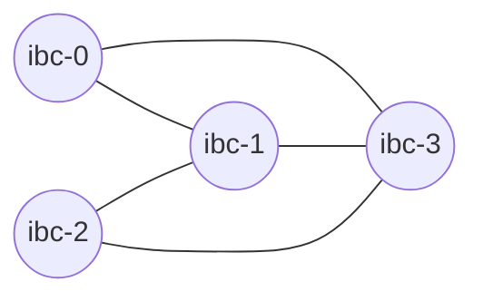

# Even more local chains

In this tutorial we will show how you can test the relayer against five chains using Gaiad manager `gm` with an arbitrary topology of IBC channels.

Using `gm` we will start five [`gaia`](https://github.com/cosmos/gaia) chains that support the `IBC` protocol.

Make sure that you followed the steps in the [Pre-requisites for local chains](../pre-requisites/index.md) section.

