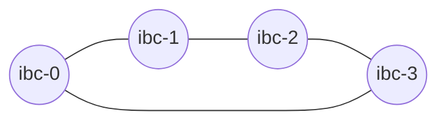

# Start the local chains

In this chapter, you will learn how to spawn four Gaia chains, connect them in an arbitrary topology and use Hermes to transfer tokens between them.



As for the [Local chains tutorial](../local-chains/index.md), we will make use of Gaiad Manager `gm` that we installed in [Install Gaiad Manager](../pre-requisites/gaiad-manager.md).

---

### Reset your configuration

First, make sure that no chain is currently running by killing all `gaiad` processes.

```shell
{{#template ../../templates/commands/gm/stop.md}}
```

Then, make sure that your folder `$HOME/.gm` does not contain any `ibc-*` or `node-*` file. You can remove them with

```shell
rm -r $HOME/.gm/node-*
rm -r $HOME/.gm/ibc-*
```

Copy and paste the configuration below to `$HOME/.gm/gm.toml` and set Hermes' binary path according to your setup. The following contains the configuration of 4 IBC-enabled chains.

__gm.toml__

```toml
{{#include ../../templates/files/gm/more-chains/gm.toml}}
```

> __NOTE__: If you have any `Docker` containers running that might be using the same ports as `gaiad` (e.g. port 27010-27012), please ensure you stop them first before proceeding to the next step.

Finally, start the chains with the `start` command.

```bash
{{#template ../../templates/commands/gm/start.md}}
```

This configures and starts four __`gaiad`__ instances.


If the command runs successfully, it should output something similar to:

```shell
Creating ibc-0 config...
ibc-0 started, PID: 21330, LOG: $HOME/.gm/ibc-0/log
Creating ibc-1 config...
ibc-1 started, PID: 21888, LOG: $HOME/.gm/ibc-1/log
Creating ibc-2 config...
ibc-2 started, PID: 22443, LOG: $HOME/.gm/ibc-2/log
Creating ibc-3 config...
ibc-3 started, PID: 22999, LOG: $HOME/.gm/ibc-3/log
Creating node-0 config...
node-0 started, PID: 23547, LOG: $HOME/.gm/node-0/log
Creating node-1 config...
node-1 started, PID: 24101, LOG: $HOME/.gm/node-1/log
Creating node-2 config...
node-2 started, PID: 24649, LOG: $HOME/.gm/node-2/log
Creating node-3 config...
node-3 started, PID: 25194, LOG: $HOME/.gm/node-3/log
```

Run the following command to check the status of the chains:

```bash
{{#template ../../templates/commands/gm/status.md}}
```

If the command is successful, you should see a message similar to:
```
NODE               PID    RPC   APP  GRPC  HOME_DIR
ibc-0            21330  27010 27011 27012  $HOME/.gm/ibc-0
 node-0          23547  27050 27051 27052  $HOME/.gm/node-0
ibc-1            21888  27020 27021 27022  $HOME/.gm/ibc-1
 node-1          24101  27060 27061 27062  $HOME/.gm/node-1
ibc-2            22443  27030 27031 27032  $HOME/.gm/ibc-2
 node-2          24649  27070 27071 27072  $HOME/.gm/node-2
ibc-3            22999  27040 27041 27042  $HOME/.gm/ibc-3
 node-3          25194  27080 27081 27082  $HOME/.gm/node-3
```


### Hermes' configuration file

Gaiad Manager `gm` takes care of creating the configuration file. Run the command below to create the `$HOME/.hermes/config.toml` file:

```bash
{{#template ../../templates/commands/gm/hermes_config.md}}
```
>__NOTE__: You can visit the [`Configuration`](../../documentation/configuration/index.md) section for more information about the configuration file.

Based on the `gm.toml` above, your `$HOME/.hermes/config.toml` file should look like:

__config.toml__

```toml
{{#include ../../templates/files/hermes/more-chains/config_without_filters.toml}}
```

### Adding private keys to the chains

Next, we will need to associate a private key to every chain which `hermes` will use to sign transactions. `gm` will automatically generate and associate them with:

```bash
{{#template ../../templates/commands/gm/hermes_keys.md}}
```

If successful, the command should show an output similar to:

```
SUCCESS Added key 'wallet' (cosmos1qsl5sq48r7xdfwq085x9pnlfu9ul5seufu3n03) on chain ibc-0
SUCCESS Added key 'wallet2' (cosmos1haaphqucg2u9g8gwgv6z8jzegvca85r4d7yqh9) on chain ibc-0
SUCCESS Added key 'wallet1' (cosmos1cgjf7m9txsxf2pdekxk60ll6xusx0heznqsnxn) on chain ibc-0
SUCCESS Added key 'wallet' (cosmos1zp3t2rp7tjr23wchp36lmw7vhk77gtvvc7lc5s) on chain ibc-1
SUCCESS Added key 'wallet2' (cosmos1644x9c8pyfwcmg43ch2u3vr6hl4rkmkz2weq39) on chain ibc-1
SUCCESS Added key 'wallet1' (cosmos1dsrj2uqjvtssenkwperuvfkgkg2xvmydvpzswy) on chain ibc-1
SUCCESS Added key 'wallet' (cosmos1k6c6le34zsmz34yez84a7tquedy3mkc3hy7wg8) on chain ibc-2
SUCCESS Added key 'wallet2' (cosmos1murv55h3utv5ck0a2tk5ue3n88wgglhlhyzyq8) on chain ibc-2
SUCCESS Added key 'wallet1' (cosmos1r8sq88n4k8ajsmq3sscnsd8829lqxvsmue2gf7) on chain ibc-2
SUCCESS Added key 'wallet' (cosmos1eykzqwq20sqdgvhf0tmz6xjq9mlcluwxed77gj) on chain ibc-3
SUCCESS Added key 'wallet2' (cosmos1lz6df9uggl9459z2vusw9tknpy3xn2v7yq60k9) on chain ibc-3
SUCCESS Added key 'wallet1' (cosmos15jxyjskrx7s8yqpfn3xddlrx7qcq0f8r69mp4g) on chain ibc-3
```

> __TROUBLESHOOTING__: 
> - If the command does not out output anything, make sure the path to Hermes' binary is set in `$HOME/.gm/gm.toml`.

### The `$HOME/.gm` directory

This directory is created when you install `gm` and the binaries are stored here but when we start the chains, all the related files and folders are stored here as well.

The `$HOME/.gm` directory has a tree structure similar to:

```shell
.gm
├── bin
│   ├── gm
│   ├── lib-gm
│   └── shell-support
├── gm.toml
├── ibc-0
│   ├── config
│   ├── data
│   ├── init.json
│   ├── keyring-test
│   ├── log
│   ├── pid
│   ├── validator_seed.json
│   ├── wallet1_seed.json
│   ├── wallet2_seed.json
│   └── wallet_seed.json
├── ibc-1
│   ├── config
│   ├── data
│   ├── init.json
│   ├── keyring-test
│   ├── log
│   ├── pid
│   ├── validator_seed.json
│   ├── wallet1_seed.json
│   ├── wallet2_seed.json
│   └── wallet_seed.json
├── ibc-2
│   ├── config
│   ├── data
│   ├── init.json
│   ├── keyring-test
│   ├── log
│   ├── pid
│   ├── validator_seed.json
│   ├── wallet1_seed.json
│   ├── wallet2_seed.json
│   └── wallet_seed.json
├── ibc-3
│   ├── config
│   ├── data
│   ├── init.json
│   ├── keyring-test
│   ├── log
│   ├── pid
│   ├── validator_seed.json
│   ├── wallet1_seed.json
│   ├── wallet2_seed.json
│   └── wallet_seed.json
├── node-0
│   ├── config
│   ├── data
│   ├── init.json
│   ├── log
│   └── pid
├── node-1
│   ├── config
│   ├── data
│   ├── init.json
│   ├── log
│   └── pid
├── node-2
│   ├── config
│   ├── data
│   ├── init.json
│   ├── log
│   └── pid
└── node-3
    ├── config
    ├── data
    ├── init.json
    ├── log
    └── pid

```

> __Tip__: You can use the command `tree ./data/ -L 2` to view the folder structure above

### The `$HOME/.hermes` directory

By default, `hermes` expects the configuration file to be in the __`$HOME/.hermes`__ folder.

It also stores the private keys for each chain in this folder as outlined in the [Keys](../../documentation/commands/keys/index.md) section.

After executing `{{#template ../../templates/commands/gm/start.md}}`, this is how the folder should look like:

```shell
$HOME/.hermes/
├── config.toml
└── keys
    ├── ibc-0
    │   └── keyring-test
    │       ├── wallet.json
    │       ├── wallet1.json
    │       └── wallet2.json
    ├── ibc-1
    │   └── keyring-test
    │       ├── wallet.json
    │       ├── wallet1.json
    │       └── wallet2.json
    ├── ibc-2
    │   └── keyring-test
    │       ├── wallet.json
    │       ├── wallet1.json
    │       └── wallet2.json
    └── ibc-3
        └── keyring-test
            ├── wallet.json
            ├── wallet1.json
            └── wallet2.json
```

---

## Next Steps

[The next section](./build-the-topology.md) describes how to create an arbitrary topology between these chains before relaying packets.
