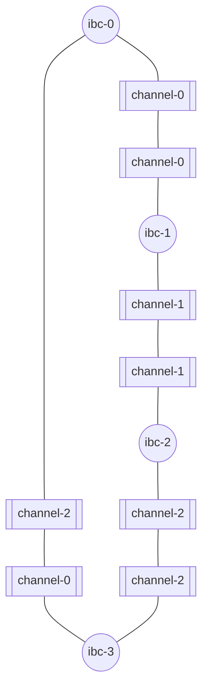

# Start relaying

In the previous tutorial, you learned about how to relay packets between a pair of chain on a relay path. Now, you will learn how to relay packets on an arbitrary topology.

>__WARNING__ Before proceeding to the sections above, please first, make sure you followed the steps in the [Build the topology section](./build-the-topology.md).

The chains should be fully connected and the relayer should be setup to relay on these channels:



## Query balances

- balance at ibc-0:

    ```shell
    gaiad --node tcp://localhost:27050 query bank balances $(gaiad --home ~/.gm/ibc-0 keys --keyring-backend="test" show wallet -a)
    ```

- balance at ibc-1:

    ```shell
    gaiad --node tcp://localhost:27060 query bank balances $(gaiad --home ~/.gm/ibc-1 keys --keyring-backend="test" show wallet -a)
    ```

- balance at ibc-2:

    ```shell
    gaiad --node tcp://localhost:27070 query bank balances $(gaiad --home ~/.gm/ibc-2 keys --keyring-backend="test" show wallet -a)
    ```

- balance at ibc-3:

    ```shell
    gaiad --node tcp://localhost:27080 query bank balances $(gaiad --home ~/.gm/ibc-3 keys --keyring-backend="test" show wallet -a)
    ```

> __NOTE__ the RPC addresses used in the two commands above are configured in `~/.hermes/config.toml` file. It can also be found with `gm status`

At this point of the tutorial, every command should output something similar to:

```
- amount: "100000000"
  denom: samoleans
- amount: "99982481"
  denom: stake
pagination:
  next_key: null
  total: "0"
```

## Start relaying

Now, let's exchange `samoleans` between chains.

- Open a new terminal and start Hermes using the `start` command : 

    ```shell
    hermes start
    ```
    Hermes will first relay the pending packets that have not been relayed and then start passive relaying by listening to and acting on packet events. 

- Let's transfer `1000000 samoleans` from ibc-1 to ibc-3. Remember that there is a direct path between ibc-1 (channel-2) and ibc-3 (channel-1).

    - In a separate terminal, use the `ft-transfer` command to send `1000000 samoleans` from ibc-1 to ibc-3 from channel-2:
    ```shell
        hermes tx ft-transfer --dst-chain ibc-3 --src-chain ibc-1 --src-port transfer --src-channel channel-2 --amount 1000000 --timeout-seconds 1000
    ``` 
    - Wait a few seconds then query balances on `ibc-1` and `ibc-3`. You should observe that `ibc-1` lost 1000000 samoleans but `ibc-3` did not receive any:

        * ibc-1 : 
        ```
        
        ```
        * ibc-3 : 
        ```
        
        ```

    - Observe the output on the relayer terminal and verify that no event is processed. 

    If you correctly created the packet filters in the [previous section](./build-the-topology.md), the relayer does not relay on this path. So what happened to the 1000000 samoleans you just sent ? It is stuck until a relayer decides to relay this packet to `ibc-3`. For now, let's forget about these samoleans. We can get as many as we want anyway. 

    It might be impossible to send packets directly from `ibc-1` to `ibc-3`, however, it is possible to use `ibc-2` as a bridge:

    ```mermaid
    graph LR;
    ibc1 --> ibc2 --> ibc3
    ```

- In a separate terminal, use the `ft-transfer` command to send `1000000 samoleans` from ibc-1 to ibc-2 from channel-1:
    ```shell
        hermes tx ft-transfer --dst-chain ibc-2 --src-chain ibc-1 --src-port transfer --src-channel channel-1 --amount 1000000 --timeout-seconds 1000
    ```
- Wait a few seconds then query balances on `ibc-1` and `ibc-2`. You should observe something similar to:
    - ibc-1:
        ```
            - amount: "99900000"
            denom: samoleans
            - amount: "99992054"
            denom: stake
            pagination:
            next_key: null
            total: "0"
        ```
    - ibc-2:
        ```
            - amount: "100000"
            denom: ibc/C1840BD16FCFA8F421DAA0DAAB08B9C323FC7685D0D7951DC37B3F9ECB08A199
            - amount: "100000000"
            denom: samoleans
            - amount: "99989196"
            denom: stake
            pagination:
            next_key: null
            total: "0"
        ```
    The samoleans were transfered to ibc-1 and are visible under the denom `ibc/C1840...`. 

- Transfer back `50000` these tokens to ibc-0:
    ```shell
        hermes tx ft-transfer --dst-chain ibc-0 --src-chain ibc-1 --src-port transfer --src-channel channel-1 --amount 50000 --timeout-seconds 1000 --denom ibc/C1840BD16FCFA8F421DAA0DAAB08B9C323FC7685D0D7951DC37B3F9ECB08A199
    ```
- Wait a few seconds then query balances on `ibc-1` and `ibc-0` again. You should observe something similar to:
    - ibc-0:
        ```
            - amount: "100000000"
            denom: samoleans
            - amount: "99987927"
            denom: stake
            pagination:
            next_key: null
            total: "0"
        ```
    - ibc-1:
        ```
            - amount: "0"
            denom: ibc/C1840BD16FCFA8F421DAA0DAAB08B9C323FC7685D0D7951DC37B3F9ECB08A199
            - amount: "100000000"
            denom: samoleans
            - amount: "99983879"
            denom: stake
            pagination:
            next_key: null
            total: "0"
        ```
- Open your browser and open `http://localhost:3001/metrics`. At this point, you should observe that the `wallet_balance` metric corresponds to what you observed in the previous step. All the metrics can be useful and are described in the [Telemetry](../../documentation/telemetry/index.md) section. We will describe a way to use them in the tutorial [Relaying in production](../production/index.md).

## Stop relaying and stop the chains

- Stop Hermes by pressing `Ctrl+C` on the terminal running `hermes start`.

- Stop the chains with `gm stop`.