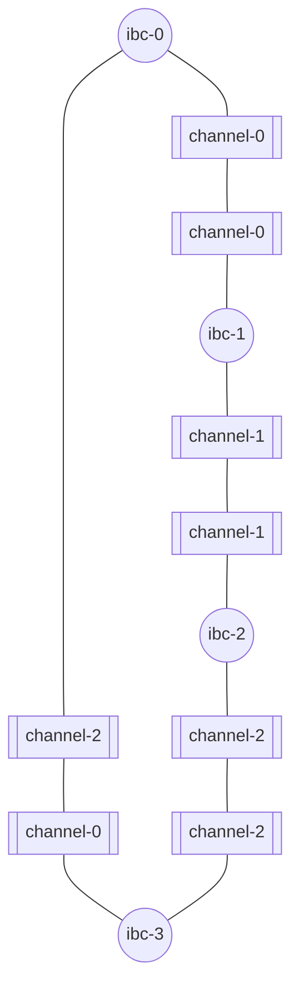
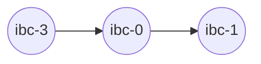
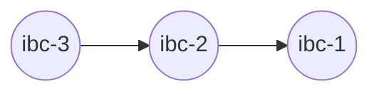

# Start relaying

In the previous tutorial, you learned about how to relay packets between a pair of chains on a relay path. Now, you will learn how to relay packets on an arbitrary topology.

>__WARNING__ Before proceeding to the sections below, please first, make sure you followed the steps in the [Build the topology section](./build-the-topology.md).

The chains should be fully connected and the relayer should be setup to relay on these channels:



---

## Query balances

- Balances on `ibc-0`:

    ```shell
    {{#template ../../templates/commands/gaia/query_balances node=tcp://localhost:27050 home=~/.gm/ibc-0 wallet=wallet}}
    ```

- Balances on `ibc-1`:

    ```shell
    {{#template ../../templates/commands/gaia/query_balances node=tcp://localhost:27060 home=~/.gm/ibc-1 wallet=wallet}}
    ```

- Balances on `ibc-2`:

    ```shell
    {{#template ../../templates/commands/gaia/query_balances node=tcp://localhost:27070 home=~/.gm/ibc-2 wallet=wallet}}
    ```

- Balances on `ibc-3`:

    ```shell
    {{#template ../../templates/commands/gaia/query_balances node=tcp://localhost:27080 home=~/.gm/ibc-3 wallet=wallet}}
    ```

> __NOTE__ the RPC addresses used in the two commands above are configured in `~/.hermes/config.toml` file. It can also be found with `{{#template ../../templates/commands/gm/status}}`

At this point in the tutorial, every command should output something similar to:

```
balances:
- amount: "100000000"
  denom: samoleans
- amount: "99982481"
  denom: stake
pagination:
  next_key: null
  total: "0"
```

## Start relaying

Now, let's exchange `samoleans` between chains.

- Open a new terminal and start Hermes using the `start` command : 

    ```shell
    {{#template ../../templates/commands/hermes/start}}
    ```
    Hermes will first relay the pending packets that have not been relayed and then start passively relaying by listening for and acting on packet events. 

- Let's transfer `1000000 samoleans` from ibc-1 to ibc-3. There is a direct path between ibc-1 (channel-2) and ibc-3 (channel-1). Let's attempt the transfer on this path.

    - In a separate terminal, use the `ft-transfer` command to send `1000000 samoleans` from ibc-1 to ibc-3 from channel-2:
    ```shell
    {{#template ../../templates/commands/hermes/transfer dst-chain=ibc-3 src-chain=ibc-1 src-port=transfer src-channel=channel-2 amount=1000000 timeout-seconds=10000}}
    ``` 
    - Wait a few seconds then query balances on `ibc-1` and `ibc-3`. You should observe that `ibc-1` lost 1000000 samoleans but `ibc-3` did not receive any:

        * Balances at ibc-1 : 
            ```
            balances:
            - amount: "99000000"
            denom: samoleans
            - amount: "99980646"
            denom: stake
            pagination:
            next_key: null
            total: "0"
            ```
        * Balances at ibc-3 : 
            ```
            balances:
            - amount: "100000000"
            denom: samoleans
            - amount: "99979803"
            denom: stake
            pagination:
            next_key: null
            total: "0"
            ```

    - Observe the output on the relayer terminal and verify that no event is processed. 

    If you correctly created the packet filters in the [previous section](./build-the-topology.md), the relayer does not relay on this path. So what happened to the 1000000 samoleans you just sent ? It is stuck until a relayer decides to relay this packet to `ibc-3`. For now, let's forget about these samoleans. We can get as many as we want anyway. 

    It might be impossible to send packets directly from `ibc-1` to `ibc-3`, however, it is possible to use `ibc-2` as a bridge:

    ```mermaid
    graph LR;
    A((ibc-1)) --> B((ibc-2)) --> C((ibc-3))
    ```

- In a separate terminal, use the `ft-transfer` command to send `1000000 samoleans` from ibc-1 to ibc-2 from channel-1:
    ```shell
    {{#template ../../templates/commands/hermes/transfer dst-chain=ibc-2 src-chain=ibc-1 src-port=transfer src-channel=channel-1 amount=1000000 timeout-seconds=10000}}
    ```
- Wait a few seconds then query balances on `ibc-1` and `ibc-2`. You should observe something similar to:
    - Balances on `ibc-1`:
        ```
        balances:
        - amount: "98000000"
        denom: samoleans
        - amount: "99979707"
        denom: stake
        pagination:
        next_key: null
        total: "0"
        ```
    - Balances at ibc-2:
        ```
        balances:
        - amount: "1000000"
        denom: ibc/C1840BD16FCFA8F421DAA0DAAB08B9C323FC7685D0D7951DC37B3F9ECB08A199
        - amount: "100000000"
        denom: samoleans
        - amount: "99979154"
        denom: stake
        pagination:
        next_key: null
        total: "0"
        ```
    The samoleans were transferred to `ibc-1` and are visible under the denomination `ibc/C1840...` (it might be a different one for you). 

- Transfer these tokens to `ibc-3`:
    ```shell
    {{#template ../../templates/commands/hermes/transfer_with_denom dst-chain=ibc-3 src-chain=ibc-2 src-port=transfer src-channel=channel-2 amount=1000000 timeout-seconds=10000 denom=ibc/C1840BD16FCFA8F421DAA0DAAB08B9C323FC7685D0D7951DC37B3F9ECB08A199}}
    ```
- Wait a few seconds then query balances on `ibc-2` and `ibc-3`. You should observe something similar to:
    - Balances on `ibc-2`:
        ```
        balances:
        - amount: "0"
        denom: ibc/C1840BD16FCFA8F421DAA0DAAB08B9C323FC7685D0D7951DC37B3F9ECB08A199
        - amount: "100000000"
        denom: samoleans
        - amount: "99977059"
        denom: stake
        pagination:
        next_key: null
        total: "0"
        ```
    - Balances on `ibc-3`:
        ```
        balances:
        - amount: "1000000"
        denom: ibc/C658F0EB9DE176E080B586D634004141239C3E55676462C976266DB54C56EBE4
        - amount: "100000000"
        denom: samoleans
        - amount: "99978251"
        denom: stake
        pagination:
        next_key: null
        total: "0"
        ```
    The tokens were correctly received by `ibc-3` under the denomination `ibc/C658...`.

## Send back the tokens

Now let's send some of these coins back to `ibc-1`. We will dedicate half of them to learn a valuable lesson while the other half will be correctly transferred back.

### The wrong way

Let's start with a common mistake and send back these coins on a different path than the one they were received on:

__Another path to ibc-1__



- Use the `ft-transfer` command to transfer `500000 ibc/C658...` tokens from `ibc-3` to `ibc-0`:
    ```shell
    {{#template ../../templates/commands/hermes/transfer_with_denom dst-chain=ibc-0 src-chain=ibc-3 src-port=transfer src-channel=channel-0 amount=500000 timeout-seconds=10000 denom=ibc/C658F0EB9DE176E080B586D634004141239C3E55676462C976266DB54C56EBE4}}
    ```
- Wait a few seconds, then query balances on `ibc-0` and `ibc-3`. You should observe something similar to:
    - Balances on `ibc-0`:
        ```
        balances:
        - amount: "500000"
        denom: ibc/563FDAE5A0D8C15013E4485134A2D2EE3317452278B56B2ED63DDB4EB677DF84
        - amount: "100000000"
        denom: samoleans
        - amount: "99980928"
        denom: stake
        pagination:
        next_key: null
        total: "0"
        ```
    - Balances on `ibc-3`:
        ```
        balances:
        - amount: "500000"
        denom: ibc/C658F0EB9DE176E080B586D634004141239C3E55676462C976266DB54C56EBE4
        - amount: "100000000"
        denom: samoleans
        - amount: "99976153"
        denom: stake
        pagination:
        next_key: null
        total: "0"
        ```
    The tokens were correctly received by `ibc-0` under the denomination `ibc/563...`.

- Transfer the `ibc/563...` tokens from `ibc-0` to `ibc-1`:
    ```shell
    {{#template ../../templates/commands/hermes/transfer_with_denom dst-chain=ibc-1 src-chain=ibc-0 src-port=transfer src-channel=channel-0 amount=500000 timeout-seconds=10000 denom=ibc/563FDAE5A0D8C15013E4485134A2D2EE3317452278B56B2ED63DDB4EB677DF84}}
    ```

- Wait a few seconds then query balances on `ibc-0` and `ibc-3`. You should observe something similar to:
    - Balances on `ibc-0`:
        ```
        balances:
        - amount: "0"
        denom: ibc/563FDAE5A0D8C15013E4485134A2D2EE3317452278B56B2ED63DDB4EB677DF84
        - amount: "100000000"
        denom: samoleans
        - amount: "99978828"
        denom: stake
        pagination:
        next_key: null
        total: "0"
        ```
    - Balances on `ibc-1`:
        ```
        balances:
        - amount: "500000"
        denom: ibc/8F3641F853A1D075C549E733AB624BA8607C8D2FFC26B32717DE660AE6A34A73
        - amount: "98000000"
        denom: samoleans
        - amount: "99978141"
        denom: stake
        pagination:
        next_key: null
        total: "0"
        ```
    The tokens were successfully received by `ibc-1` under the denomination `ibc/8F3...` while they should be recognized as samoleans. Indeed, **it is impossible to transfer back tokens from a different channel than the one they were received from**.

    Let's forget about these tokens.

### The right way

Now that you have seen the wrong way to transfer back tokens, let's see the right way. **Tokens should be transferred back on the same path they were received**.

__Correct Path__:


- Use the `ft-transfer` command to transfer `500000 ibc/C658...` tokens from `ibc-3` to `ibc-2`:
    ```shell
    {{#template ../../templates/commands/hermes/transfer_with_denom dst-chain=ibc-2 src-chain=ibc-3 src-port=transfer src-channel=channel-2 amount=500000 timeout-seconds=10000 denom=ibc/C658F0EB9DE176E080B586D634004141239C3E55676462C976266DB54C56EBE4}}
    ```
- Wait a few seconds then query balances on `ibc-2` and `ibc-3`. You should observe something similar to:
    - Balances at ibc-2:
        ```
        balances:
        - amount: "500000"
        denom: ibc/C1840BD16FCFA8F421DAA0DAAB08B9C323FC7685D0D7951DC37B3F9ECB08A199
        - amount: "100000000"
        denom: samoleans
        - amount: "99975713"
        denom: stake
        pagination:
        next_key: null
        total: "0"
        ```
    - Balances at ibc-3:
        ```
        balances:
        - amount: "0"
        denom: ibc/C658F0EB9DE176E080B586D634004141239C3E55676462C976266DB54C56EBE4
        - amount: "100000000"
        denom: samoleans
        - amount: "99973935"
        denom: stake
        pagination:
        next_key: null
        total: "0"
        ```
    The tokens were correctly received by `ibc-0` under the denomination `ibc/C184...`. The tokens retrieved the denomination they had before they were transferred to ibc-3.

- Transfer the `ibc/C184...` tokens from ibc-2 to ibc-1:
    ```shell
    {{#template ../../templates/commands/hermes/transfer_with_denom dst-chain=ibc-1 src-chain=ibc-2 src-port=transfer src-channel=channel-1 amount=500000 timeout-seconds=10000 denom=ibc/C1840BD16FCFA8F421DAA0DAAB08B9C323FC7685D0D7951DC37B3F9ECB08A199}}
    ```

- Wait a few seconds, then query balances on `ibc-1` and `ibc-2`. You should observe something similar to:
    - Balances on `ibc-1`:
        ```
        balances:
        - amount: "500000"
        denom: ibc/8F3641F853A1D075C549E733AB624BA8607C8D2FFC26B32717DE660AE6A34A73
        - amount: "98500000"
        denom: samoleans
        - amount: "99975741"
        denom: stake
        pagination:
        next_key: null
        total: "0"
        ```
    - Balances on `ibc-2`:
        ```
        balances:
        - amount: "0"
        denom: ibc/C1840BD16FCFA8F421DAA0DAAB08B9C323FC7685D0D7951DC37B3F9ECB08A199
        - amount: "100000000"
        denom: samoleans
        - amount: "99974602"
        denom: stake
        pagination:
        next_key: null
        total: "0"
        ```
    The tokens were successfully received by `ibc-1` under the denomination `samoleans`. 

---

## Next Steps

In the [next section](./concurrent-instances.md), you will start new instances of Hermes to relay packets over the channels that were filtered out by the first instance.
