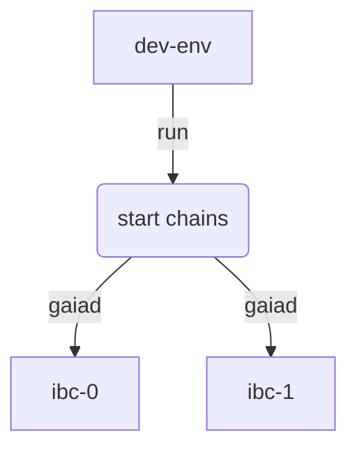

# Testing the relayer with two local chains

In order to test the relayer against two chains, we provide a script that can start two separate chains and configure them automatically. This is the easiest way to get started.

The script below starts two [`gaia`](https://github.com/cosmos/gaia) chains that support the `IBC` protocol.

### Running the script

To run the script, open a terminal and navigate to the `ibc-rs` repository folder

```bash
cd ibc-rs
```

#### Configuration

In order to run the script, you will need a `TOML` configuration file to be passed as a parameter. Please check the [`Configuration`](./config.md) section for more information about the relayer configuration file.

#### Start the chains

Run the following script with the parameters below to start the chains:

```bash
./dev-env two_chains.toml ibc-0 ibc-1
```

The script will configure and start two `gaiad` instances, one named `ibc-0` and the other `ibc-1`



If the script runs successfully you should see a message similar to the one below in the terminal:

```shell
$ ./dev-env ./relayer-cli/tests/fixtures/two_chains.toml ibc-0 ibc-1

GAIA VERSION INFO: 3.0.0
Generating gaia configurations...
Creating gaiad instance: home=./data | chain-id=ibc-0 | p2p=:26656 | rpc=:26657 | profiling=:6060 | grpc=:9090 | samoleans=:100000000000
Change settings in config.toml file...
balances:
- amount: "0"
  denom: stake
pagination:
  next_key: null
  total: "0"
balances:
- amount: "100000000000"
  denom: samoleans
- amount: "100000000000"
  denom: stake
pagination:
  next_key: null
  total: "0"
Creating gaiad instance: home=./data | chain-id=ibc-1 | p2p=:26556 | rpc=:26557 | profiling=:6061 | grpc=:9091 | samoleans=:100000000000
Change settings in config.toml file...
balances:
- amount: "0"
  denom: stake
pagination:
  next_key: null
  total: "0"
balances:
- amount: "100000000000"
  denom: samoleans
- amount: "100000000000"
  denom: stake
pagination:
  next_key: null
  total: "0"
ibc-0 initialized. Watch file /home/user/development/github.com/informalsystems/ibc-rs/data/ibc-0.log to see its execution.
ibc-1 initialized. Watch file /home/user/development/github.com/informalsystems/ibc-rs/data/ibc-1.log to see its execution.
Building the Rust relayer...
Removing light client peers from configuration...
Adding primary peers to light client configuration...
Adding secondary peers to light client configuration...
Importing keys...
```

#### Data directory
The script will also create a `data` directory in the current directory in order to install the chain store and configuration files for each chain.

The `data` directory should have a tree structure similar to this

```shell
data
├── ibc-0
│   ├── config
│   ├── data
│   ├── keyring-test
│   ├── key_seed.json
│   └── validator_seed.json
├── ibc-0.log
├── ibc-1
│   ├── config
│   ├── data
│   ├── keyring-test
│   ├── key_seed.json
│   └── validator_seed.json
└── ibc-1.log

```

#### Next steps

Now that you have two chains running with IBC support, you can run some relayer [commands](./commands.md)