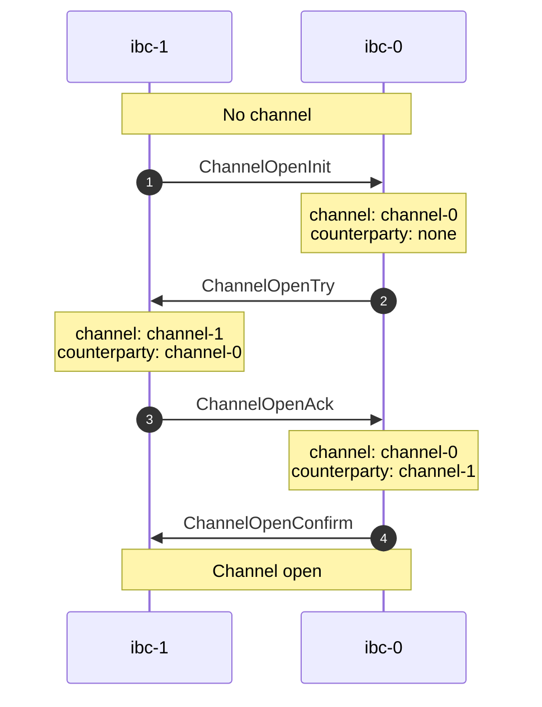

# Channel Handshake

The `tx raw` commands can be used to establish a channel for a given connection.

<center>



</center>

## Channel Open Init

Use the `chan-open-init` command to initialize a new channel.

```shell
USAGE:
    hermes tx raw chan-open-init <OPTIONS>

DESCRIPTION:
    Initialize a channel (ChannelOpenInit)

POSITIONAL ARGUMENTS:
    dst_chain_id              identifier of the destination chain
    src_chain_id              identifier of the source chain
    dst_conn_id               identifier of the destination connection
    dst_port_id               identifier of the destination port
    src_port_id               identifier of the source port

FLAGS:
    -o, --ordering ORDERING   the channel order: `UNORDERED` or `ORDERED`, default `UNORDERED`
```

__Example__

First, let's initialize the channel on `ibc-0` using an existing connection identified by `connection-0`:

```shell
$ hermes -c config.toml tx raw chan-open-init ibc-0 ibc-1 connection-0 transfer transfer | jq
```

```json
{
  "status": "success",
  "result": {
    "OpenInitChannel": {
      "channel_id": "channel-0",
      "connection_id": "connection-0",
      "counterparty_channel_id": null,
      "counterparty_port_id": "transfer",
      "height": "1",
      "port_id": "transfer"
    }
  }
}
```

A new channel has been initialized on `ibc-1` with identifier `channel-0`.
Note that the `counterparty_channel_id` field is currently empty.


## Channel Open Try

Use the `chan-open-try` command to establish a counterparty to the channel on the other chain.

```shell
USAGE:
    hermes tx raw chan-open-try <OPTIONS>

DESCRIPTION:
    Relay the channel attempt (ChannelOpenTry)

POSITIONAL ARGUMENTS:
    dst_chain_id              identifier of the destination chain
    src_chain_id              identifier of the source chain
    dst_conn_id               identifier of the destination connection
    dst_port_id               identifier of the destination port
    src_port_id               identifier of the source port

FLAGS:
    -s, --src-chan-id ID      identifier of the source channel (required)
    -o, --ordering ORDERING   the channel order: `UNORDERED` or `ORDERED`, default `UNORDERED`
```

__Example__

Let's now create the counterparty to `channel-0` on chain `ibc-1`:

```shell
$ hermes -c config.toml tx raw chan-open-try ibc-1 ibc-0 connection-1 transfer transfer -s channel-0 | jq
```

```json
{
  "status": "success",
  "result": {
    "OpenTryChannel": {
      "channel_id": "channel-1",
      "connection_id": "connection-1",
      "counterparty_channel_id": "channel-0",
      "counterparty_port_id": "transfer",
      "height": "1",
      "port_id": "transfer"
    }
  }
}
```

A new channel has been created on `ibc-1` with identifier `channel-1`.
Note that the field `counterparty_channel_id` points to the channel on `ibc-0`.


## Channel Open Ack

Use the `chan-open-ack` command to acknowledge the channel on the initial chain.

```shell
USAGE:
    hermes tx raw chan-open-ack <OPTIONS>

DESCRIPTION:
    Relay acknowledgment of a channel attempt (ChannelOpenAck)

POSITIONAL ARGUMENTS:
    dst_chain_id              identifier of the destination chain
    src_chain_id              identifier of the source chain
    dst_conn_id               identifier of the destination connection
    dst_port_id               identifier of the destination port
    src_port_id               identifier of the source port

FLAGS:
    -d, --dst-chan-id ID      identifier of the destination channel (required)
    -s, --src-chan-id ID      identifier of the source channel (required)
    -o, --ordering ORDERING   the channel order: `UNORDERED` or `ORDERED`, default `UNORDERED`
```

__Example__

We can now acknowledge on `ibc-0` that `ibc-1` has accepted the opening of the channel:

```shell
$ hermes -c config.toml tx raw chan-open-ack ibc-0 ibc-1 connection-0 transfer transfer -d channel-0 -s channel-1 | jq
```

```json
{
  "status": "success",
  "result": {
    "OpenAckChannel": {
      "channel_id": "channel-0",
      "connection_id": "connection-0",
      "counterparty_channel_id": "channel-1",
      "counterparty_port_id": "transfer",
      "height": "1",
      "port_id": "transfer"
    }
  }
}
```

Note that the field `counterparty_channel_id` now points to the channel on `ibc-1`.


## Channel Open Confirm

Use the `chan-open-confirm` command to confirm that the channel has been acknowledged,
and finish the handshake, after which the channel is open on both chains.

```shell
USAGE:
    hermes tx raw chan-open-confirm <OPTIONS>

DESCRIPTION:
    Confirm opening of a channel (ChannelOpenConfirm)

POSITIONAL ARGUMENTS:
    dst_chain_id              identifier of the destination chain
    src_chain_id              identifier of the source chain
    dst_conn_id               identifier of the destination connection
    dst_port_id               identifier of the destination port
    src_port_id               identifier of the source port

FLAGS:
    -d, --dst-chan-id ID      identifier of the destination channel (required)
    -s, --src-chan-id ID      identifier of the source channel (required)
    -o, --ordering ORDERING   the channel order: `UNORDERED` or `ORDERED`, default `UNORDERED`
```

__Example__

Confirm on `ibc-1` that `ibc-0` has accepted the opening of the channel,
after which the channel is open on both chains.

```shell
$ hermes -c config.toml tx raw chan-open-confirm ibc-1 ibc-0 connection-1 transfer transfer channel-1 channel-0 | jq
```

```json
{
  "status": "success",
  "result": {
    "OpenConfirmChannel": {
      "channel_id": "channel-1",
      "connection_id": "connection-1",
      "counterparty_channel_id": "channel-0",
      "counterparty_port_id": "transfer",
      "height": "1",
      "port_id": "transfer"
    }
  }
}
```

We have now successfully opened a channel over an existing connection between the two chains.


## Channel Close Init

Use the `chan-close-init` command to initialize the closure of a channel.

```shell
USAGE:
    hermes tx raw chan-close-init <OPTIONS>

DESCRIPTION:
    Initiate the closing of a channel (ChannelCloseInit)

POSITIONAL ARGUMENTS:
    dst_chain_id              identifier of the destination chain
    src_chain_id              identifier of the source chain
    dst_conn_id               identifier of the destination connection
    dst_port_id               identifier of the destination port
    src_port_id               identifier of the source port

FLAGS:
    -d, --dst-chan-id ID      identifier of the destination channel (required)
    -s, --src-chan-id ID      identifier of the source channel (required)
```

__Example__

```shell
$ hermes -c config.toml tx raw chan-close-init ibc-0 ibc-1 connection-0 transfer transfer -d channel-0 -s channel-1 | jq
```

```json
{
  "status": "success",
  "result": {
    "CloseInitChannel": {
      "channel_id": "channel-1",
      "connection_id": "connection-1",
      "counterparty_channel_id": "channel-3",
      "counterparty_port_id": "transfer",
      "height": "1",
      "port_id": "transfer"
    }
  }
}
```

## Channel Close Confirm

Use the `chan-close-confirm` command to confirm the closure of a channel.

```shell
USAGE:
    hermes tx raw chan-close-confirm <OPTIONS>

DESCRIPTION:
    Confirm the closing of a channel (ChannelCloseConfirm)

POSITIONAL ARGUMENTS:
    dst_chain_id              identifier of the destination chain
    src_chain_id              identifier of the source chain
    dst_conn_id               identifier of the destination connection
    dst_port_id               identifier of the destination port
    src_port_id               identifier of the source port

FLAGS:
    -d, --dst-chan-id ID      identifier of the destination channel (required)
    -s, --src-chan-id ID      identifier of the source channel (required)
```

__Example__

```shell
$ hermes -c config.toml tx raw chan-close-confirm ibc-1 ibc-0 connection-1 transfer transfer -d channel-1 -s channel-0 | jq
```

```json
{
  "status": "success",
  "result": {
    "CloseConfirmChannel": {
      "channel_id": "channel-3",
      "connection_id": "connection-3",
      "counterparty_channel_id": "channel-1",
      "counterparty_port_id": "transfer",
      "height": "1",
      "port_id": "transfer"
    }
  }
}
```
